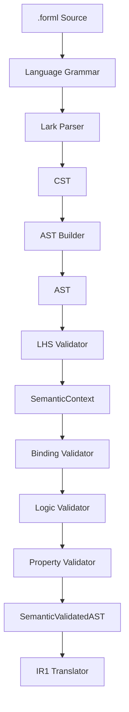

# C4 Component View — DSL Compiler

> Status: Stabilizing  
> Scope: Compiler component architecture  
> Implementation: Implemented until IR1 / planned after IR1  
> V1 backend scope: Z3 only

## Purpose

This document decomposes the FORML DSL Compiler into internal components.

It answers:

```text
How does FORML transform `.forml` source into semantically valid IR?
```

---

## Component diagram



---

## Components

| Component | Responsibility | Output | Status |
|---|---|---|---|
| Language Grammar | Defines legal FORML syntax. | Grammar rules | Implemented / stabilizing |
| Lark Parser | Parses source text. | CST | Implemented |
| AST Builder | Converts CST into typed AST nodes. | AST | Implemented / stabilizing |
| LHS Validator | Builds semantic scope and variables. | SemanticContext | Implemented / stabilizing |
| Binding Validator | Resolves attributes and implicit entities. | Semantic annotations | Implemented / stabilizing |
| Logic Validator | Validates logical structure and problem/function compatibility. | Validated logic | Implemented / needs fixes |
| Property Validator | Orchestrates semantic validation for one property. | SemanticValidatedAST | Implemented / stabilizing |
| IR1 Translator | Translates validated AST into IR1 tasks. | VerificationTask list | Implemented / stabilizing |

---

## Compiler artifact flow

```text
Source
→ CST
→ AST
→ SemanticContext
→ SemanticAnnotations
→ SemanticValidatedAST
→ IR1 VerificationTask
```

The compiler should never skip a layer. Each layer has a contract and expected failure modes.

---

## Language Grammar

The language grammar defines:

- headers;
- model and target declarations;
- property sections;
- scopes;
- assertions;
- comparison operators;
- backend syntax.

The grammar is not responsible for semantic validity. It only defines what can be parsed.

---

## Parser

The parser converts raw `.forml` source into a concrete syntax tree.

Responsibilities:

- preserve syntax structure;
- expose parse errors;
- avoid semantic interpretation;
- provide a stable input for the builder.

---

## AST Builder

The builder converts the CST into typed Python nodes.

Responsibilities:

- remove syntactic noise;
- build `ProgramNode`, `PropertyNode`, scopes and assertions;
- preserve explicit user intent;
- reject structurally invalid CST fragments.

---

## Semantic validation

Semantic validation is composed of several passes.

| Pass | Purpose |
|---|---|
| LHS validation | Defines scope, variables, default entity, domain and neighborhood. |
| Binding validation | Resolves explicit and implicit attribute references. |
| Logic validation | Validates logical operators, comparisons, and problem-level predicates. |
| Property compatibility | Ensures property type supports the selected semantic scope. |

The output of semantic validation is not a new syntax tree type yet; it is the AST enriched with semantic annotations and validated context.

---

## IR1 translation

IR1 translation turns semantic AST nodes into backend-independent verification tasks.

The translator should consume resolved semantic information, not raw unresolved syntax.

Target invariant:

```text
IR1 must not contain unresolved attributes.
```

---

## Implementation status

| Area | Status | Notes |
|---|---|---|
| Grammar | Implemented / stabilizing | Operator casing and quantifier normalization need cleanup. |
| Parser | Implemented | Uses Lark. |
| Builder | Implemented / stabilizing | AST node inheritance/semantic fields should be normalized. |
| Semantic validation | Implemented / needs fixes | Enum normalization and error boundaries need stabilization. |
| IR1 translation | Implemented / needs fixes | Should use semantic annotations for resolved entities. |
| IR2 translation | Planned | Covered by logical pipeline docs. |
| Backend lowering | Planned | Z3-first. |

---

## Related contracts

- `contracts/source-to-cst.md`
- `contracts/cst-to-ast.md`
- `contracts/ast-contract.md`
- `contracts/ast-to-semantic.md`
- `contracts/semantic-to-ir1.md`
- `contracts/errors.md`
- `contracts/type-normalization.md`
