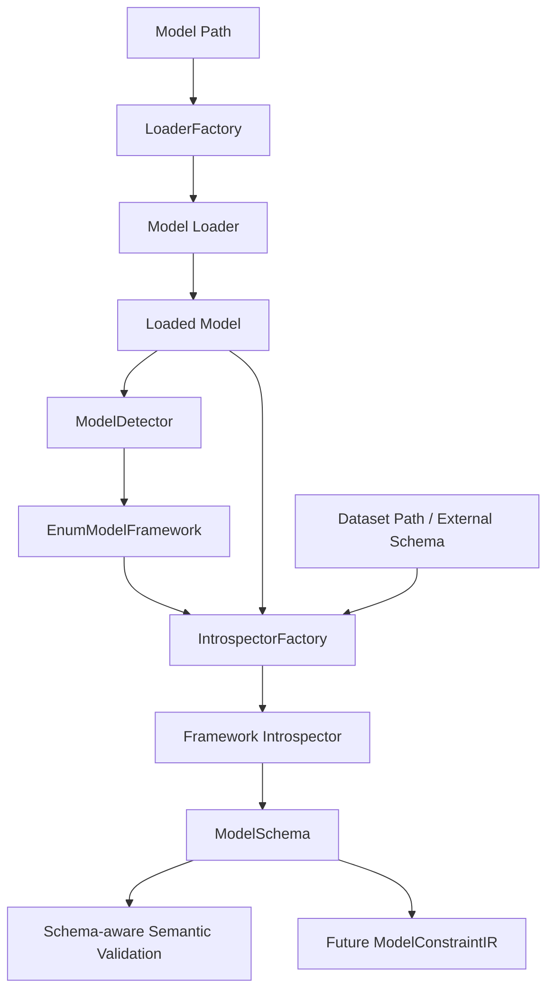

# C4 Component View — ModelBridge

> Status: Stabilizing  
> Scope: ModelBridge component architecture  
> Implementation: Partially implemented  
> V1 backend scope: Z3 only

## Purpose

This document decomposes ModelBridge into internal components.

It answers:

```text
How does FORML understand an ML model before verifying properties against it?
```

ModelBridge provides the normalized model representation required by semantic validation, model-aware constraints, and backend lowering.

---

## Component diagram



---

## Components

| Component | Responsibility | Status |
|---|---|---|
| ModelManager | Orchestrates the full ModelBridge pipeline. | Implemented / stabilizing |
| LoaderFactory | Selects loader from file extension. | Implemented |
| Model Loader | Loads serialized model artifacts. | Implemented for pkl/joblib/json path |
| ModelDetector | Detects ML framework from loaded model type. | Implemented for sklearn/XGBoost |
| IntrospectorFactory | Selects framework-specific introspector. | Implemented for sklearn/XGBoost |
| Framework Introspector | Extracts normalized model metadata. | Partially implemented |
| ModelSchema | Normalized bridge representation. | Implemented / stabilizing |
| ModelConstraint Generator | Produces model-side logical constraints. | Planned |

---

## ModelBridge artifact flow

```text
model_path
→ LoaderFactory
→ ModelLoader
→ loaded_model
→ ModelDetector
→ EnumModelFramework
→ IntrospectorFactory
→ FrameworkIntrospector
→ ModelSchema
→ schema-aware semantic validation
→ future ModelConstraintIR
```

---

## ModelManager

`ModelManager` is the orchestration entry point.

Responsibilities:

- receive the model path;
- receive optional dataset/schema;
- select a loader;
- load the model;
- detect framework;
- select introspector;
- produce a normalized `ModelSchema`.

The ModelManager should remain a coordinator. It should not contain framework-specific introspection logic.

---

## LoaderFactory and loaders

The loader layer isolates serialization formats.

Expected supported formats for early V1:

- `.pkl`;
- `.joblib`;
- optional `.json` if the format has a clear semantic meaning.

The loader layer should only deserialize. It should not infer semantics.

---

## ModelDetector

The detector identifies the framework family of a loaded model.

Initial framework support:

- scikit-learn;
- XGBoost through sklearn-compatible APIs.

Post-V1 framework support may include:

- PyTorch;
- TensorFlow;
- ONNX;
- other model formats.

---

## Introspectors

An introspector extracts normalized information from a loaded model.

Responsibilities:

- infer task type;
- infer or consume feature schema;
- extract target metadata;
- expose framework-specific metadata;
- produce a `ModelSchema`.

Introspectors are framework-specific, but their output must be framework-normalized.

---

## ModelSchema

`ModelSchema` is the key bridge artifact between the ML model and FORML semantics.

It contains:

- framework identity;
- model type;
- features;
- target;
- task;
- framework-specific metadata.

Target usage:

```text
ModelSchema
→ feature-aware semantic validation
→ model constraint generation
→ backend lowering support
```

---

## Future ModelConstraintIR

ModelBridge should eventually produce or support model-side constraints.

Examples:

- feature existence constraints;
- feature dtype constraints;
- input dimensionality constraints;
- task compatibility constraints;
- symbolic model encoding constraints;
- prediction output constraints.

These constraints will feed the assertion aggregation layer.

---

## V1 scope

For V1, ModelBridge should focus on:

1. loading a minimal supported model format;
2. detecting sklearn/XGBoost-like models;
3. producing reliable `ModelSchema`;
4. enabling schema-aware semantic validation;
5. supporting Z3-oriented backend preparation.

ModelBridge does not need to support every ML framework before V1.

---

## Related documents

- `model-bridge/overview.md`
- `model-bridge/model-schema.md`
- `model-bridge/model-constraints.md`
- `contracts/model-to-schema.md`
- `contracts/schema-to-semantic.md`
- `contracts/model-constraints.md`
