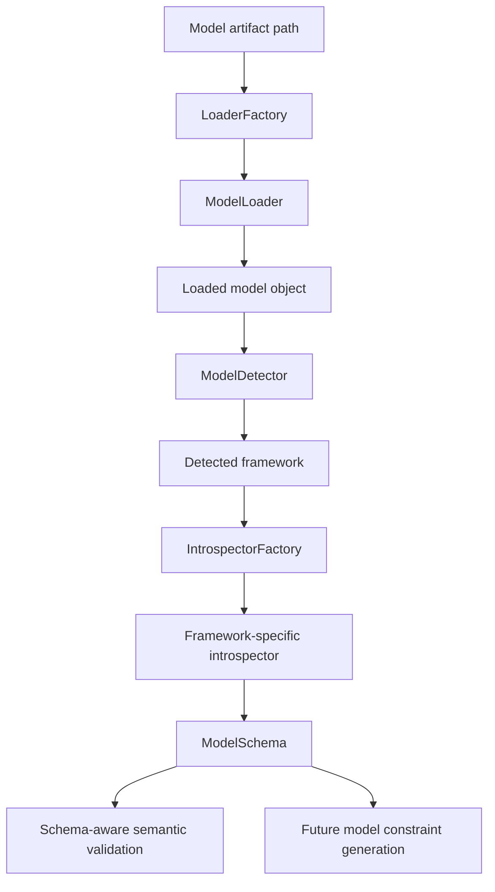

# ModelBridge Overview

> Status: partially implemented / stabilizing  
> Scope: model representation pipeline  
> Priority: P0

## Purpose

ModelBridge is the subsystem that allows FORML to understand the machine learning artifact targeted by a `.forml` specification.

A FORML query is not complete with the DSL alone. The DSL expresses what must be verified, but the model defines what can be verified against.

ModelBridge provides the bridge between:

- serialized machine learning artifacts;
- framework-specific model objects;
- dataset or schema metadata;
- FORML semantic validation;
- future model-derived constraints;
- backend lowering.

## Design Intent

ModelBridge exists because FORML must avoid treating machine learning models as opaque black boxes.

Before a property can be lowered to a verification backend, FORML needs to know:

- which framework produced the model;
- which task type the model appears to solve;
- which input features exist;
- which data types are associated with these features;
- which target is expected;
- which framework-specific metadata may be useful for backend compilation.

ModelBridge does not prove properties by itself. It produces the normalized model representation required by later FORML stages.

## Pipeline



## Current Responsibilities

ModelBridge currently covers the following responsibilities:

| Responsibility | Description | Status |
|---|---|---|
| Model loading | Select the proper loader from the model file extension. | implemented / stabilizing |
| Framework detection | Detect the framework of the loaded model object. | implemented / stabilizing |
| Model introspection | Extract normalized model metadata. | implemented / stabilizing |
| Model schema production | Produce a `ModelSchema` consumed by FORML. | implemented / stabilizing |
| Schema-aware semantic validation | Validate DSL feature references against the model schema. | planned / critical |
| Model constraint generation | Generate model-side constraints from schema and metadata. | planned / critical |
| Backend-aware encoding | Convert model representation into backend-specific expressions. | planned |

## Current Implementation Shape

The current orchestration entry point is conceptually:

```text
ModelManager.build_schema()
```

It performs:

```text
1. Select a loader from the model path.
2. Load the serialized model.
3. Detect the model framework.
4. Select the corresponding introspector.
5. Produce a normalized ModelSchema.
```

## Relationship with FORML Compiler

ModelBridge is independent from the DSL compiler, but both pipelines converge before backend lowering.

```text
DSL Compiler Pipeline:
    .forml → CST → AST → SemanticValidatedAST → IR1 → IR2

ModelBridge Pipeline:
    model artifact → loaded model → framework → ModelSchema

Convergence:
    IR2 + ModelSchema → Assertion Aggregation → Lowering → BackendQuery
```

## Relationship with Semantic Validation

ModelBridge provides the external model knowledge required for stronger semantic validation.

Without ModelBridge, FORML can validate that a property is syntactically and semantically coherent within the DSL itself.

With ModelBridge, FORML can additionally validate that:

- referenced features exist in the model schema;
- feature types are compatible with comparison operators;
- the declared problem type is compatible with the detected model task;
- the target column is coherent with the model and dataset metadata.

## Relationship with Model Constraints

The `ModelSchema` is not the final verification artifact.

It is a normalized source of truth that can later be transformed into model constraints.

Examples of future model constraints include:

- input dimensionality constraints;
- feature domain constraints;
- dtype constraints;
- target compatibility constraints;
- task compatibility constraints;
- framework-specific symbolic constraints;
- backend-specific model encodings.

## Boundary

ModelBridge should not:

- parse `.forml` source code;
- validate DSL logical structure;
- perform IR1 or IR2 logical rewriting;
- execute verification backends;
- decide final backend orchestration alone.

ModelBridge should:

- load model artifacts;
- detect framework identity;
- introspect model metadata;
- expose a normalized schema;
- provide model-side information for semantic validation and lowering.

## Architectural Invariants

ModelBridge should preserve the following invariants:

1. A loaded model must be associated with exactly one detected framework.
2. A supported framework must map to an introspector.
3. Introspection must produce a normalized `ModelSchema`.
4. `ModelSchema` must be independent from any specific verification backend.
5. Framework-specific metadata must remain optional and isolated under metadata fields.
6. Schema generation must not mutate the original model object.
7. Downstream compiler stages must not depend directly on framework-specific model APIs.

## Status Summary

| Component | Status |
|---|---|
| LoaderFactory | implemented |
| Pickle loader | implemented |
| Joblib loader | implemented |
| JSON loader | needs stabilization |
| ModelDetector | implemented for sklearn and XGBoost |
| IntrospectorFactory | implemented for sklearn and XGBoost |
| SklearnIntrospector | implemented / stabilizing |
| XGBoostIntrospector | implemented / stabilizing |
| TensorFlow support | planned |
| PyTorch support | planned |
| ModelSchema | implemented / stabilizing |
| ModelConstraints | planned / critical |

## Documentation Map

| Document | Purpose |
|---|---|
| `model-loading.md` | Explain model loading and loader selection. |
| `model-detection.md` | Explain framework detection. |
| `model-introspection.md` | Explain introspector responsibilities. |
| `model-schema.md` | Define the normalized model representation. |
| `model-constraints.md` | Define future model-derived constraints. |
| `supported-frameworks.md` | Track supported and planned ML frameworks. |
