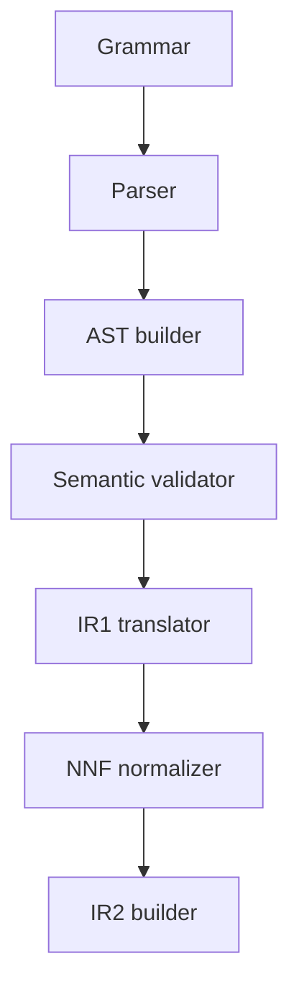

# C4 component view — compiler

> **Status:** As built for `1.0.0rc4`
>
> **Scope:** `toetra._language` and `toetra._compiler`

## Components

| Component | Source | Input | Output |
|---|---|---|---|
| Grammar/vocabulary | `_language` | EBNF and enum definitions | generated Lark grammar and canonical tokens |
| Parser | `_compiler/parser` | source text | Lark CST |
| Builder | `_compiler/builder` | CST | `ProgramNode` AST |
| Semantic validator | `_compiler/semantic` | AST, optional schema/anchors | validated AST state and semantic context |
| IR1 translator | `_compiler/ir/ir1` | validated AST | `VerificationTask` list |
| NNF normalizer | `_compiler/ir/normalization` | lowered IR1 task | NNF `VerificationTask` |
| IR2 builder | `_compiler/ir/ir2` | NNF task and typed assumptions | `VerificationTaskIR2` |

## Semantic component

Semantic validation owns:

- scope and point visibility;
- explicit and implicit bindings;
- specification constants;
- feature and output-observable typing;
- schema-aware feature/target validation;
- property/scope compatibility;
- diagnostics before logical translation.

The validator mutates or annotates the AST and supporting semantic state. A
successful call establishes the semantic boundary; it does not allocate a
separate `SemanticValidatedAST` object.

## IR1 component

IR1 detaches the property from source syntax while retaining declarative intent:

- `VerificationTask`;
- `ScopeIR` and ordered binders;
- point bindings and domains;
- scalar and logical nodes;
- output-observable expressions;
- optional backend hint.

Model-dependent public observables deliberately survive into IR1. Their meaning
is applied by `toetra._models.semantics` before final NNF normalization.

## IR2 component

`IR2Builder` is an orchestration component. Specialized collaborators own:

- anchor and domain assumption encoding;
- assumption collection;
- verification-condition construction;
- NNF/CNF/DNF selection and conversion;
- point and quantifier analysis;
- requirement derivation;
- diagnostics and validation.

IR2 does not load model frameworks or create Z3 objects.

## Failure boundaries

| Failure | Component |
|---|---|
| grammar rejection | parser |
| unsupported CST shape | builder |
| unbound point, invalid type, unsupported observable | semantic validator |
| missing semantic resolution | IR1 translator |
| residual model-dependent observable | model-semantic gate |
| non-NNF task or normal-form explosion | normalizer/IR2 builder |
| inconsistent assumptions or missing requirements | IR2 validator |

## Contracts

- [Source to CST](../contracts/source-to-cst.md)
- [CST to AST](../contracts/cst-to-ast.md)
- [AST to semantic](../contracts/ast-to-semantic.md)
- [Semantic to IR1](../contracts/semantic-to-ir1.md)
- [IR1 to IR2](../contracts/ir1-to-ir2.md)
