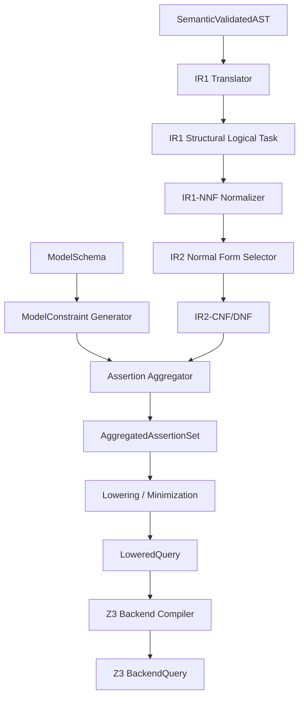

# C4 Component View — Logical Verification Pipeline

> Status: Target architecture / partially implemented  
> Scope: IR, aggregation, lowering, backend query preparation  
> Implementation: IR1 implemented, later layers planned  
> V1 backend scope: Z3 only

## Purpose

This document decomposes the Logical Verification Pipeline.

It answers:

```text
How does Toetra turn validated user intent and model metadata into a solver-ready backend query?
```

The Logical Verification Pipeline is the bridge between semantic validation and backend execution.

---

## Component diagram



---

## Components

| Component | Responsibility | Status |
|---|---|---|
| IR1 Translator | Converts SemanticValidatedAST to backend-independent IR1 tasks. | Implemented / stabilizing |
| IR1-NNF Normalizer | Applies De Morgan / NNF guarantees after structural IR1. | Planned / critical |
| IR2 Normal Form Selector | Chooses CNF or DNF depending on verification needs. | Planned / critical |
| IR2-CNF/DNF | Clause-oriented or case-oriented logical representation. | Planned / critical |
| ModelConstraint Generator | Converts ModelSchema into model-side constraints. | Planned / critical |
| Assertion Aggregator | Combines DSL assertions, semantic constraints, and model constraints. | Planned / critical |
| Lowering / Minimization | Simplifies and prepares the aggregated problem. | Planned / critical |
| Z3 Backend Compiler | Encodes lowered query into Z3-specific query. | Planned / V1 critical |
| BackendQuery | Solver-ready artifact. | Planned / V1 critical |

---

## Logical artifact flow

```text
SemanticValidatedAST
→ IR1 structural logical task
→ IR1-NNF normalization (planned)
→ IR2-CNF/DNF
→ ModelConstraintIR
→ AggregatedAssertionSet
→ LoweredQuery
→ Z3 BackendQuery
```

---

## IR1-NNF

IR1 is the first logical representation after semantic validation. The structural IR1 translator is implemented/stabilizing; the IR1-NNF normalizer is the planned subphase that will apply implication normalization, De Morgan transformations, and negation pushing.

Responsibilities:

- preserve semantic bindings;
- remain backend-independent;
- expose explicit logical structure;
- provide the input to the planned NNF normalizer.

IR1 does not select CNF or DNF. That is the role of IR2.

---

## IR2-CNF/DNF

IR2 is the planned normal-form layer.

Responsibilities:

- produce CNF when solver-oriented conjunction of clauses is needed;
- produce DNF when scenario exploration or case splitting is needed;
- preserve equivalence or explicitly track equisatisfiability;
- keep traceability to original DSL assertions.

---

## Model constraints

Model constraints are derived from ModelBridge outputs.

Examples:

- feature existence;
- feature dtype;
- target compatibility;
- task compatibility;
- input dimensionality;
- future symbolic model representation.

These constraints are not user assertions, but they participate in the final verification problem.

---

## Assertion aggregation

The Assertion Aggregator combines:

- user DSL assertions;
- semantic constraints;
- scope/domain/neighborhood constraints;
- model-derived constraints;
- backend capability constraints if needed.

Target output:

```text
AggregatedAssertionSet
```

This artifact represents the complete verification problem before simplification and backend-specific encoding.

---

## Lowering / Minimization

Lowering and minimization prepare the aggregated problem for a backend.

Responsibilities:

- simplify redundant expressions;
- remove unnecessary constraints when safe;
- preserve logical meaning or explicitly record approximation/equisatisfiability;
- prepare symbolic forms for Z3.

This layer must remain traceable. Removed or rewritten constraints should be explainable.

---

## Z3 backend compiler

For V1, the backend compiler targets Z3 only.

Responsibilities:

- map Toetra logical atoms to Z3 variables and expressions;
- encode scope constraints;
- encode model constraints;
- encode final solver assertions;
- produce a solver-ready query.

ERAN and other backends are post-V1 and should not shape the critical V1 design too early.

---

## Pipeline invariants

The Logical Verification Pipeline should preserve these invariants:

1. No raw DSL should appear after semantic validation.
2. No unresolved attribute should appear in IR1 or later.
3. IR2 must explicitly declare whether it is CNF, DNF, or another form.
4. Aggregation must preserve traceability to source assertions.
5. Lowering must record simplifications and minimizations.
6. BackendQuery must be backend-specific, but generated from backend-independent inputs.
7. Z3 is the only required V1 backend.

---

## Related documents

- `ir/overview.md`
- `ir/ir1-nnf.md`
- `ir/ir2-normal-forms.md`
- `ir/aggregated-assertion-set.md`
- `ir/backend-query.md`
- `contracts/ir1-to-ir2.md`
- `contracts/assertion-aggregation.md`
- `contracts/lowering-minimization.md`
- `contracts/ir-to-backend.md`
- `backends/z3.md`
