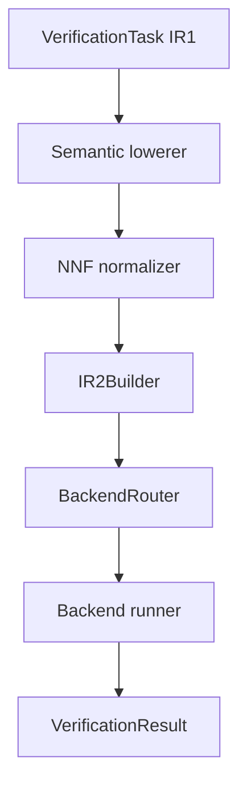

# C4 component view — logical verification

> **Status:** As built for `1.0.0rc3`
>
> **Scope:** model-semantic lowering, NNF, IR2, routing, and backend execution



## Components and artifacts

| Component | Input | Output |
|---|---|---|
| `ModelSemanticLowerer` | IR1 task + `ModelSchema` | lowered task + structured evidence |
| `NNFNormalizer` | lowered task | NNF `VerificationTask` |
| model encoder | schema + requested evaluations | model `AssumptionIR2` values |
| `IR2Builder` | NNF task + assumptions + policy | `VerificationTaskIR2` |
| `BackendRouter` | IR2 task + compatibility/execution context | `BackendRoute` |
| backend runner | routed IR2 task + execution policy | `VerificationResult` |

## Lowering order

Model-semantic lowering precedes final NNF. This matters when one public
observable expands into Boolean structure. Pairwise binary-label equality, for
example, becomes a disjunction of same-region conjunctions before negations are
normalized.

The lowerer must leave no unresolved public model observable in a supported
task. It retains deterministic evidence for reporting and compatibility policy.

## IR2 construction

`IR2Builder` combines data without introducing a separate aggregate object:

```text
NNF property
+ anchor assumptions
+ domain assumptions
+ model assumptions
+ verification semantics
→ VerificationTaskIR2
```

The task keeps assumptions individually typed and also carries the executable
verification condition. Its `requirements` summarize everything a backend must
represent.

Normal forms are real implemented artifacts:

- `NNFFormulaIR2`;
- `CNFFormulaIR2`;
- `DNFFormulaIR2`.

Selection follows `IR2BuildContext` and cost guardrails. Failure to distribute
safely retains NNF or raises the defined normal-form error according to policy;
it does not silently change meaning.

## Backend boundary

The router compares `IR2Requirements` with backend capabilities, numeric
compatibility rules, and execution-policy capabilities. Only then does a runner
translate the task.

The built-in Z3 adapter uses `Z3Translation` internally. That artifact contains
Z3 expressions and reverse symbol mappings and never re-enters IR2.

## Status interpretation

The runner interprets SAT/UNSAT according to `VerificationSemantics`:

| Semantics | SAT | UNSAT |
|---|---|---|
| universal refutation | `COUNTEREXAMPLE` | `PROVED` |
| existential witness | `WITNESS` | `NO_WITNESS` |

Numeric and semantic-lowering policies may weaken the conclusion to `UNKNOWN`
after execution when an approximate route does not permit that conclusion.

## Invariants

1. Public observable meaning is resolved before final NNF.
2. Model equations are emitted only for requested evaluations.
3. Assumptions remain separate and traceable.
4. IR2 contains no backend API object.
5. Routing precedes translation.
6. Translation never repairs unsupported requirements.
7. Reporting retains both source intent and canonical evidence.

## Contracts

- [Model semantic lowering](../contracts/model-semantic-lowering.md)
- [IR1 to IR2](../contracts/ir1-to-ir2.md)
- [Numeric compatibility](../contracts/numeric-compatibility-registry.md)
- [IR to backend](../contracts/ir-to-backend.md)
- [Backend execution](../contracts/backend-execution-contract.md)
