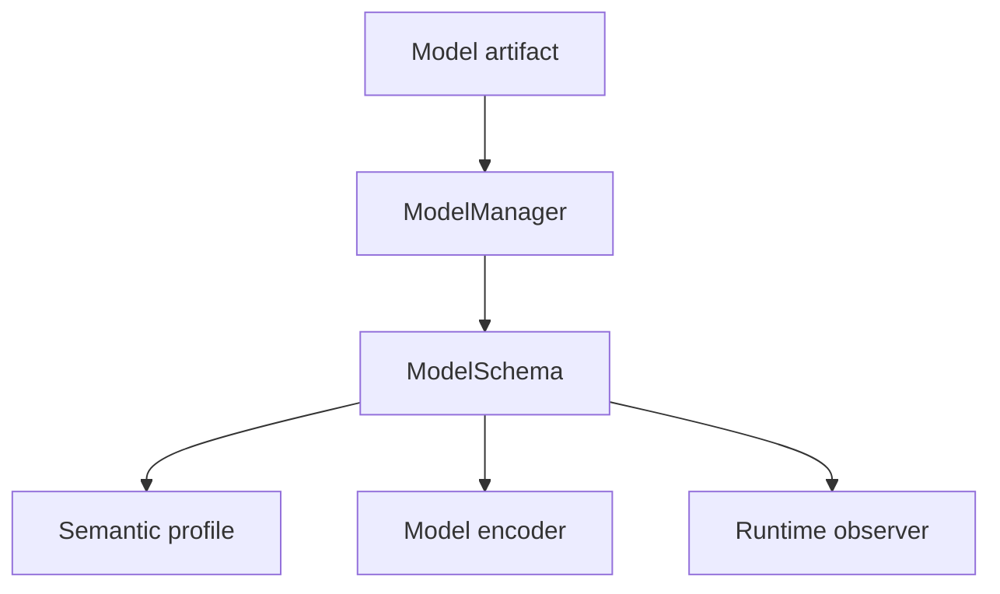

# C4 component view — ModelBridge

> **Status:** As built for `1.0.0rc4`
>
> **Scope:** `toetra._models`

ModelBridge converts framework-specific estimator state into four
framework-neutral views used at different boundaries: schema, model-family
semantics, formal assumptions, and concrete replay observations.



## Components

| Component | Responsibility | V1 use |
|---|---|---|
| loader factory | choose a serializer loader and deserialize the artifact | pickle/joblib path used by supported sklearn artifacts |
| framework detector | classify the loaded estimator | sklearn |
| introspector factory | extract normalized feature/output metadata | supported sklearn estimators |
| `ModelManager` | orchestrate load, detect, introspect, and schema construction | default artifact-based `verify(...)` path |
| `ModelSchema` | framework-neutral feature, output, task, and family contract | semantic validation, encoder selection, replay |
| semantic registry | select model-family meaning for public observables | regression identity and binary logistic profile |
| encoder factory | select and invoke formal model equation encoder | linear and direct binary logistic affine equations |
| runtime observer | normalize concrete `predict`, `predict_proba`, and `decision_function` outputs | replay |

## Artifact flow

```text
artifact + optional dataset + target
→ loaded estimator
→ detected framework
→ normalized ModelSchema
```

An explicit `ModelSchema` can enter the runtime directly and bypass artifact
loading. It is authoritative for compilation, but replay requires a compatible
concrete model.

For formal encoding:

```text
ModelSchema
+ requested ModelEvaluationIR identities
+ optional encoding context
→ tuple[AssumptionIR2, ...]
```

For concrete replay:

```text
ModelSchema
+ concrete model
+ ordered point inputs
→ ModelObservation
```

## Separation of concerns

- Introspection describes a model; it does not define proof semantics.
- A semantic profile rewrites public observables; it does not extract fitted
  coefficients.
- An encoder creates formal equations; it does not choose the property point.
- A runtime observer executes the model; it does not change formal status.
- Numeric compatibility is decided outside ModelBridge from explicit
  descriptors.

## Implemented V1 profile

| Model | Schema/semantics | Encoder | Replay |
|---|---|---|---|
| sklearn `LinearRegression` | scalar regression | affine output equation | `predict` |
| direct binary sklearn `LogisticRegression` | typed labels/probabilities and oriented decision policy | affine oriented-decision equation | `predict`, `predict_proba`, `decision_function` |

XGBoost-related detection or introspection code is internal groundwork only. It
has no complete encoder, backend, reporting, replay, and release-tested public
route in V1.

## Contracts

- [Model to schema](../contracts/model-to-schema.md)
- [Schema to semantic](../contracts/schema-to-semantic.md)
- [Model semantic lowering](../contracts/model-semantic-lowering.md)
- [Model constraints](../contracts/model-constraints.md)
- [Output reporting and replay](../contracts/output-reporting-and-replay.md)
