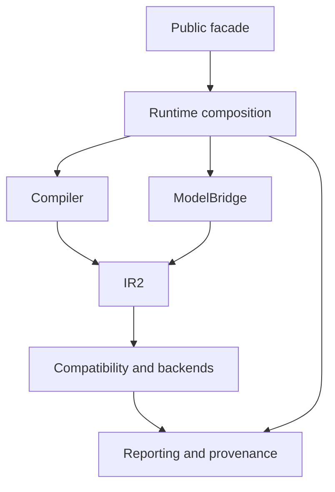

# C4 container view

> **Status:** As built for `1.0.0rc3`
>
> **Level:** logical containers inside the installed Python distribution

Toetra is distributed as one Python package. The containers below are logical
ownership boundaries, not independently deployed services.



## Containers

| Container | Source | Responsibility |
|---|---|---|
| Public facade | `src/toetra/__init__.py` | stable user imports |
| Runtime composition | `src/toetra/_runtime` | resolve request inputs, orchestrate properties, return sessions, replay |
| Language/compiler | `src/toetra/_language`, `src/toetra/_compiler` | grammar, AST, semantics, IR1, NNF, IR2 |
| ModelBridge | `src/toetra/_models` | loading, schema, semantic profiles, encoders, runtime observers |
| Numeric compatibility | `src/toetra/_compatibility` | qualify framework/encoder/backend numeric meaning and permitted conclusions |
| Backend adapters | `src/toetra/_backends` | capabilities, routing, translation, solver execution |
| Evidence | `src/toetra/_reporting`, `src/toetra/_provenance` | reports, renderers, fingerprints |
| Installed examples | `src/toetra/examples` | packaged resource lookup |

## Main interactions

### Request composition

```text
public verify(...)
→ runtime input resolution
→ compiler + ModelBridge
→ IR2 tasks
→ route and runner
→ reports
→ public session
```

### Compiler/ModelBridge convergence

The compiler receives `ModelSchema` during semantic validation. Model semantics
lower public observables before final NNF. The model encoder then emits
`AssumptionIR2` values only for evaluations discovered in the lowered property.
IR2 owns the final verification condition.

### Backend boundary

The router receives completed IR2 tasks and returns a `BackendRoute`. The
runtime runner registry maps that route to a concrete executor. Backend-native
objects stay inside the adapter.

### Evidence boundary

The report builder receives task, route, result, schema, and provenance context.
Renderers consume `VerificationReport`; they do not inspect Z3. Replay consumes
formal evidence and a concrete model through a runtime-observer protocol.

## Deployment statement

`1.0.0rc3` is a local library/runtime. It does not ship a server, remote worker,
monitoring daemon, distributed scheduler, or multi-service control plane.

## Stability statement

Only the public facade is versioned as public API. Logical container boundaries
are documented for contributors and can evolve under the accepted contracts
without exposing their Python types at the package root.
