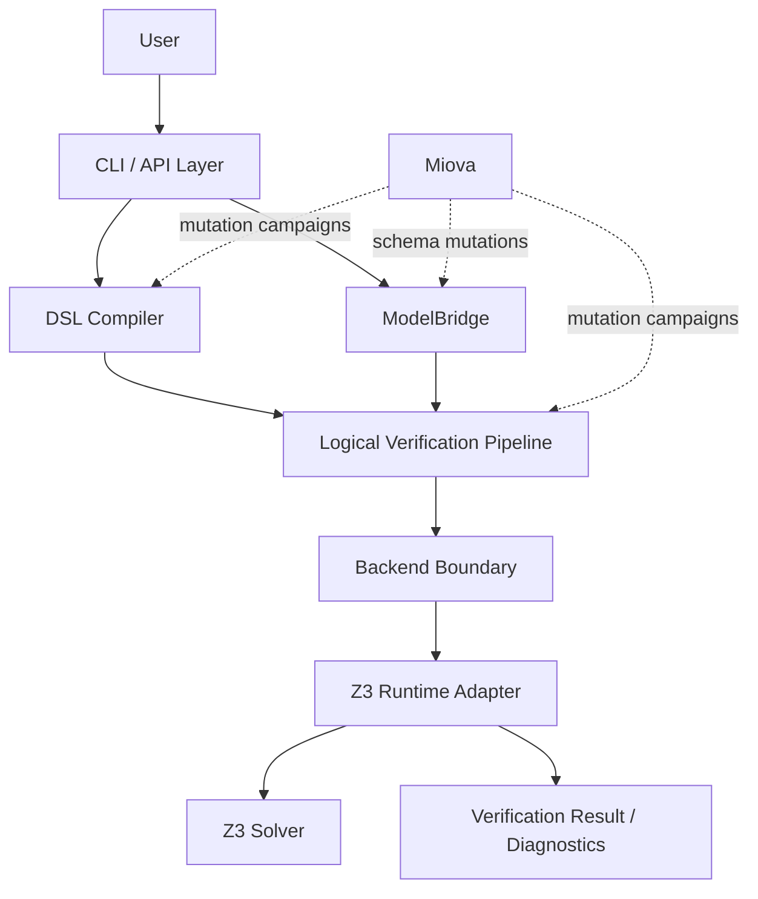

# C4 Container View

> Status: Stabilizing  
> Scope: Major Toetra containers
> Implementation: Current + target  
> V1 backend scope: Z3 only

## Purpose

This document describes the major containers that compose Toetra.

It answers:

```text
What are the main executable or logical subsystems inside Toetra?
```

In this documentation, “container” means a major runtime or architectural unit, not necessarily a Docker container.

---

## Container diagram



---

## Containers

| Container | Responsibility | Status |
|---|---|---|
| CLI / API Layer | Entry point for compiling or verifying Toetra specifications. | Planned / stabilizing |
| DSL Compiler | Parses, builds, validates and translates `.toetra` source. | Implemented until IR1 / stabilizing |
| ModelBridge | Loads and introspects ML models into `ModelSchema`. | Partially implemented |
| Logical Verification Pipeline | IR1, IR2, aggregation, lowering and backend query preparation. | Partially implemented / planned |
| Backend Boundary | Converts lowered queries into backend-specific artifacts. | Planned / critical |
| Z3 Runtime Adapter | Executes V1 backend queries against Z3. | Planned / critical |
| Verification Result / Diagnostics | Normalized output of verification execution. | Planned |
| Miova Integration | External mutation and contract validation layer. | Planned integration |

---

## Container responsibilities

### CLI / API Layer

The CLI/API layer should orchestrate the end-to-end path.

Responsibilities:

- accept `.toetra` files;
- accept model and dataset/schema inputs;
- trigger compiler pipeline;
- trigger ModelBridge;
- execute the Z3-backed verification runtime;
- expose diagnostics.

The CLI/API layer should not contain semantic logic. It should orchestrate existing services.

---

### DSL Compiler

The DSL Compiler transforms a user specification into semantically validated logical representations.

```text
.toetra → CST → AST → SemanticValidatedAST → IR1
```

Responsibilities:

- parsing;
- AST construction;
- scope validation;
- binding resolution;
- property compatibility validation;
- IR1 generation.

---

### ModelBridge

ModelBridge transforms model artifacts into normalized model metadata.

```text
model artifact → loader → detector → introspector → ModelSchema
```

Responsibilities:

- model loading;
- framework detection;
- feature extraction;
- task detection;
- target/schema normalization;
- future model constraint generation.

---

### Logical Verification Pipeline

The Logical Verification Pipeline progressively prepares the verification problem.

```text
IR1-NNF
→ IR2-CNF/DNF
→ AggregatedAssertionSet
→ LoweredQuery
→ BackendQuery
```

Responsibilities:

- De Morgan / NNF normalization in IR1;
- CNF/DNF selection in IR2;
- assertion aggregation;
- integration of model-derived constraints;
- simplification and minimization;
- backend query preparation.

---

### Backend Boundary

The Backend Boundary isolates the rest of Toetra from backend-specific details.

V1 target:

```text
LoweredQuery → Z3 BackendQuery
```

Responsibilities:

- backend-specific encoding;
- backend capability checks;
- backend diagnostics;
- no direct access to raw DSL or AST.

---

### Z3 Runtime Adapter

The Z3 Runtime Adapter executes the minimal V1 backend path.

Responsibilities:

- create Z3 variables and constraints;
- submit solver queries;
- interpret solver result;
- normalize results and diagnostics.

---

### Miova Integration

Miova is not part of the normal runtime verification path.

It is used to:

- mutate Toetra artifacts;
- validate layer contracts;
- test expected failures;
- run invariant checks;
- explore robustness boundaries.

---

## V1 container path

The minimal V1 execution path is:

```text
CLI/API
→ DSL Compiler
→ ModelBridge
→ Logical Verification Pipeline
→ Backend Boundary
→ Z3 Runtime Adapter
→ Verification Result
```

Multi-backend orchestration, ERAN, runtime monitoring and advanced backend capability routing are post-V1 concerns.

---

## Related documents

- `architecture/c4-context.md`
- `compiler/pipeline.md`
- `model-bridge/overview.md`
- `ir/overview.md`
- `runtime/verification-runtime.md`
- `backends/z3.md`
