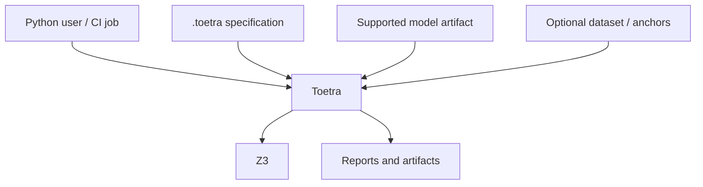

# C4 context view

> **Status:** As built for `1.0.0rc3`
>
> **Level:** system context

## System purpose

Toetra lets a Python user express behavioral properties in a `.toetra`
specification, verify them against a supported fitted model through Z3, inspect
structured evidence, and replay a concrete witness or counterexample.

## Actors and external systems

| Actor or system | Relationship to Toetra |
|---|---|
| Python user | calls the public `toetra` facade and interprets findings |
| CI/release job | executes the same API and uses session exit semantics/artifacts |
| `.toetra` specification | declares model reference, target, points, domains, properties, and backend hint |
| model artifact | supplies the fitted estimator used to build schema and equations |
| dataset/anchor source | may supply feature dtypes and exact referenced points |
| Z3 | executes the built-in V1 formal query |
| filesystem/notebook | receives text, HTML, JSON, records, or rendered findings |

## Trust boundaries

- Model and dataset files are external inputs; loading errors remain explicit.
- A parsed specification is not trusted until builder and semantic validation
  complete.
- A backend is not called until capabilities, numeric compatibility, and
  execution policy have been checked.
- A formal result applies to the encoded assumptions and numeric abstraction.
- Concrete replay is corroborating evidence for one assignment, not a second
  proof system.

## Public boundary

The supported integration surface is the root `toetra` package documented in
the [Python API reference](../api-reference/index.md). Compiler, model, backend,
runtime, reporting, and provenance packages beneath `toetra._*` are private.

The [public V1 profile](../public-v1-profile.md) defines which model and property
combinations cross the full system context successfully.

## Outside the current context

Miova mutation campaigns, runtime monitoring, remote execution, multi-backend
comparison, and autonomous retraining/deployment orchestration are not part of
the `1.0.0rc3` execution context.
