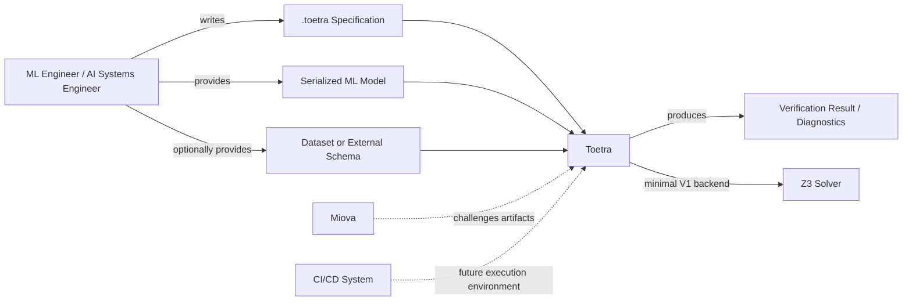

# C4 Context View

> Status: Stabilizing  
> Scope: System context  
> Implementation: Current + target  
> V1 backend scope: Z3 only

## Purpose

This document describes Toetra at the highest architectural level.

It answers:

```text
Who uses Toetra, what does Toetra interact with, and what problem does it solve?
```

Toetra is a behavioral specification and verification platform for machine learning systems. It allows a user to express behavioral properties in a `.toetra` DSL, validate those properties, connect them to model metadata through ModelBridge, and prepare backend-specific verification queries.

---

## Context diagram



---

## External actors

| Actor | Role |
|---|---|
| ML Engineer | Writes Toetra properties and provides model artifacts. |
| AI Systems Engineer | Integrates Toetra into model validation workflows. |
| Researcher | Uses Toetra to explore formal specification and ML verification ideas. |
| CI/CD System | Future execution environment for automated verification. |

---

## External systems

| System | Relationship |
|---|---|
| Serialized ML model | Input artifact consumed by ModelBridge. |
| Dataset / schema | Optional source of feature metadata. |
| Z3 | Minimal backend solver for the first V1. |
| Miova | External mutation framework used to challenge Toetra artifacts. |
| CI/CD | Future orchestration environment for automated checks. |

---

## Toetra responsibilities

At the context level, Toetra is responsible for:

- parsing user-defined `.toetra` specifications;
- validating syntax, structure, semantics, and property compatibility;
- introspecting ML models through ModelBridge;
- normalizing logical intent through IR layers;
- aggregating DSL assertions and model-derived constraints;
- lowering/minimizing verification problems;
- producing backend-specific queries;
- executing the minimal Z3-backed V1 verification path.

---

## Toetra non-responsibilities

Toetra should not be responsible for:

- training ML models;
- replacing ML frameworks;
- replacing Z3 or other solvers;
- mutating artifacts during normal runtime verification;
- supporting every backend before V1;
- performing production monitoring before the verification runtime is stable.

Miova is used for testing and mutation campaigns, not for normal verification execution.

---

## V1 context boundary

The first functional V1 should have this context boundary:

```text
User inputs:
    - .toetra specification
    - serialized sklearn/XGBoost-compatible model or external schema
    - optional dataset

Toetra processing:
    - compile DSL
    - build ModelSchema
    - validate semantics
    - generate IR1/IR2 path
    - aggregate and lower assertions

Backend:
    - Z3 only

Output:
    - verification result
    - diagnostics
    - traces if available
```

---

## Post-V1 context extensions

Post-V1 extensions may include:

- ERAN backend support;
- additional model frameworks;
- automatic backend selection;
- runtime monitoring;
- richer CI/CD integration;
- model checking integrations;
- proof artifacts or explanations.

These should remain outside the critical V1 path.

---

## Related documents

- `architecture/overview.md`
- `architecture/c4-container.md`
- `runtime/verification-runtime.md`
- `backends/z3.md`
- `miova/overview.md`
