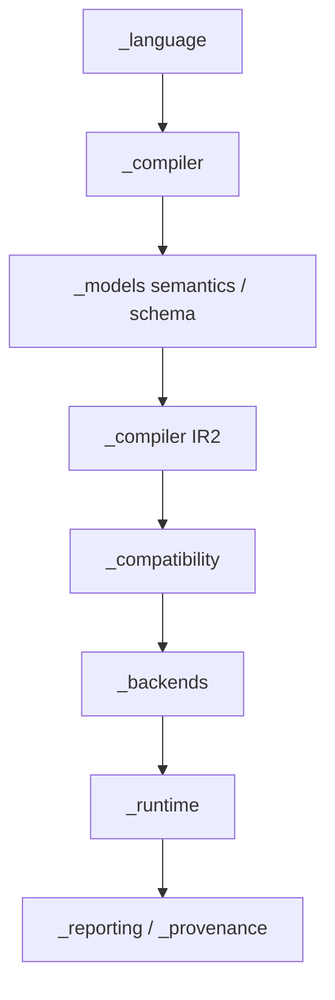

# Dependency direction

> **Status:** As built for `1.0.0rc4`
>
> **Scope:** internal package dependencies and forbidden coupling

Toetra uses one installed package, `toetra`, with a small public facade and
underscored implementation packages. Dependency direction follows the data flow
from language definitions to evidence; lower layers do not call the public
runtime to recover information they should receive explicitly.

## Package direction



The diagram is a responsibility view, not a claim that every package imports
only the node immediately above it. Shared typed artifacts cross explicit
boundaries.

## Allowed knowledge

| Consumer | May know |
|---|---|
| parser | generated grammar and source text |
| builder | CST shapes and AST node constructors |
| semantic validator | AST, language rules, `ModelSchema`, resolved anchors |
| IR1 translator | validated AST state and semantic annotations |
| model-semantic lowerer | IR1 output observables and `ModelSchema` |
| model encoder | `ModelSchema`, requested evaluations, encoding context |
| IR2 builder | NNF IR1, typed assumptions, build policy |
| compatibility layer | model/encoder/backend descriptors and IR2 numeric requirements |
| router | IR2 requirements, backend capabilities, numeric and execution policies |
| backend translator | routed `VerificationTaskIR2` |
| report builder | task, route, result, schema, lowering and provenance evidence |
| replay | report/formal evidence, concrete model, runtime observer |

## Forbidden coupling

| Forbidden dependency | Reason |
|---|---|
| AST or semantic modules importing Z3 | solver objects must not leak into compiler artifacts |
| IR2 inspecting sklearn/XGBoost estimator objects | framework state belongs to ModelBridge |
| a backend re-parsing `.toetra` source | backend input is already validated IR2 |
| a model encoder selecting a point from scope | exact requested evaluations are supplied explicitly |
| a renderer re-interpreting SAT/UNSAT | status interpretation belongs to the runner and policies |
| replay changing the formal report status | replay is post-proof evidence |
| internal code importing through the root facade | private code imports the concrete owning module |

## Runtime dependency assembly

`toetra._runtime.api.verify` is the composition root. It creates or receives:

- `ModelSchema` and the optional concrete model;
- model encoder and numeric compatibility descriptors;
- `IR2BuildContext`;
- backend capability and runner registries;
- execution policy;
- anchor resolver;
- provenance context.

The runtime passes these dependencies to the owning layers. Individual
components do not reach back into the runtime to obtain global state.

## Optional framework dependencies

Framework detection and introspection use guarded imports. Importing `toetra`
must not require every possible ML framework. A framework adapter may exist as
internal infrastructure without becoming a built-in public route.

The public V1 distribution requires the dependencies needed by its declared
sklearn and Z3 paths. Future adapters must preserve clean import behavior and
must not over-declare support when an optional dependency is absent.

## Backend isolation

IR2 owns backend-neutral requirements and assumptions. Backend-native artifacts
are created only inside an adapter:

```text
VerificationTaskIR2
→ capability/numeric/execution qualification
→ BackendRoute
→ backend translator
→ backend-private translation
→ VerificationResult
```

For Z3 the private artifact is `Z3Translation`. Another adapter is free to use a
different representation; it does not require a repository-wide
`BackendQuery` class.

The governing contracts are:

- [IR1 to IR2](../contracts/ir1-to-ir2.md);
- [IR to backend](../contracts/ir-to-backend.md);
- [backend execution](../contracts/backend-execution-contract.md);
- [numeric compatibility registry](../contracts/numeric-compatibility-registry.md).

## Public facade isolation

`src/toetra/__init__.py` re-exports only the nine supported public names.
Internal packages do not re-export implementation symbols through package
initializers. This keeps imports explicit and prevents source layout from
silently becoming public API.

See the [public V1 contract](../contracts/public-v1-contract.md) and
[repository contract](../contracts/repository-contract.md).
