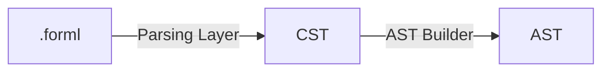
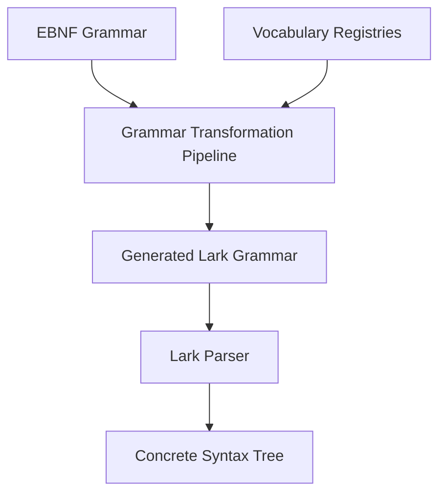
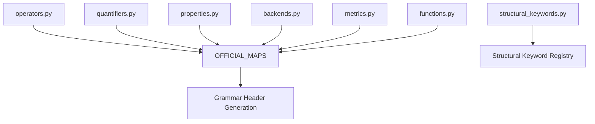
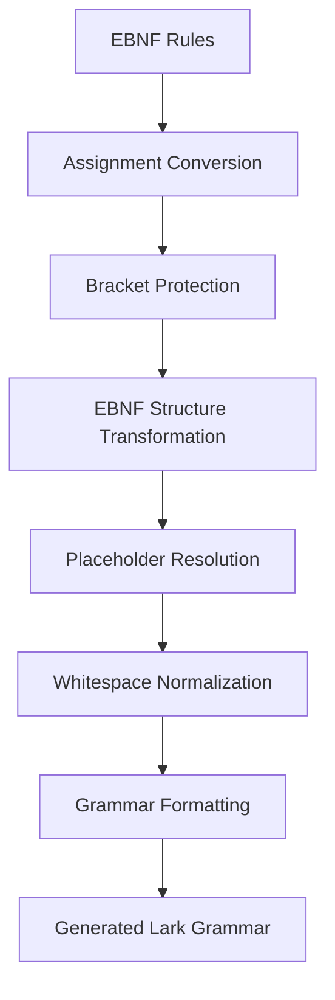
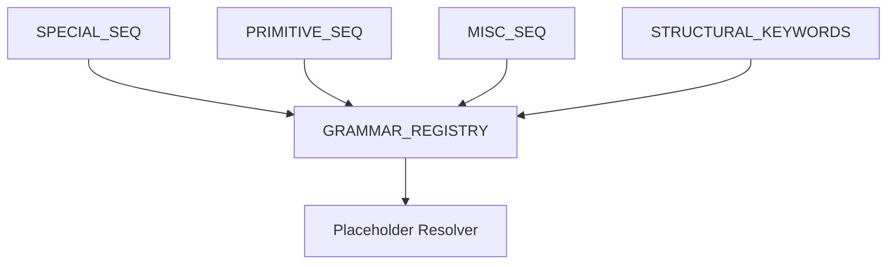
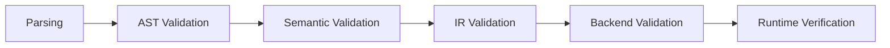

# Parsing Layer

## Introduction

The Parsing Layer is the entry point of the FORML DSL compilation pipeline.

Its responsibility is to transform a raw `.forml` specification into a deterministic syntactic representation consumable by downstream layers.

This layer is intentionally restricted to syntax-oriented concerns and must remain isolated from:

- semantic interpretation,
- logical reasoning,
- backend orchestration,
- runtime verification concerns.

The Parsing Layer guarantees syntactic correctness only.

Semantic correctness is intentionally deferred to subsequent layers of the pipeline.

---

# Architectural Position



The Parsing Layer is responsible for:

```text
.forml → Concrete Syntax Tree (CST)
```

No semantic interpretation must occur during this stage.

---

# Purpose

The purpose of the Parsing Layer is to:

* parse `.forml` specifications,
* apply the FORML grammar,
* generate deterministic syntax structures,
* validate grammar conformity,
* preserve syntactic hierarchy,
* provide syntax-oriented diagnostics.

---

# Responsibilities

The Parsing Layer is responsible for:

* EBNF grammar interpretation,
* grammar transformation,
* grammar generation,
* parser construction,
* tokenization,
* syntax validation,
* CST generation,
* syntax error reporting,
* grammar-level determinism.

---

# Non-Responsibilities

The Parsing Layer must NOT:

* resolve symbols,
* validate semantic correctness,
* validate typing constraints,
* perform logical rewriting,
* normalize logical expressions,
* perform backend reasoning,
* perform capability analysis,
* generate IR representations,
* interpret verification intent semantically.

These responsibilities belong to downstream layers.

---

# Parsing Architecture Overview

The FORML parsing infrastructure is composed of several distinct subsystems:



The parsing architecture relies on:

* grammar generation,
* vocabulary modularization,
* deterministic transformation passes,
* parser-driven syntax validation.

---

# Grammar Infrastructure

## EBNF as Source of Truth

The FORML grammar is primarily defined using an EBNF-like notation.

The EBNF grammar acts as the canonical syntax definition for the language.

The generated Lark grammar is considered a derived artifact.

---

## Backend Agnosticism

The FORML grammar must remain backend-agnostic.

The grammar defines:

* verification intent,
* logical structures,
* declarative constraints,
* user-facing semantics.

Backend-specific reasoning is intentionally deferred to later orchestration and compilation stages.

This separation ensures that FORML remains a high-level verification language rather than a backend-specific frontend abstraction.

---

## Vocabulary Registries

The parsing infrastructure relies on centralized vocabulary registries.

These registries provide reusable grammar fragments associated with domain-specific concepts.

Examples include:

* logical operators,
* comparison operators,
* quantifiers,
* backend identifiers,
* properties,
* metrics,
* DSL functions.

---

# Structural Keywords

The parsing infrastructure also defines structural language keywords.

These keywords are reserved syntactic constructs used to organize DSL expressions and introduce semantic clauses.

Unlike domain vocabulary, these keywords do not represent verification concepts themselves.

They instead define the structural organization of the language.

Examples include:

* `WITH`
* `IN`
* `AT`
* `USING`
* `TARGET`

---

# Vocabulary Architecture



The registries are centralized through:

```text
OFFICIAL_MAPS
```

This architecture allows:

* vocabulary modularization,
* grammar extensibility,
* centralized syntax evolution,
* deterministic grammar generation.

---

# Grammar Generation Pipeline

The parsing layer does not directly maintain a handwritten Lark grammar.

Instead, FORML relies on a grammar generation pipeline:

```text
EBNF → Generated Lark Grammar
```

---

# Grammar Transformation Pipeline



---

# Main Transformation Responsibilities

| Transformation Stage          | Responsibility                                 |
| ----------------------------- | ---------------------------------------------- |
| Assignment Conversion         | Convert EBNF assignment syntax into Lark rules |
| Bracket Protection            | Preserve escaped grammar symbols               |
| EBNF Structure Transformation | Convert optional and repeated constructs       |
| Placeholder Resolution        | Inject vocabulary registry definitions         |
| Normalization                 | Stabilize grammar formatting                   |
| Formatting                    | Produce deterministic grammar output           |

---

# Placeholder Resolution System

The grammar infrastructure supports placeholder replacement using centralized registries.

Examples:

```text
?official_properties?
?official_backends?
?official_logic_operations?
```

These placeholders are dynamically resolved during grammar generation.

---

# Grammar Registry Architecture



The registry system provides:

* reusable grammar fragments,
* primitive abstractions,
* regex primitives,
* domain-specific syntax injection,
* structural language markers.

---

# Header Generation

The parsing infrastructure dynamically generates shared Lark header sections.

These include:

* common imports,
* whitespace handling,
* comment handling,
* primitive tokens,
* shared grammar rules,
* official vocabulary definitions.

---

# Parser Engine

FORML currently relies on:

```text
Lark Parser
```

The parser engine is responsible for:

* tokenization,
* grammar application,
* parse tree construction,
* ambiguity resolution,
* syntax error detection.

---

# Syntax Validation

Syntax validation is primarily delegated to the parser engine through grammar conformity enforcement.

A specification is considered syntactically valid if it can be successfully parsed into a valid CST structure.

The Parsing Layer validates:

* grammar conformity,
* token validity,
* structural syntax consistency,
* delimiter correctness,
* operator placement,
* syntactic hierarchy.

---

# Important Architectural Distinction

The Parsing Layer guarantees:

```text
Syntactic Correctness
```

The Parsing Layer does NOT guarantee:

```text
Semantic Correctness
```

Example:

```text
always(x > "hello")
```

may be:

* syntactically valid,
* semantically invalid.

Semantic interpretation is intentionally deferred to downstream layers.

---

# Concrete Syntax Tree (CST)

## Purpose

The CST represents the raw syntactic structure produced by parsing.

It preserves:

* grammar hierarchy,
* token ordering,
* syntactic grouping,
* parsing context.

The CST intentionally remains close to the original grammar structure.

---

# CST Characteristics

The CST may contain:

* intermediate grammar nodes,
* grammar artifacts,
* punctuation-related structures,
* parsing-specific hierarchy,
* syntactic helper nodes.

The CST is considered a parsing-oriented intermediate representation.

---

# Progressive Validation Philosophy

FORML applies a layered validation strategy.

Each layer validates a specific class of guarantees before forwarding artifacts to downstream stages.

Validation guarantees therefore accumulate progressively across the pipeline.

---

# Validation Cascade



Each layer introduces stronger guarantees than the previous one.

---

# Error Model

The Parsing Layer is responsible for reporting:

* invalid grammar constructs,
* malformed expressions,
* invalid delimiters,
* tokenization failures,
* ambiguous syntax structures,
* unsupported syntax patterns.

Errors produced by this layer must remain syntax-oriented.

The parser must avoid introducing semantic assumptions into diagnostics.

---

# Architectural Invariants

## Grammar Determinism

A valid `.forml` specification must always produce the same CST.

---

## Syntax Isolation

The Parsing Layer must remain isolated from semantic interpretation concerns.

---

## Structural Preservation

The CST must preserve the syntactic organization of the original specification.

---

## Deterministic Grammar Generation

The same EBNF input and vocabulary registries must always generate the same Lark grammar.

---

## Backend Independence

The parsing layer must remain fully backend-agnostic.

No backend-specific semantic assumptions may influence grammar interpretation.

---

# Validation Guarantees

If the Parsing Layer succeeds, the following guarantees hold:

* the specification is syntactically valid,
* the grammar was successfully applied,
* the CST is structurally well-formed,
* parsing ambiguity has been resolved,
* token ordering is preserved,
* the generated parse structure is deterministic.

No semantic guarantees are provided at this stage.

---

# Layer Contracts

| Property           | Description                           |
| ------------------ | ------------------------------------- |
| Input              | `.forml` specification                |
| Output             | Concrete Syntax Tree (CST)            |
| Responsibility     | Syntax parsing and grammar validation |
| Deterministic      | Yes                                   |
| Semantic Awareness | No                                    |
| Backend Awareness  | No                                    |

---

# Interaction With Adjacent Layers

## Upstream

The Parsing Layer receives:

* raw `.forml` specifications.

---

## Downstream

The Parsing Layer provides:

* a CST consumed by the AST Builder layer.

The AST Builder is responsible for transforming grammar-oriented structures into semantic-oriented syntax representations.

---

# Extensibility

Future evolutions of the Parsing Layer may include:

* grammar modularization,
* grammar versioning,
* incremental parsing,
* IDE tooling integration,
* advanced diagnostics,
* parser optimization,
* dialect support,
* custom vocabulary injection.

---

# Related Documents

| Document      | Purpose                        |
| ------------- | ------------------------------ |
| `overview.md` | Global FORML architecture      |
| `pipeline.md` | Multi-view architectural views |
| `ast.md`      | AST construction layer         |
| `semantic.md` | Semantic validation layer      |

---

# Conclusion

The Parsing Layer forms the syntactic foundation of the FORML platform.

Its primary goal is to transform raw `.forml` specifications into deterministic structural representations while remaining strictly isolated from semantic and backend-specific concerns.

The layer relies on:

* grammar generation,
* vocabulary modularization,
* parser-driven validation,
* deterministic transformation pipelines,
* progressive validation principles.

This separation ensures:

* modularity,
* maintainability,
* architectural clarity,
* deterministic parsing behavior,
* and progressive formalization across the FORML pipeline.

