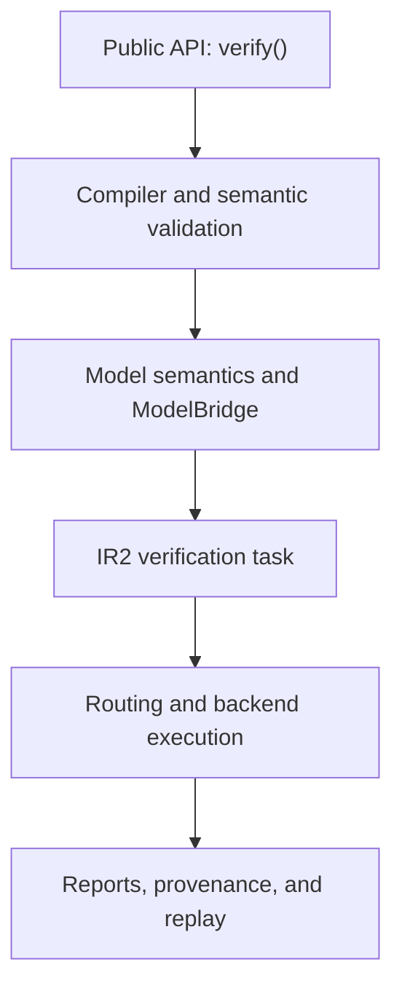

# Architecture overview

> **Status:** As built for `1.0.0rc4`
>
> **Audience:** maintainers, contributors, backend authors, and reviewers
>
> **Stability:** internal implementation; only the root `toetra` facade is public

Toetra is a staged compiler and verification runtime for declarative behavioral
properties of machine-learning models. The implementation keeps source syntax,
model-family meaning, formal verification conditions, backend execution, and
user-facing evidence in separate layers.

The executable V1 path is:

```text
.toetra source
→ CST
→ ProgramNode AST
→ semantic validation in place
→ VerificationTask (IR1)
→ model-semantic lowering + evidence
→ NNF normalization
→ VerificationTaskIR2 + typed assumptions
→ capability, numeric, and execution-policy routing
→ backend translation and execution
→ VerificationResult
→ VerificationReport + provenance
→ VerificationSession and optional concrete replay
```

This page describes that implementation. It does not widen the
[public V1 profile](../public-v1-profile.md) or make any `toetra._*` module a
supported import.

## System boundaries



| Boundary | Owned responsibility | Current artifact |
|---|---|---|
| Public runtime | Resolve files, model/schema inputs, anchors, policies, and session lifecycle | `VerificationSession` |
| Language and compiler | Parse, build, bind, type, and translate source intent | `ProgramNode`, then `VerificationTask` |
| Model semantics | Rewrite typed output observables into canonical model-family quantities | lowered `VerificationTask` plus evidence |
| ModelBridge | Normalize model metadata and encode equations for requested evaluations | `ModelSchema`, `AssumptionIR2` |
| IR2 | Build the property formula, assumptions, verification condition, requirements, and diagnostics | `VerificationTaskIR2` |
| Backend routing | Check structural capabilities, numeric compatibility, and execution controls | `BackendRoute` |
| Backend adapter | Translate an accepted IR2 task and execute it | backend-private translation, then `VerificationResult` |
| Evidence | Build stable reports, provenance fingerprints, renderings, and replay views | `VerificationReport`, `CounterexampleReplay` |

## Compiler path

The parser produces a Lark concrete syntax tree. The builder converts it into a
typed `ProgramNode` tree. `ToetraValidator` validates that AST in place and
records semantic resolution through contexts, symbols, point bindings, types,
and annotations. There is no separate `SemanticValidatedAST` runtime class.

`IRTranslator` then creates one backend-neutral `VerificationTask` per property.
IR1 retains the public observable and source meaning until the selected
model-family semantic profile performs any required rewrite. Final NNF
normalization happens after that rewrite because label equality and probability
predicates can introduce Boolean structure.

The governing boundaries are:

- [compiler pipeline contract](../contracts/compiler-pipeline.md);
- [AST to semantic contract](../contracts/ast-to-semantic.md);
- [semantic to IR1 contract](../contracts/semantic-to-ir1.md);
- [model-semantic lowering contract](../contracts/model-semantic-lowering.md);
- [IR1 to IR2 contract](../contracts/ir1-to-ir2.md).

## Model path

`verify(...)` accepts either a normalized `ModelSchema` or model artifacts from
which `ModelManager` builds one. Supplying both is rejected. The schema is used
during semantic validation and to select:

1. a model-family semantic profile for public output observables;
2. a model encoder for concrete model equations;
3. a numeric compatibility descriptor;
4. a runtime observer for replay.

The encoder receives the exact `(model, point, output)` evaluations discovered
from the lowered property. It emits one typed model assumption per requested
evaluation. It does not inspect a scope and guess a point.

The public V1 routes are direct fitted sklearn `LinearRegression` and binary
`LogisticRegression`. Detection or introspection infrastructure for another
framework is not an executable-support claim.

## IR2 and assumption composition

`IR2Builder` receives an NNF-normalized IR1 task and typed assumptions. It:

1. encodes anchor and domain assumptions;
2. collects those with model assumptions;
3. preserves the normalized source property as `spec_formula`;
4. builds the verification condition required by the quantifier semantics;
5. selects NNF, CNF, or DNF under the configured cost guardrails;
6. derives backend requirements, point mappings, and model evaluations;
7. validates the completed `VerificationTaskIR2`.

For universal refutation the executable condition is conceptually
`Γ ∧ ¬P`; for existential witness search it is `Γ ∧ P`. The assumptions remain
separately typed and traceable inside the task. There is no
`AggregatedAssertionSet` or `LoweredQuery` runtime type.

## Routing and backend execution

`BackendRouter` does not translate formulas. It chooses a registered backend
only after three checks agree:

- the backend capabilities satisfy `IR2Requirements`;
- the registered numeric compatibility rule permits the route;
- the backend can enforce the requested execution policy.

The selected `BackendRoute` records the backend, capabilities, reason, and
numeric assessment. The runtime then obtains the corresponding runner from
`BackendRunnerRegistry`.

For V1, `Z3Runner` asks `Z3Translator` to create a backend-private
`Z3Translation`, executes the solver under one total policy budget, and returns
a backend-neutral `VerificationResult`. No generic `BackendQuery` class crosses
this boundary.

See the [IR to backend contract](../contracts/ir-to-backend.md) and
[backend execution contract](../contracts/backend-execution-contract.md).

## Reports, provenance, and replay

The runtime applies numeric and semantic-lowering conclusion policies before
report construction. `build_verification_report(...)` then combines the IR2
task, route, result, schema, lowering evidence, and provenance context.

Reports are backend-neutral and serializable. They retain:

- the original source-level property;
- assumptions and backend assignments;
- route and execution evidence;
- numeric compatibility and lowering evidence;
- model-evaluation views;
- content and route fingerprints.

Replay is deliberately separate from proof. It executes the concrete model for
one formal witness or counterexample and compares the observed values with the
formal evidence. Replay can detect a mismatch; it cannot upgrade an exact-real
abstraction into a bit-exact global proof of framework execution.

See the
[reporting and replay contract](../contracts/output-reporting-and-replay.md) and
[verification provenance contract](../contracts/verification-provenance.md).

## Source ownership

| Source path | Responsibility |
|---|---|
| `src/toetra/_language` | EBNF source, generated grammar, and vocabulary |
| `src/toetra/_compiler/{parser,builder,ast,semantic}` | Source structure, binding, typing, and semantic validation |
| `src/toetra/_compiler/ir/ir1` | Backend-neutral declarative intent |
| `src/toetra/_models/semantics` | Model-family semantic lowering and evidence |
| `src/toetra/_compiler/ir/{normalization,ir2}` | NNF, assumptions, verification conditions, normal forms, and requirements |
| `src/toetra/_models/{loader,detector,introspector,schema,encoder}` | ModelBridge |
| `src/toetra/_compatibility` | Numeric route qualification and conclusion policy |
| `src/toetra/_backends` | Backend capabilities, routing, translation, and execution |
| `src/toetra/_runtime` | High-level orchestration, sessions, anchors, and replay |
| `src/toetra/_reporting`, `src/toetra/_provenance` | Reports, renderers, and reproducibility evidence |

## V1 exclusions

The architecture contains extension points, but V1 does not execute multiclass,
multi-output, nonlinear, tree, ensemble, neural-network, symbolic-preprocessing,
categorical-reasoning, alternating-quantifier, or non-Z3 routes. The
[status matrix](status-matrix.md) separates implemented infrastructure from
publicly executable behavior.
