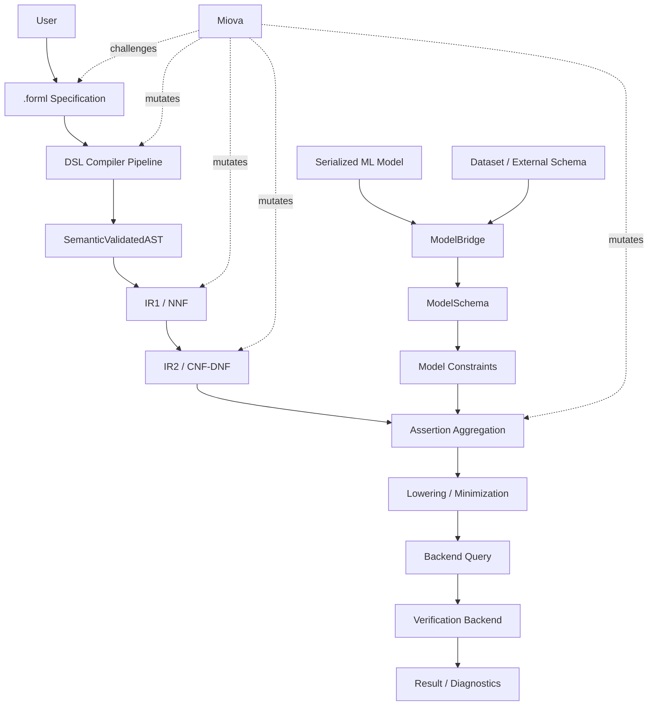

# Architecture Overview

> Status: P0 documentation baseline  
> Scope: Current and target FORML architecture  
> Implementation state: Partially implemented, with planned end-to-end logical verification pipeline

FORML is designed as an end-to-end behavioral verification architecture for machine learning systems.

It starts from a user-defined `.forml` specification and a model artifact, then progressively transforms them into a backend-specific verification query.

The architecture is intentionally layered so that each stage has a clear responsibility, artifact boundary, validation rule, and future mutation-testing surface.

## Architectural intent

FORML exists to bridge the gap between human-expressed ML behavioral requirements and formal or semi-formal verification backends.

It does this through a progressive pipeline:

```text
User intent
    ↓
DSL specification
    ↓
Compiler artifacts
    ↓
Semantic validation
    ↓
Logical IR
    ↓
Model-aware constraint integration
    ↓
Backend-specific verification
```

The key architectural principle is that user intent should not be lowered directly to a solver.

Instead, FORML introduces explicit intermediate artifacts that make the transformation inspectable, testable, and extensible.

## High-level architecture



## Primary pipelines

FORML has two primary input pipelines that converge before backend lowering.

### 1. DSL Compiler Pipeline

The DSL compiler pipeline transforms a `.forml` source file into semantically validated logical artifacts.

```text
.forml source
    ↓
CST
    ↓
AST
    ↓
SemanticValidatedAST
    ↓
IR1 / NNF
    ↓
IR2 / CNF-DNF
```

This pipeline answers:

> What does the user want to verify?

Current implementation status:

- source parsing exists,
- CST generation exists,
- AST builder exists,
- semantic validation exists,
- IR1 exists,
- IR1 is being shaped around logical normalization such as De Morgan and NNF,
- IR2 CNF/DNF is planned.

### 2. ModelBridge Pipeline

The ModelBridge pipeline transforms a model artifact and optional dataset/schema into a normalized model representation.

```text
model artifact
    ↓
loader
    ↓
loaded model
    ↓
framework detector
    ↓
introspector
    ↓
ModelSchema
    ↓
model constraints
```

This pipeline answers:

> What model is being verified, and what can be known about its features, task, target, and framework?

Current implementation status:

- model loaders exist for pickle/joblib/json-like paths,
- framework detection exists for sklearn and XGBoost foundations,
- introspection exists for sklearn and XGBoost-style models,
- `ModelSchema` and `FeatureSchema` exist,
- model constraint generation is planned.

## Convergence point

The DSL pipeline and ModelBridge pipeline converge at the model-aware verification preparation stage.

```text
IR2 Normal Forms
    +
Model Constraints
    +
Semantic Constraints
    ↓
Aggregated Assertion Set
```

This convergence is one of the most important parts of the architecture.

FORML should not merely check whether a `.forml` property is syntactically valid. It should eventually check whether that property is meaningful for the actual target model.

Examples:

- referenced features should exist in the model schema,
- constants should be compatible with feature types,
- problem functions should match the model task,
- robustness neighborhoods should match model input dimensions,
- backend selection should respect model and property constraints.

## Logical verification pipeline

After semantic validation, FORML enters the logical verification pipeline.

```text
SemanticValidatedAST
    ↓
IR1 / NNF
    ↓
IR2 / CNF-DNF
    ↓
Assertion Aggregation
    ↓
Lowering / Minimization
    ↓
Backend Query
```

### IR1 / NNF

IR1 is the first backend-independent logical representation.

It should preserve semantic resolution while normalizing logical structure.

Responsibilities include:

- representing verification tasks,
- representing semantic scopes,
- representing logical expressions,
- preserving resolved entity bindings,
- applying De Morgan transformations,
- pushing negations toward leaves,
- producing or enforcing Negation Normal Form.

### IR2 / CNF-DNF

IR2 is planned as the next logical layer.

It is responsible for selecting and producing normal forms according to verification needs.

CNF may be useful for:

- SAT/SMT-like solving,
- global consistency constraints,
- conjunction of clauses,
- backend-oriented symbolic encoding.

DNF may be useful for:

- scenario exploration,
- case splitting,
- counterexample search,
- mutation-driven boundary exploration.

IR2 should document whether each transformation preserves strict semantic equivalence or only equisatisfiability.

### Assertion Aggregation

Assertion aggregation combines multiple sources of constraints:

- user DSL assertions,
- semantic constraints from scopes, domains, neighborhoods, and bindings,
- model-derived constraints from ModelBridge,
- backend capability constraints,
- optional strategy constraints.

The output is an `AggregatedAssertionSet` or equivalent artifact.

### Lowering / Minimization

Lowering and minimization prepare aggregated assertions for backend-specific query generation.

Responsibilities include:

- simplification,
- redundancy elimination,
- symbolic preparation,
- backend-aware but not yet backend-specific rewriting,
- traceability of removed, merged, or transformed constraints.

### Backend Query

The backend query is the first artifact that belongs to a specific backend.

Before this boundary, FORML should remain as backend-agnostic as possible.

## Semantic layer

The semantic layer is the meaning boundary of the compiler.

It is responsible for:

- validating the left-hand side of properties,
- building semantic contexts,
- registering variables in a symbol table,
- resolving explicit and implicit attributes,
- validating logical expressions,
- checking problem/function compatibility,
- checking property/scope compatibility,
- attaching semantic annotations to downstream artifacts.

The semantic layer is also where future ModelSchema-aware validation will be integrated.

## Specification Constants and Name Resolution

Specification constants are program-level immutable values declared in the `.forml` header.

```forml
max_risk := 0.20
minimum_income := 25000.0
```

They participate in the compiler as a separate symbol kind:

```text
header declaration
→ SpecificationConstantDeclarationNode
→ program-level symbol registration
→ context-aware NameRef resolution
→ typed constant IR with provenance
```

The raw AST preserves a bare scalar name as `NameRefNode`. The semantic layer resolves it according to context:

- in assertions: specification constant first, otherwise implicit feature;
- in domain bounds: specification constant first, while features must remain explicit;
- in finite sets: specification constant first, otherwise symbolic categorical literal.

An explicitly qualified reference always denotes a feature. Specification constants are lowered as known literal values, not backend solver variables.

This design keeps the DSL concise while preserving deterministic compiler semantics.

## Backend-agnostic design

FORML separates:

- DSL syntax,
- user intent,
- semantic meaning,
- logical representation,
- model metadata,
- backend preparation,
- backend-specific encoding.

This separation allows FORML to support multiple backends over time without tying the DSL or semantic layer to one solver.

## Miova as external validation layer

Miova is external to the normal verification runtime.

It is used to challenge FORML itself.

Miova can mutate artifacts at several boundaries:

```text
source
CST
AST
SemanticValidatedAST
IR1
IR2
AggregatedAssertionSet
BackendQuery
ModelSchema
```

Its role is to test:

- contracts,
- invariants,
- expected failures,
- robustness of transformations,
- rejection of invalid artifacts,
- preservation of valid semantics when expected.

Miova therefore supports FORML's engineering quality, but does not replace FORML's verification backends.

## Current architecture vs target architecture

FORML documentation must always distinguish current implementation from target architecture.

| Area | Current | Target |
|---|---|---|
| DSL parser | Implemented | Stable parser with clean grammar boundaries. |
| AST builder | Implemented / stabilizing | Strict AST contracts and no accidental dynamic fields. |
| Semantic validation | Implemented / stabilizing | ModelSchema-aware semantic validation. |
| IR1 | Implemented / stabilizing | Stable NNF-oriented logical layer. |
| IR2 | Planned | CNF/DNF selection and transformation layer. |
| ModelBridge | Partially implemented | Full schema and model-constraint generation. |
| Aggregation | Planned | Combined verification problem. |
| Lowering | Planned | Simplified backend-preparation artifact. |
| Backend query | Planned | Backend-specific executable query. |
| Runtime | Planned | Execute and report verification results. |
| Monitoring | Research direction | Runtime behavioral observation. |
| Miova | External / planned integration | Mutation campaigns over FORML artifacts. |

## Architectural risks

The main risks to control are:

1. **Overclaiming future layers**  
   Planned components should be documented, but clearly labeled.

2. **Backend leakage**  
   Backend-specific logic should not contaminate parser, AST, or semantic layers.

3. **Semantic loss between layers**  
   Resolved bindings must be preserved from semantic validation into IR.

4. **Grammar / enum drift**  
   Vocabulary, generated grammar, and runtime enums must remain aligned.

5. **ModelBridge underuse**  
   ModelBridge should not remain a passive metadata extractor; it must become part of model-aware validation and constraint generation.

6. **Unclear mutation boundaries**  
   Miova integration requires explicit artifacts and expected outcomes.

## Documentation policy

Every FORML architecture document should include:

- current implementation state,
- target architecture,
- responsibilities,
- artifacts,
- invariants,
- failure modes,
- open questions.

This prevents the documentation from becoming either too vague or too tied to temporary implementation details.
