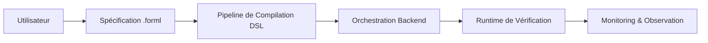

# Vue d’Ensemble de l’Architecture FORML

## Introduction

FORML est une plateforme de vérification formelle et de spécification comportementale conçue pour faire le lien entre des propriétés comportementales définies par l’utilisateur et des systèmes de vérification spécifiques à différents backends.

Le projet combine :

* l’ingénierie de DSL (Domain Specific Language),
* les méthodes formelles,
* les transformations logiques,
* l’orchestration multi-backend,
* le monitoring runtime et la validation comportementale.

FORML ne se limite pas à être un simple compilateur de DSL. Le système agit comme une couche d’orchestration sémantique capable :

* de comprendre l’intention de vérification de l’utilisateur,
* de représenter formellement des systèmes backend,
* de sélectionner des stratégies de vérification adaptées,
* de compiler des pipelines de vérification backend-aware,
* et de monitorer des garanties comportementales à l’exécution.

---

# Vue Système Haut Niveau

À haut niveau, FORML est composé de quatre grands sous-systèmes :

1. Pipeline DSL utilisateur
2. Pipeline de représentation backend
3. Système d’orchestration backend
4. Runtime de vérification et monitoring



---

# Philosophie Architecturale

FORML est conçu autour d’un principe de formalisation progressive.

Chaque étape du pipeline transforme un objet depuis une représentation peu contrainte vers une représentation plus formellement validée et sémantiquement précise.

L’architecture suit plusieurs principes fondamentaux :

* étapes de transformation explicites,
* isolation des couches,
* validation progressive,
* préservation sémantique,
* orchestration backend-agnostique,
* représentations intermédiaires formelles,
* observabilité runtime.

---

# Couches Architecturales

## 1. Pipeline de Compilation DSL

Le pipeline DSL transforme une spécification `.forml` en représentations formelles normalisées.

Ce pipeline est responsable :

* du parsing,
* de la validation syntaxique,
* de la validation sémantique,
* du lowering logique,
* des réécritures,
* de la normalisation.

### Étapes principales

```text
.forml
→ CST
→ AST
→ Validated AST
→ IR Level 1
→ IR Level 2
→ Normalized Forms
```

Le pipeline de compilation garantit que le sens sémantique est préservé tout au long des transformations.

---

## 2. Pipeline de Représentation Backend

FORML doit comprendre le système cible qu’il vérifie.

Le pipeline de représentation backend détecte et transcrit les modèles backend en représentations formelles validées.

Ce sous-système permet à FORML :

* de raisonner sur les capacités des backends,
* de mapper des propriétés logiques à des entités runtime,
* d’effectuer une vérification backend-aware,
* de supporter plusieurs cibles de vérification.

Exemples futurs de backends potentiels :

* modèles de machine learning,
* systèmes symboliques,
* environnements runtime,
* moteurs de vérification,
* infrastructures de monitoring.

---

## 3. Système d’Orchestration Backend

FORML est backend-agnostique.

Un backend de vérification peut :

* être explicitement spécifié par l’utilisateur,
* être sélectionné automatiquement,
* ou être choisi dynamiquement selon les contraintes de la propriété et les capacités backend.

Cette couche d’orchestration est responsable :

* de l’analyse des propriétés,
* du capability matching,
* du backend routing,
* de la sélection des stratégies de compilation,
* des diagnostics de compatibilité.

Ce sous-système constitue la base du futur système AutoFORML.

---

## 4. Runtime de Vérification & Monitoring

Une fois une stratégie backend sélectionnée, FORML compile les artefacts de vérification et exécute les pipelines de vérification runtime.

Ce sous-système est responsable :

* de l’exécution des vérifications,
* du monitoring runtime,
* de l’observation comportementale,
* de la collecte de traces,
* des diagnostics runtime.

---

# Représentations Intermédiaires (IR)

FORML utilise plusieurs représentations intermédiaires afin de formaliser progressivement l’intention utilisateur.

## IR Level 1

IR Level 1 représente la première représentation logique backend-indépendante produite après validation sémantique.

Son objectif principal est de :

* capturer la sémantique formelle,
* détacher la logique de la syntaxe DSL,
* fournir une base stable de transformation.

---

## IR Level 2

IR Level 2 est dédié :

* à la normalisation,
* aux réécritures,
* aux optimisations,
* à la canonicalisation,
* à la préparation des transformations backend-aware.

Cette représentation sert de base à des systèmes de transformations formelles tels que :

* NNF,
* CNF,
* DNF,
* et de futures passes de transformation logique.

---

# Philosophie de Validation

La validation est une préoccupation architecturale de premier ordre dans FORML.

Chaque couche peut introduire sa propre étape de validation.

Exemples :

| Couche                 | Type de Validation               |
| ---------------------- | -------------------------------- |
| Parsing                | Validation syntaxique            |
| AST                    | Validation structurelle          |
| Couche sémantique      | Validation des types et symboles |
| Couches IR             | Validation de cohérence logique  |
| Représentation backend | Validation des capacités backend |
| Runtime                | Vérification comportementale     |

L’objectif est d’augmenter progressivement les garanties de confiance à travers le pipeline.

---

# Préservation Sémantique

L’un des invariants architecturaux centraux de FORML est la préservation sémantique.

Toutes les étapes de transformation doivent préserver le sens logique de la spécification utilisateur originale.

Cela inclut :

* les réécritures logiques,
* les normalisations,
* les lowerings backend,
* les passes d’optimisation.

L’équivalence sémantique est considérée comme un invariant critique du système.

---

# Architecture Backend-Agnostique

FORML est volontairement conçu comme un système backend-agnostique.

Le système sépare :

* l’intention utilisateur,
* la sémantique logique,
* la représentation backend,
* la stratégie runtime de vérification.

Cette séparation permet :

* l’extensibilité,
* le support multi-backend,
* la spécialisation backend,
* le routage dynamique,
* la sélection automatique de stratégies.

---

# Directions Futures

L’architecture est volontairement conçue pour supporter des extensions futures telles que :

* la sélection automatique AutoFORML,
* les systèmes de scoring de capabilities,
* l’instrumentation runtime avancée,
* la vérification distribuée,
* les extensions de logique temporelle,
* les intégrations de model checking,
* la génération de preuves formelles,
* les systèmes d’explicabilité,
* les stratégies d’optimisation de vérification.

---

# Structure de la Documentation

La documentation d’architecture est organisée en plusieurs sections dédiées.

```text
architecture/
├── overview.md
├── pipeline.md
├── layers/
│   ├── parsing.md
│   ├── ast.md
│   ├── semantic.md
│   ├── logic_ir.md
│   ├── nnf.md
│   ├── cnf.md
│   ├── dnf.md
│   ├── execution_plan.md
│   └── backend.md
```

Chaque document se concentre sur une préoccupation architecturale spécifique et définit :

* les responsabilités,
* les invariants,
* les garanties,
* les règles de transformation,
* les contraintes de validation,
* et les interactions avec les couches adjacentes.

---

# Conclusion

FORML vise à fournir une infrastructure formelle unifiée capable de relier :

* l’intention comportementale utilisateur,
* le raisonnement logique formel,
* la vérification backend-aware,
* et le monitoring comportemental runtime.

L’architecture met l’accent sur :

* la modularité,
* la correction formelle,
* l’extensibilité,
* l’observabilité,
* et la rigueur sémantique.

Cette documentation constitue la base de stabilisation et
