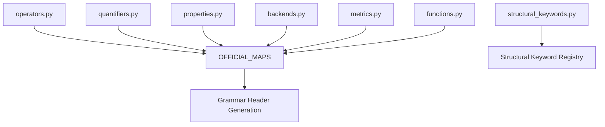

# Vocabulary Registry Architecture

## 1. Purpose

Centralize reusable vocabulary fragments used by grammar generation.

---

## 2. Responsibilities

Vocabulary registries provide:

- logical operators,
- quantifiers,
- metrics,
- functions,
- backend identifiers,
- DSL primitives.

---

## 3. Architecture

---

## 4. Invariants

* Vocabulary injection must remain deterministic.
* Registry composition must remain centralized.
* Vocabulary definitions must remain backend-agnostic.
