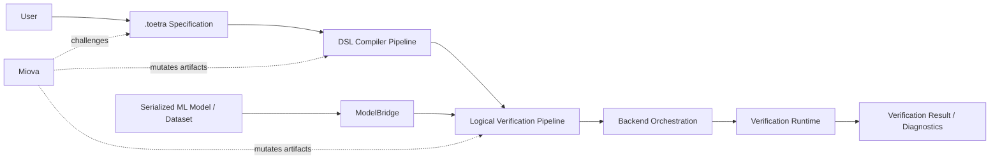
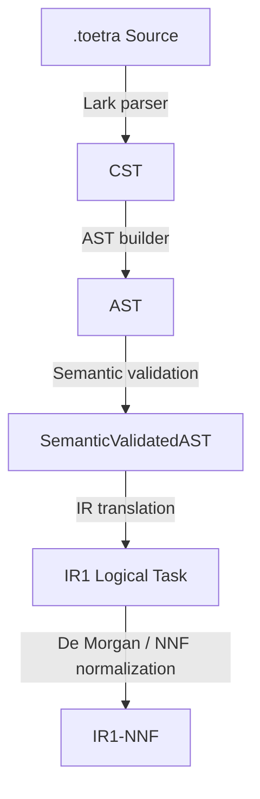
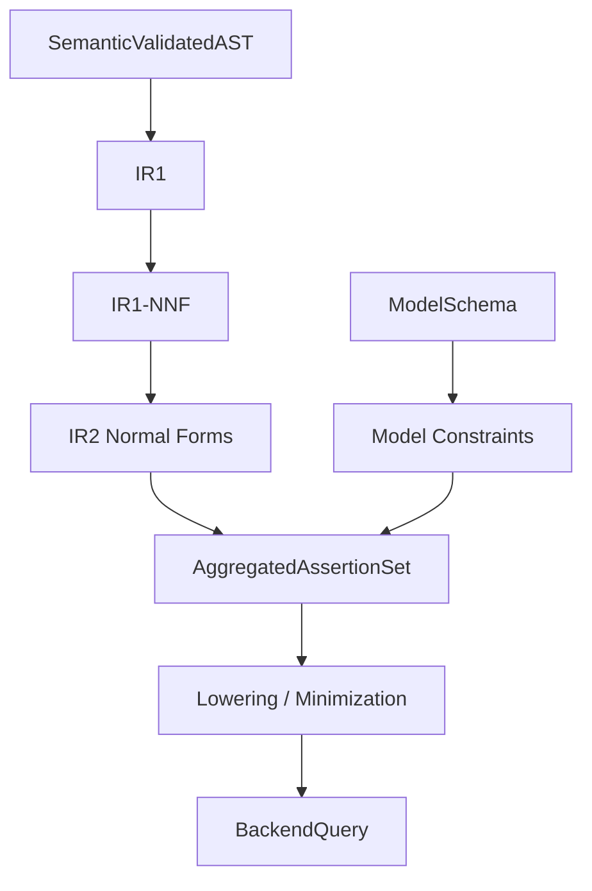
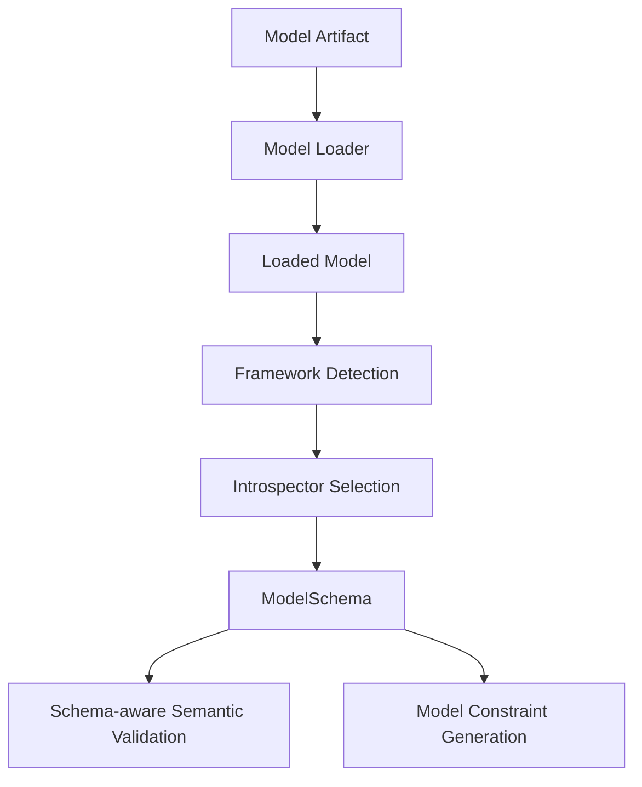
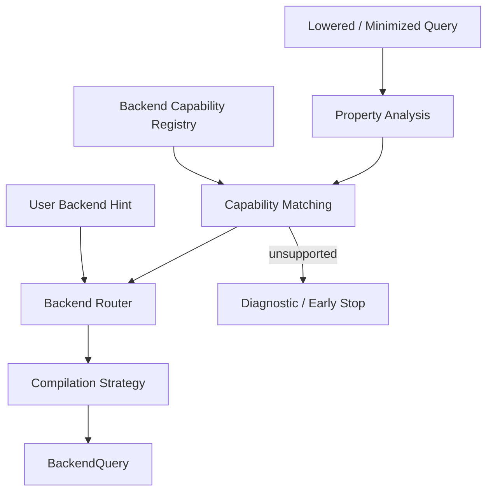
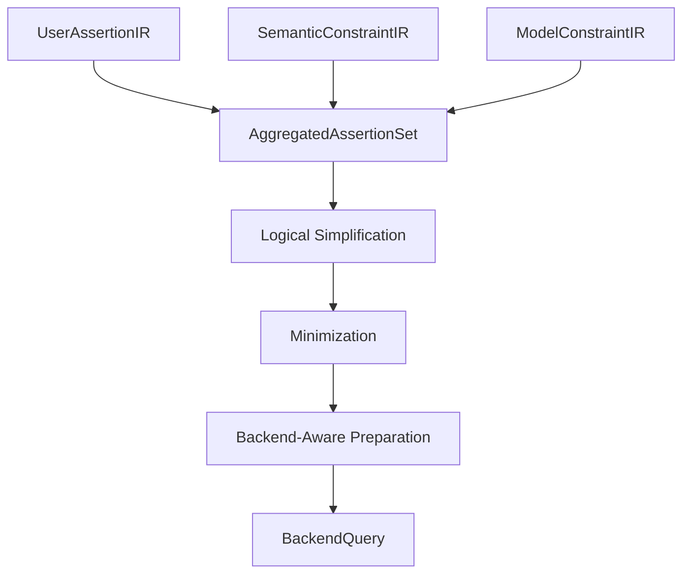
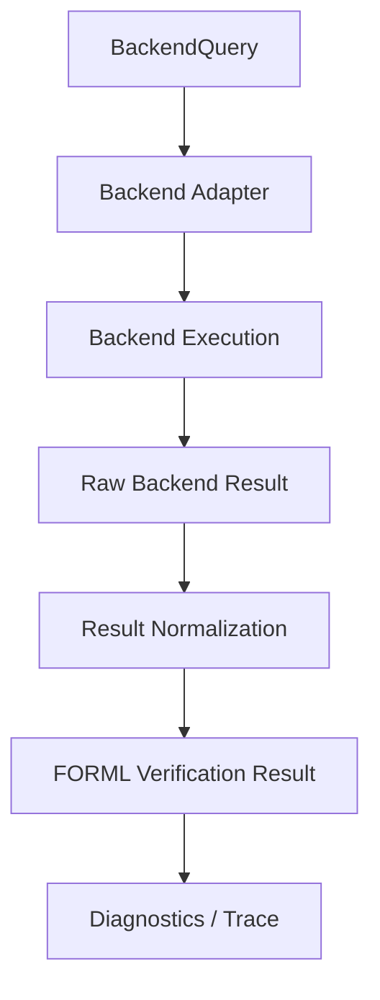
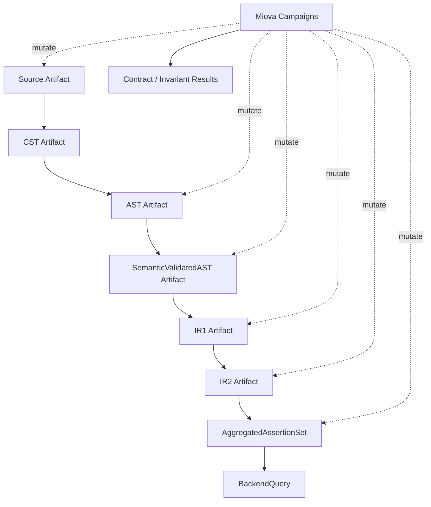
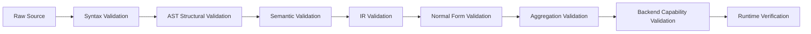

# FORML Pipeline Views

> Status: **P0 — target architecture, partially implemented**  
> Scope: **architecture views**  
> Audience: contributors, maintainers, reviewers, and future backend authors

## Purpose

This document presents FORML through multiple complementary architectural views.

Its purpose is not to describe every implementation detail. Its purpose is to make the end-to-end architecture understandable before all implementation layers are complete.

FORML is designed as an end-to-end behavioral specification and verification platform for machine learning systems. A complete FORML request is expected to combine:

- a `.toetra` specification expressing behavioral properties;
- a model artifact or model schema handled through ModelBridge;
- a compiler pipeline that transforms the DSL into semantic and logical intermediate representations;
- a logical verification pipeline that normalizes, aggregates, lowers, and prepares assertions;
- one or more verification backends;
- optional mutation campaigns powered by Miova to challenge compiler boundaries.

This document separates those concerns into views so that each subsystem can evolve without making the global architecture ambiguous.

---

## Implementation status legend

| Status | Meaning |
|---|---|
| Implemented | The subsystem exists in the current codebase. |
| Stabilizing | The subsystem exists but its API, invariants, or edge cases still need to be hardened. |
| Planned | The subsystem is architecturally required but not yet implemented. |
| Research direction | The subsystem is part of the long-term vision and may change significantly. |

---

## 1. Global system view

### Question answered

What is FORML globally?

### View

### Responsibilities

| Subsystem | Responsibility | Status |
|---|---|---|
| `.toetra` specification | Express user verification intent. | Implemented / stabilizing |
| DSL Compiler Pipeline | Parse, build, validate, and translate DSL properties. | Implemented until IR1 |
| ModelBridge | Load and introspect ML models into normalized schemas. | Partially implemented |
| Logical Verification Pipeline | Normalize and prepare logical assertions. | Structural IR1 implemented; NNF and later stages planned |
| Backend Orchestration | Select backend strategies and route queries. | Planned |
| Verification Runtime | Execute backend-specific verification workflows. | Planned |
| Miova | Challenge FORML artifacts through mutation campaigns. | External integration planned |

### Architectural position

FORML should not be understood as a parser only. It is a layered verification architecture where user intent, model metadata, logical constraints, and backend capabilities are progressively aligned.

---

## 2. DSL compiler pipeline view

### Question answered

How does FORML transform a `.toetra` specification into a validated logical representation?

### View

### Stage responsibilities

| Stage | Role | Status |
|---|---|---|
| Source | Raw `.toetra` text. | Implemented |
| CST | Concrete syntax tree produced by the parser. | Implemented |
| AST | Typed structural representation of the DSL. | Implemented / stabilizing |
| SemanticValidatedAST | AST enriched with semantic context and bindings. | Implemented / stabilizing |
| IR1 | First backend-independent logical representation. | Implemented / stabilizing |
| IR1-NNF | Logical form after negation normalization. | Planned / critical |

### Guarantees

The compiler pipeline progressively increases guarantees:

1. **Parser boundary**: the source conforms to grammar-level syntax.
2. **Builder boundary**: the CST is converted into typed FORML nodes.
3. **Semantic boundary**: scopes, variables, implicit entities, and compatibility rules are resolved.
4. **IR1 boundary**: the logical assertion is detached from DSL syntax and represented as backend-independent logical structure.
5. **IR1-NNF boundary**: planned boundary where negations are pushed to leaves and boolean structure is normalized for later transformation.

### Non-goals of this view

This view does not describe CNF/DNF, assertion aggregation, model constraints, backend lowering, or runtime execution. Those belong to later views.

---

## 3. Logical verification pipeline view

### Question answered

How does FORML prepare semantic logical intent for backend verification?

### View

### Stage responsibilities

| Stage | Role | Status |
|---|---|---|
| IR1 | Represent property scope and logical query. | Implemented / stabilizing |
| IR1-NNF | Apply De Morgan and negation normalization. | Planned / critical |
| IR2 | Select and produce CNF or DNF depending on verification needs. | Planned / critical |
| Model Constraints | Produce model-side constraints from ModelBridge. | Planned / critical |
| AggregatedAssertionSet | Combine DSL assertions, semantic constraints, and model constraints. | Planned / critical |
| Lowering / Minimization | Simplify, reduce, and prepare solver/backend expressions. | Planned / critical |
| BackendQuery | Backend-specific verification artifact. | Planned |

### IR1 vs IR2

IR1 and IR2 must not be confused.

IR1 currently captures the validated property in a backend-independent structure. The planned IR1-NNF subphase is responsible for early logical normalization through implication handling, De Morgan transformations, and NNF-style negation pushing.

IR2 is responsible for backend-preparation logical forms. It selects CNF, DNF, or another canonical form depending on the verification strategy.

| IR layer | Main concern | Typical forms |
|---|---|---|
| IR1 | Backend-independent logical task | structural logical IR |
| IR1-NNF | Logical normalization | NNF |
| IR2 | Backend-preparation normal forms | CNF, DNF |

### Assertion aggregation

Backend queries should not be generated from isolated DSL assertions alone.

A complete verification problem may combine:

- assertions written by the user in the DSL;
- semantic constraints introduced by scopes, domains, neighborhoods, and quantifiers;
- model constraints derived from ModelBridge;
- backend capability constraints or preconditions;
- simplifications or minimizations introduced before backend encoding.

This aggregation layer is the bridge between “what the user asked” and “what the backend must verify”.

---

## 4. ModelBridge / model representation view

### Question answered

How does FORML understand the target ML model?

### View

### Responsibilities

| Component | Responsibility | Status |
|---|---|---|
| Loader | Load serialized model artifacts. | Partially implemented |
| Detector | Detect the model framework. | Partially implemented |
| Introspector | Extract model metadata and features. | Partially implemented |
| ModelSchema | Normalize model representation. | Implemented / stabilizing |
| Schema-aware semantic validation | Validate DSL references against model features. | Planned / critical |
| Model constraint generation | Produce model-side constraints for aggregation. | Planned / critical |

### Architectural role

ModelBridge is not only a metadata extraction subsystem.

It is the bridge between:

- ML framework-specific objects;
- FORML semantic validation;
- future model constraint generation;
- backend lowering.

A `.toetra` specification says what should be verified. ModelBridge determines what the specification can refer to and what model-side constraints must be introduced before verification.

---

## 5. Backend orchestration view

### Question answered

How does FORML select and prepare verification backends?

### View

### Responsibilities

- Analyze property type, scope, logical form, and required model constraints.
- Match the verification request with backend capabilities.
- Respect explicit backend choices when provided by the user.
- Fail early when no backend can soundly handle the request.
- Select the compilation strategy required by the chosen backend.

### Status

Backend orchestration is a planned subsystem.

The architecture should still document it early because it affects upstream contracts: IR2, aggregation, lowering, and backend query generation must produce artifacts that a router can reason about.

---

## 6. Assertion aggregation and lowering view

### Question answered

How are DSL assertions and model constraints composed before backend encoding?

### View

### Responsibilities

| Stage | Responsibility | Status |
|---|---|---|
| UserAssertionIR | Logical content expressed in the DSL. | Implemented through IR1, evolving |
| SemanticConstraintIR | Constraints introduced by scope, domain, neighborhood, quantifier, and typing. | Planned / critical |
| ModelConstraintIR | Constraints introduced from model schema and model representation. | Planned / critical |
| AggregatedAssertionSet | Unified verification problem. | Planned / critical |
| Simplification | Remove trivial or redundant logical structure. | Planned |
| Minimization | Reduce the logical problem before backend encoding. | Planned |
| Backend-aware preparation | Prepare without fully leaking backend-specific implementation. | Planned |

### Key invariant

Aggregation and minimization must preserve either:

- **semantic equivalence**, when transformations are exactly equivalent; or
- **equisatisfiability**, when auxiliary variables or backend-oriented rewrites are introduced.

The selected guarantee must be explicit and traceable.

---

## 7. Verification runtime view

### Question answered

How does a backend-specific query become a verification result?

### View

### Responsibilities

- Execute backend-specific verification queries.
- Normalize backend results into FORML-level results.
- Preserve diagnostics and traces.
- Explain unsupported cases and failure modes.
- Prepare future monitoring or runtime observation flows.

### Status

The verification runtime is planned. Runtime monitoring remains a research direction.

---

## 8. Miova mutation and contract validation view

### Question answered

How does FORML challenge its own compiler and verification pipeline?

### View

### Role of Miova

Miova is not part of the normal FORML verification path.

Miova is used to:

- mutate FORML artifacts;
- challenge layer boundaries;
- validate expected failures;
- detect compiler fragility;
- verify contract and invariant behavior;
- explore the robustness limits of FORML properties and transformations.

### Boundary rule

FORML owns the verification pipeline.

Miova owns mutation campaigns and artifact challenge strategies.

This separation is important: FORML should remain a verification platform, while Miova remains a domain-agnostic mutation and exploration framework.

---

## 9. Validation-oriented view

### Question answered

How does FORML progressively increase confidence across the platform?

### View

### Validation philosophy

Validation is not a single phase. It is a progressive architectural principle.

Each layer introduces stronger guarantees than the previous layer:

| Boundary | Guarantee |
|---|---|
| Source → CST | Syntax is accepted by the grammar. |
| CST → AST | Syntax is converted into typed structural nodes. |
| AST → SemanticValidatedAST | Scopes, symbols, and bindings are resolved. |
| SemanticValidatedAST → IR1 | DSL syntax is detached from logical representation. |
| IR1 → IR2 | Logical forms are normalized for verification needs. |
| IR2 → AggregatedAssertionSet | User assertions and model constraints are composed. |
| AggregatedAssertionSet → BackendQuery | Logical problem is lowered and prepared for execution. |
| BackendQuery → Result | Verification outcome is normalized into FORML diagnostics. |

---

## View separation rationale

FORML separates architectural views because the system is not a simple linear compiler.

It is at once:

- a DSL compiler;
- a semantic validation engine;
- a logical normalization pipeline;
- a model representation bridge;
- a backend preparation layer;
- a future verification runtime;
- a mutation-tested artifact pipeline.

Keeping those concerns separate prevents the documentation from collapsing into a single overloaded pipeline diagram.

---

## Related documents

| Document | Purpose |
|---|---|
| `architecture/overview.md` | High-level architecture and subsystem status. |
| `architecture/runtime-flow.md` | End-to-end flow of one FORML request. |
| `architecture/status-matrix.md` | Current implementation status of each subsystem. |
| `compiler/pipeline.md` | Technical compiler pipeline. |
| `contracts/compiler-pipeline.md` | Artifact contracts between compiler layers. |
| `model-bridge/overview.md` | ModelBridge responsibilities and flow. |
| `ir/ir1-nnf.md` | IR1 and NNF normalization details. |
| `ir/ir2-normal-forms.md` | Planned IR2 CNF/DNF design. |
| `miova/overview.md` | Miova integration boundaries. |
