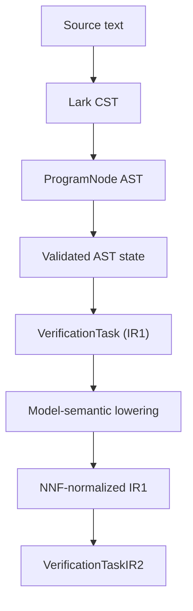
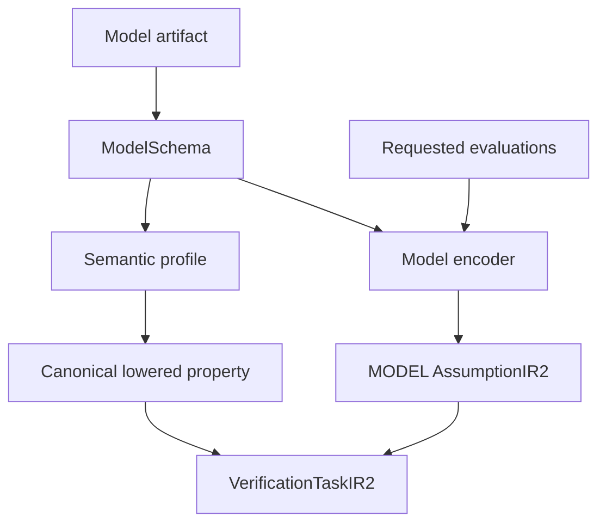
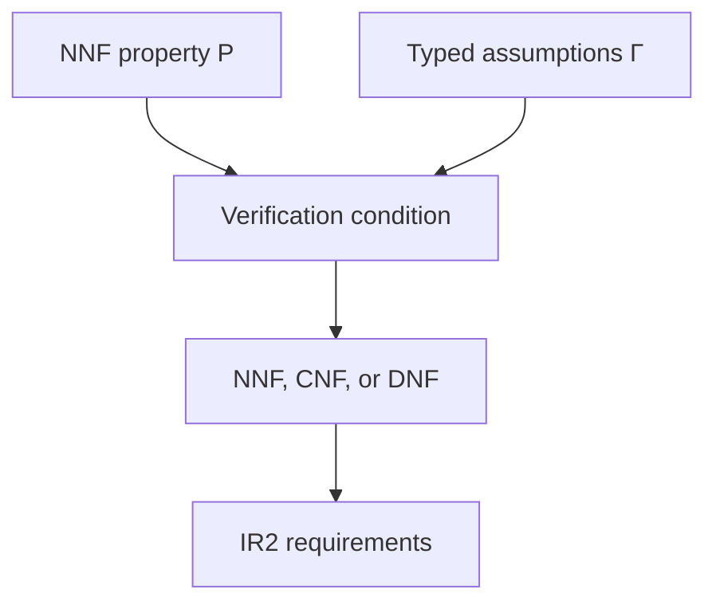
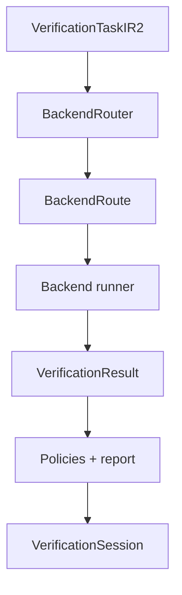
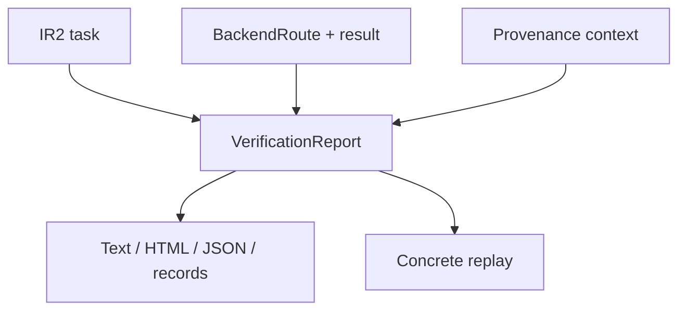

# Pipeline views

> **Status:** As built for `1.0.0rc4`
>
> **Scope:** internal data flow and ownership

The same verification request can be read from three complementary views:
compilation, model integration, and execution. All three converge in
`VerificationTaskIR2`; they are not independent pipelines joined by an
unimplemented aggregation layer.

## Compilation view



| Transition | Producer | Guarantee added |
|---|---|---|
| source → CST | `parse_toetra_code` | grammar acceptance |
| CST → AST | `parse_program` | typed syntax nodes |
| AST → validated AST state | `ToetraValidator` | bindings, points, types, output-observable compatibility |
| validated AST → IR1 | `IRTranslator` | source-independent logical task |
| IR1 → lowered IR1 | `ModelSemanticLowerer` | model-family meaning and lowering evidence |
| lowered IR1 → NNF | `NNFNormalizer` | no implication; negation only above atoms |
| NNF IR1 → IR2 | `IR2Builder` | assumptions, verification condition, normal form, requirements, diagnostics |

Semantic validation enriches the existing AST and supporting context. The label
“semantic AST” may describe that state conceptually, but it is not a Python
artifact named `SemanticValidatedAST`.

## Model integration view



`ModelSchema` is the only framework-neutral model description consumed by the
compiler. The selected semantic profile says what a public output observable
means for the model family. The selected encoder materializes equations from a
concrete estimator.

These roles must remain separate:

| Role | Question answered |
|---|---|
| Schema | What features, output, task, framework, and model family exist? |
| Semantic profile | What does `label` or `probability(label)` mean mathematically? |
| Encoder | What equation represents this fitted model at each requested point? |
| Compatibility policy | Which conclusions remain sound for this numeric route? |
| Runtime observer | What does the concrete model return during replay? |

## Verification-condition view



`VerificationTaskIR2` retains both the source property and the executable
condition. Assumptions are tagged by source, including domain, anchor, and
model assumptions. Under the implemented semantics:

| Scope semantics | Executable condition | SAT means |
|---|---|---|
| universal refutation | `Γ ∧ ¬P` | counterexample |
| existential witness | `Γ ∧ P` | witness |

The builder may retain NNF or select CNF/DNF. Cost guardrails prevent an
unbounded distributive expansion. Backend requirements are derived from the
actual selected form and every assumption.

## Execution view



Routing is fail-closed. A route exists only if structural capabilities, numeric
compatibility, and execution controls all match. Translation belongs to the
selected runner, after routing.

For the built-in route:

```text
VerificationTaskIR2
→ Z3Translator
→ Z3Translation
→ Z3Runner
→ VerificationResult
```

`Z3Translation` is backend-private. A future backend may use a different native
artifact without changing IR2.

## Evidence view



The report builder is the convergence point for proof evidence. Rendering does
not re-interpret solver status. Replay does not participate in the proof; it
observes the concrete model after a witness or counterexample is available.

## Boundary contracts

| Boundary | Contract |
|---|---|
| source → compiler artifacts | [Compiler pipeline](../contracts/compiler-pipeline.md) |
| semantic state → IR1 | [Semantic to IR1](../contracts/semantic-to-ir1.md) |
| public observable → canonical constraint | [Model semantic lowering](../contracts/model-semantic-lowering.md) |
| IR1 → IR2 | [IR1 to IR2](../contracts/ir1-to-ir2.md) |
| IR2 → backend | [IR to backend](../contracts/ir-to-backend.md) |
| backend attempt | [Backend execution](../contracts/backend-execution-contract.md) |
| result → report/replay | [Output reporting and replay](../contracts/output-reporting-and-replay.md) |
