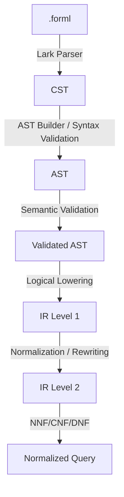
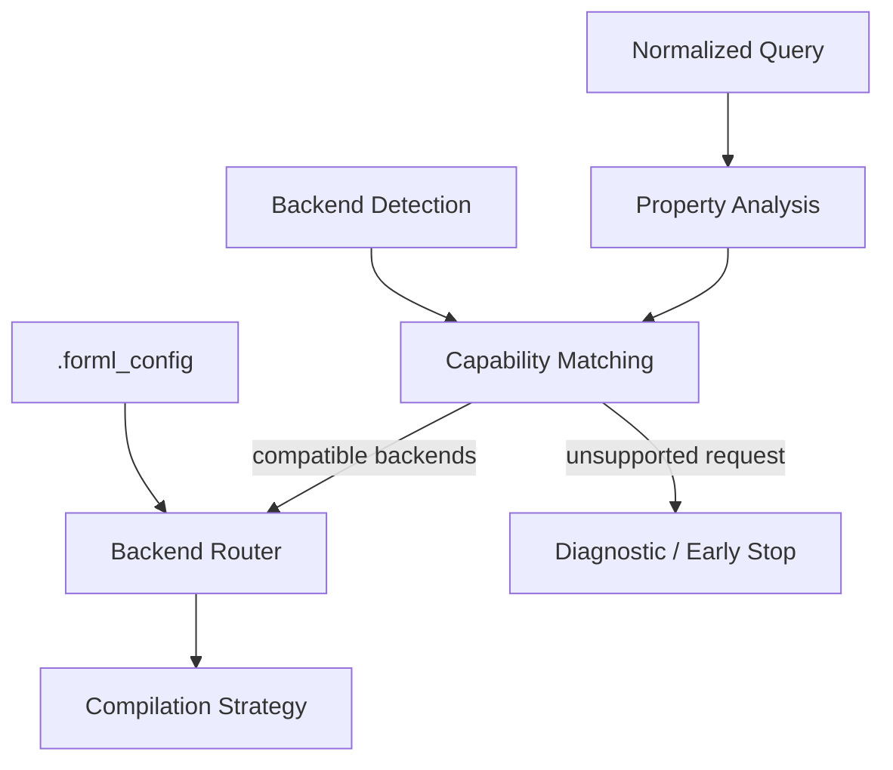
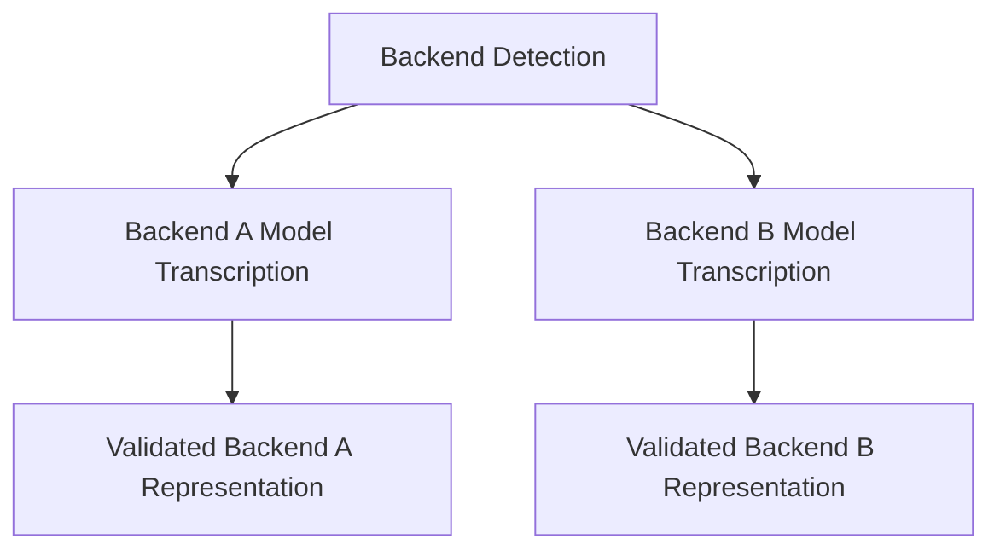
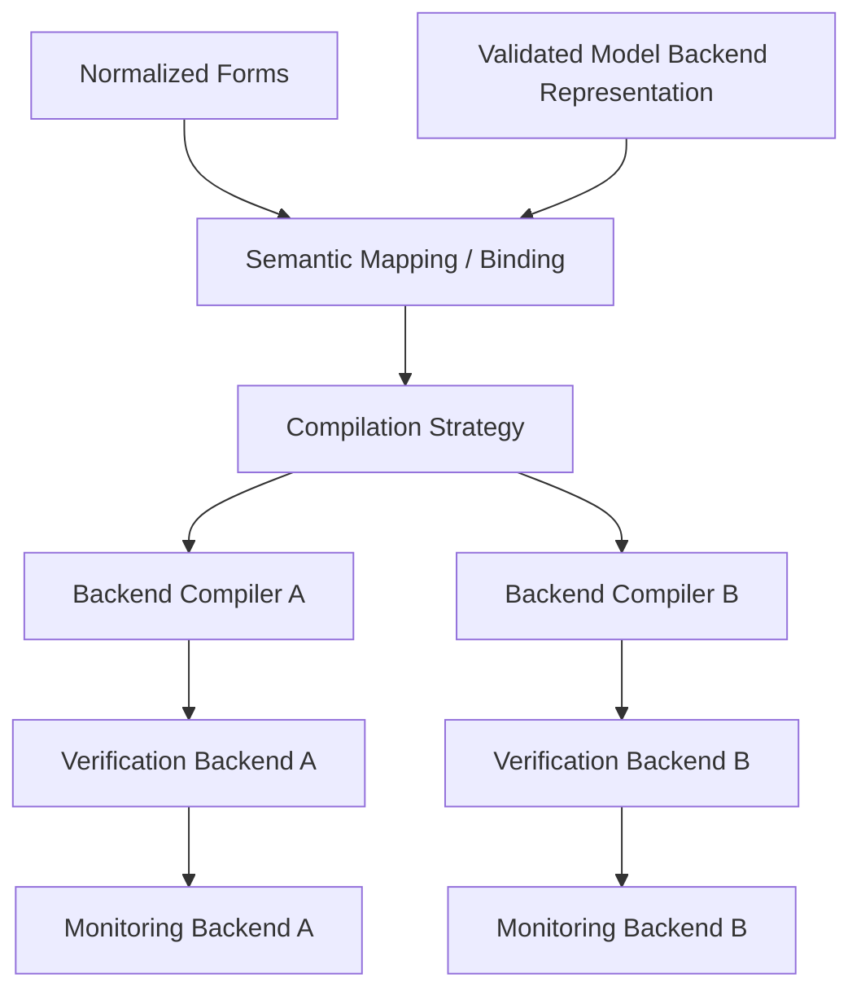
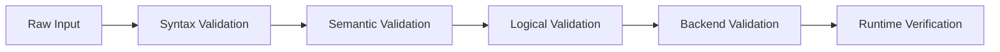

# FORML Pipeline Architecture Views

## Introduction

This document presents the FORML platform through multiple architectural views.

The objective is not to describe the implementation details of each subsystem, but rather to provide several complementary perspectives allowing the reader to understand:

* how the DSL pipeline operates,
* how backend orchestration is performed,
* how backend representations are built,
* and how verification and monitoring are executed.

Each architectural view focuses on a specific concern of the FORML ecosystem.

---

# 1. Global System View

This view presents the high-level interaction between the major FORML subsystems.


## Purpose

This view answers the question:

```text
What is FORML globally?
```

## Main Responsibilities

| Subsystem                | Responsibility                 |
| ------------------------ | ------------------------------ |
| DSL Compilation Pipeline | Formalize user intent          |
| Backend Orchestration    | Select verification strategies |
| Verification Runtime     | Execute verification workflows |
| Monitoring               | Observe runtime behavior       |

---

# 2. DSL Compilation Pipeline View

This view focuses on the transformation of a `.forml` specification into normalized formal representations.



## Purpose

This view answers the question:

```text
How does FORML transform user specifications into formal representations?
```

## Guarantees

* Syntax correctness
* Semantic consistency
* Progressive validation
* Semantic preservation
* Backend-independent formalization

## Main Concepts

| Stage            | Role                                           |
| ---------------- | ---------------------------------------------- |
| CST              | Raw syntactic representation                   |
| AST              | Structured syntax representation               |
| Validated AST    | Semantically validated representation          |
| IR Level 1       | Backend-independent logical representation     |
| IR Level 2       | Normalized and rewrite-oriented representation |
| Normalized Query | Canonical logical forms                        |

---

# 3. Backend Orchestration View

This view presents the orchestration logic responsible for selecting verification backends and strategies.



## Purpose

This view answers the question:

```text
How does FORML select and orchestrate verification backends?
```

## Responsibilities

* Property analysis
* Backend capability analysis
* Backend compatibility matching
* Dynamic backend routing
* Strategy selection
* User constraint handling
* Early failure detection

## AutoFORML

This subsystem forms the basis of the future AutoFORML system.

When no backend is explicitly specified, FORML may dynamically select:

* the most appropriate backend,
* the most efficient strategy,
* or the backend best matching user-defined constraints.

Examples of future constraints include:

* proof power,
* execution performance,
* determinism,
* runtime observability,
* verification cost.

---

# 4. Backend Representation View

This view describes how FORML understands and formalizes backend systems.



## Purpose

This view answers the question:

```text
How does FORML understand target systems?
```

## Responsibilities

* Backend detection
* Backend model transcription
* Backend formal representation
* Representation validation
* Capability extraction

## Architectural Importance

This subsystem allows FORML to:

* reason about backend structures,
* map formal properties to runtime entities,
* perform backend-aware verification,
* support heterogeneous systems.

---

# 5. Semantic Mapping & Verification View

This view presents how formal user properties are aligned with backend representations and verification runtimes.



## Purpose

This view answers the question:

```text
How are formal properties verified against backend systems?
```

## Responsibilities

* Semantic alignment
* Runtime binding
* Backend-specific compilation
* Verification execution
* Runtime monitoring
* Behavioral observation

---

# 6. Validation-Oriented View

This view focuses on progressive validation across the platform.



## Purpose

This view answers the question:

```text
How does FORML progressively increase confidence guarantees?
```

## Validation Philosophy

Each transformation stage introduces stronger guarantees than the previous one.

Validation is not treated as a single isolated phase, but as a progressive architectural principle applied throughout the entire platform.

---

# Architectural View Separation

FORML intentionally separates multiple architectural concerns into dedicated views.

This separation allows:

* clearer documentation,
* reduced architectural ambiguity,
* subsystem isolation,
* easier maintenance,
* improved extensibility,
* and progressive stabilization of the platform.

Each view answers a specific architectural question and should be interpreted independently from implementation details.

---

# Related Documents

Additional details for each layer are documented in:

```text
layers/
├── parsing.md
├── ast.md
├── semantic.md
├── logic_ir.md
├── nnf.md
├── cnf.md
├── dnf.md
├── execution_plan.md
└── backend.md
```

These documents define:

* invariants,
* contracts,
* transformation rules,
* guarantees,
* validation constraints,
* and implementation-oriented details.
