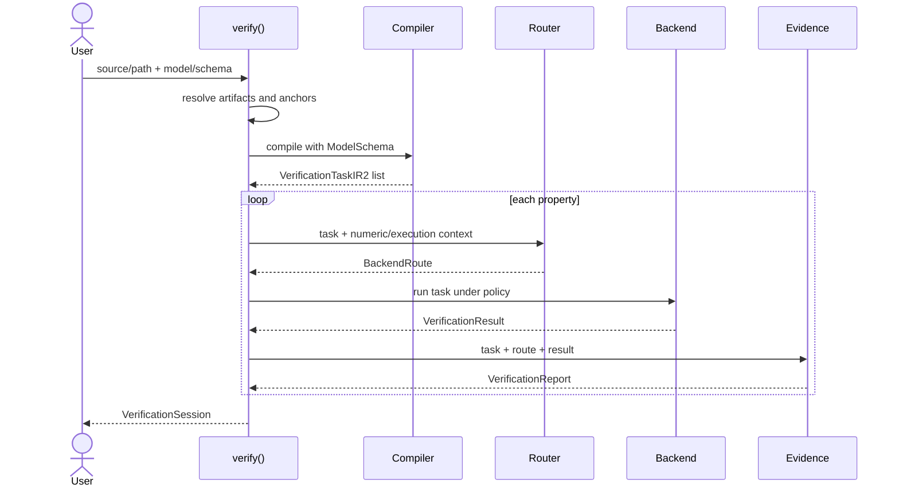

# Runtime flow

> **Status:** As built for `1.0.0rc3`
>
> **Entry point:** `toetra.verify`
>
> **Scope:** lifecycle of one verification session

`verify(...)` orchestrates the complete public request. Compilation helpers and
registries are private implementation details; callers receive a completed
`VerificationSession` or an exception, never a partially populated session.

## End-to-end sequence



## 1. Load the specification

The runtime accepts source text or a `.toetra` path. A file is decoded as UTF-8,
and relative model references are resolved from its directory. Non-canonical
legacy specification extensions are rejected explicitly. The source is parsed
once at this boundary to obtain the header and anchor
declarations required for artifact resolution. Compilation later parses the
same retained source into the formal pipeline.

Produced runtime state:

- exact source text;
- optional resolved specification path;
- base directory;
- declared model, target, and optional dataset references;
- an immutable declared/effective execution context;
- an isolated effective `ProgramNode` used for semantic and anchor validation.

## 2. Resolve model metadata

The request must choose one authority:

- `schema=...` supplies an already normalized `ModelSchema`; or
- model/dataset artifacts are handled by `ModelManager`.

Combining a schema with model artifacts is a configuration error. An explicit
target creates an isolated schema view bound to the effective output name; the
caller-owned schema and declared AST remain unchanged.

For artifact-based requests, `ModelManager` loads the estimator, detects its
framework, introspects it, and builds the normalized schema. The concrete model
is retained only for replay.

See the [model-to-schema contract](../contracts/model-to-schema.md) and
[schema-to-semantic contract](../contracts/schema-to-semantic.md).

## 3. Resolve anchors

Inline anchors are already self-contained. Referenced anchors are resolved
before formal compilation through:

1. an explicit `anchor_resolver`;
2. otherwise an explicit `anchor_source`;
3. otherwise a compatible dataset artifact.

The default DataFrame/CSV resolver requires exactly one row per lookup, projects
only declared model features, validates values against schema dtypes, and
records lookup provenance. Missing or ambiguous anchors cannot reach IR2.

## 4. Compile each property

`run_ir2_with_model_schema(...)` performs:

```text
source
→ CST
→ ProgramNode
→ semantic validation with schema and resolved anchors
→ VerificationTask IR1
→ model-semantic lowering
→ NNF normalization
→ requested model evaluations
→ model assumptions
→ VerificationTaskIR2
```

The original IR1 property is retained separately from the canonical lowered
formula so reports and replay can speak in source-level terms.

`VerificationTaskIR2` contains the normalized property, typed assumptions,
verification condition, selected normal form, semantic branch, capability
requirements, point mappings, model evaluations, diagnostics, and lowering
evidence.

## 5. Qualify a backend route

For every IR2 task, `BackendRouter` evaluates:

```text
IR2 requirements
+ registered backend capabilities
+ numeric compatibility context
+ execution policy
→ BackendRoute
```

An explicit `using Z3` hint restricts selection; it does not bypass the checks.
Without a hint, the first registered fully compatible backend is selected. V1
registers only Z3 by default.

No route is returned when:

- structural or semantic requirements are unsupported;
- no numeric rule preserves an executable conclusion;
- the backend cannot enforce the requested timeout, resource, cancellation, or
  deterministic controls.

## 6. Execute under one policy budget

`BackendRunnerRegistry` resolves the concrete runner for the selected route.
`Z3Runner` translates the IR2 task, performs the solver call, and returns a
backend-neutral `VerificationResult`.

The timeout is a total per-property budget that begins before translation. A
technical backend exception raises a structured execution error and does not
become a logical report.

Logical status and technical termination are distinct:

| Logical status | Meaning |
|---|---|
| `PROVED` | no counterexample exists under the encoded assumptions |
| `COUNTEREXAMPLE` | a violating assignment exists |
| `WITNESS` | a satisfying existential assignment exists |
| `NO_WITNESS` | no satisfying existential assignment exists |
| `UNKNOWN` | the backend did not justify a stronger conclusion |

Technical timeout, resource exhaustion, or cancellation maps to `UNKNOWN` with
separate backend execution evidence.

## 7. Apply conclusion policies

Before a report is created, the runtime applies:

1. numeric compatibility policy for the framework/encoder/backend route;
2. semantic-lowering policy for exact or conservative rewrites.

These policies may preserve a result or weaken it to `UNKNOWN`. They never
promote an unsupported backend result into a proof or witness.

## 8. Build report and provenance

The provenance context is built once per request from the specification, model,
dataset, anchors, schema, software identity, and compiler policy. Each property
report adds task, route, result, and property fingerprints.

`build_verification_report(...)` produces the backend-neutral report used by
text, HTML, Jupyter, records/DataFrame, and JSON v6 renderers.

See the [verification provenance contract](../contracts/verification-provenance.md)
and [output reporting and replay contract](../contracts/output-reporting-and-replay.md).

## 9. Return a session

The runtime returns one immutable `VerificationSession` containing:

- the retained source and resolved artifact paths;
- the normalized schema and optional concrete model;
- resolved anchors and provenance;
- one `VerificationExecution` per property.

Each execution groups its IR2 task, route, raw result, and public report. The
public session exposes reports and findings rather than private compiler
artifacts; see the [Python API reference](../api-reference/index.md).

## Optional replay

Replay begins only from a counterexample or witness finding. A registered
`ModelRuntimeObserver` evaluates the concrete model for every formal point,
compares outputs and model quantities, and reevaluates the preserved original
property.

Replay is evidence about one assignment. It remains outside the formal backend
execution and cannot replace the numeric compatibility contract.

## Failure ownership

| Failure | Owning boundary |
|---|---|
| malformed source | parser or builder |
| invalid binding, type, point, or observable | semantic validation |
| unsupported model-family meaning | model-semantic lowering |
| unsupported fitted model equation | model encoder |
| incompatible task/backend/policy | routing |
| solver translation or execution failure | backend adapter |
| unavailable concrete observation | replay |
| ambiguous public configuration | high-level runtime |
