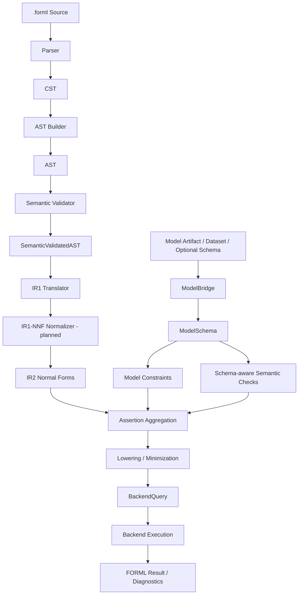

# FORML Runtime Flow

> Status: **P0 — end-to-end target flow, partially implemented**  
> Scope: **runtime architecture / request lifecycle**  
> Audience: maintainers, contributors, backend authors, and test designers

## Purpose

This document describes the lifecycle of a single FORML request from user input to verification result.

It defines the target end-to-end flow even though some subsystems are still planned. The goal is to make the execution model explicit early, so that compiler contracts, ModelBridge contracts, IR contracts, backend contracts, and Miova campaigns can be designed consistently.

A FORML request is not only a DSL compilation request. It is a verification request that combines:

- a `.forml` property specification;
- a model artifact or model schema;
- semantic validation;
- logical normalization;
- model-aware constraints;
- backend preparation;
- verification execution.

---

## End-to-end flow summary

```text
.forml source
    ↓
CST
    ↓
AST
    ↓
SemanticValidatedAST
    ↓
IR1 structural logical task
    ↓
IR1-NNF normalization (planned)
    ↓
IR2-CNF/DNF
    ↓
Assertion Aggregation
    ↑
ModelBridge → ModelSchema → Model Constraints
    ↓
Lowering / Minimization
    ↓
BackendQuery
    ↓
Verification Runtime
    ↓
FORML Result / Diagnostics
```

---

## Complete runtime flow



---

## Phase 1 — Source parsing

### Input

A raw `.forml` specification.

### Output

A CST produced by the grammar parser.

### Responsibilities

- Accept or reject grammar-level syntax.
- Preserve source structure for downstream building.
- Keep parsing concerns separate from semantic concerns.

### Failure class

Parser-level errors.

### Status

Implemented / stabilizing.

---

## Phase 2 — CST to AST building

### Input

Concrete syntax tree.

### Output

Typed FORML AST.

### Responsibilities

- Convert grammar-specific structures into domain-level AST nodes.
- Build property nodes, scope nodes, assertion nodes, backend nodes, and primitives.
- Normalize local syntactic noise.
- Reject malformed CST structures that should not reach semantic validation.

### Important distinction

The AST is not yet semantically valid.

At this phase, FORML knows that the source has structure, but not necessarily that variables, scopes, features, model references, or property compatibility are valid.

### Failure class

Builder-level structural errors.

### Status

Implemented / stabilizing.

---

## Phase 3 — Semantic validation

### Input

AST.

### Output

SemanticValidatedAST.

### Responsibilities

- Validate the left-hand side scope.
- Build the semantic execution context.
- Register semantic symbols.
- Resolve explicit and implicit entity bindings.
- Validate logical structure.
- Validate property/scope compatibility.
- Attach semantic annotations used by IR and later stages.

### Key artifacts

| Artifact | Role |
|---|---|
| `SemanticContext` | Defines scope, variables, default entity, domain, neighborhood, and symbol table. |
| `SymbolTable` | Resolves semantic variables such as anchors, perturbations, and symbolic variables. |
| `SemanticAnnotations` | Carries resolved entity, resolved path, symbol, and logical root metadata. |

### Example semantic behavior

In a local robustness scope:

```text
at x in neighborhood(metric=L2, eps=0.1) => age <= 30
```

An implicit feature access like `age` may be resolved as:

```text
x'.age
```

because the perturbation is the default entity for local robustness assertions.

### Failure class

Semantic errors.

### Status

Implemented / stabilizing.

---

## Phase 4 — SemanticValidatedAST to IR1

### Input

SemanticValidatedAST.

### Output

IR1 verification tasks.

### Responsibilities

- Detach logical representation from DSL syntax.
- Convert property scopes into `ScopeIR`.
- Convert assertions into logical IR nodes.
- Preserve semantic bindings resolved by the semantic layer.
- Produce backend-independent verification tasks.

### Key artifacts

| Artifact | Role |
|---|---|
| `VerificationTask` | Top-level IR unit representing one property verification task. |
| `ScopeIR` | Backend-independent representation of the semantic evaluation scope. |
| `QueryIR` | Logical query attached to the property. |
| `LogicalIR` | Boolean/logical representation of assertions. |
| `ProblemIR` | High-level ML problem predicate such as classification equality. |

### Failure class

IR translation errors.

### Status

Implemented / needs stabilization.

---

## Phase 5 — IR1-NNF normalization

### Status

Planned / critical. Structural IR1 exists, but full NNF enforcement should not be treated as implemented until the normalizer and golden tests exist.

### Input

IR1 logical tree.

### Output

IR1-NNF.

### Responsibilities

- Eliminate or normalize implication when required.
- Apply De Morgan transformations.
- Push negations toward leaves.
- Produce a negation-normal logical structure.
- Preserve semantic bindings and traceability.

### Guarantees

IR1-NNF should preserve the meaning of the original logical assertion.

If a transformation cannot preserve strict semantic equivalence, the weaker guarantee must be explicitly recorded. For IR1-NNF, the expected guarantee is semantic equivalence.

---

## Phase 6 — IR2 normal forms

### Input

IR1-NNF.

### Output

IR2 normal form.

### Responsibilities

- Select CNF, DNF, or another normal form depending on verification needs.
- Prepare the logical structure for backend-oriented reasoning.
- Preserve traceability to original assertions.
- Represent whether transformations preserve semantic equivalence or only equisatisfiability.

### CNF use cases

CNF is useful when the backend or strategy prefers conjunctions of clauses, such as SAT/SMT-style solving or consistency checking.

### DNF use cases

DNF is useful for scenario exploration, case splitting, counterexample search, and mutation-driven boundary analysis.

### Status

Planned / critical.

---

## Phase 7 — ModelBridge schema construction

### Input

A model artifact, dataset path, and optionally an external schema.

### Output

A normalized `ModelSchema`.

### Responsibilities

- Select the appropriate model loader.
- Load the serialized model.
- Detect the ML framework.
- Select the correct introspector.
- Extract feature, target, task, and framework metadata.
- Produce a normalized model representation.

### Key artifacts

| Artifact | Role |
|---|---|
| Model artifact | Serialized ML model, such as pickle/joblib. |
| Loaded model | Runtime model object. |
| Framework | Detected ML framework, such as sklearn or XGBoost. |
| Introspector | Framework-specific metadata extraction component. |
| `ModelSchema` | Normalized FORML representation of model metadata. |

### Status

Partially implemented.

---

## Phase 8 — Schema-aware semantic checks

### Input

SemanticValidatedAST and `ModelSchema`.

### Output

Schema-aware validation result.

### Responsibilities

- Verify that DSL feature references exist in the model schema.
- Validate feature types against comparison values and operators.
- Validate target references.
- Validate property/problem compatibility with model task type.
- Prepare model-aware constraints for later stages.

### Example checks

| DSL reference | ModelSchema check |
|---|---|
| `age <= 30` | `age` exists and is numeric. |
| `CLASSIFICATION.EQUAL()` | model task is compatible with classification. |
| `target` | target exists or is inferable. |
| neighborhood constraints | perturbable features and distance assumptions are valid. |

### Status

Planned / critical.

---

## Phase 9 — Model constraint generation

### Input

`ModelSchema` and optional framework-specific metadata.

### Output

Model constraints.

### Responsibilities

- Convert model metadata into constraints used by the verification problem.
- Represent input dimensionality constraints.
- Represent feature type constraints.
- Represent task-level constraints.
- Prepare future symbolic model encodings.

### Important note

Model constraints are not the same as semantic checks.

Semantic checks validate whether a DSL property is meaningful with respect to the model schema. Model constraints contribute logical information to the verification problem.

### Status

Planned / critical.

---

## Phase 10 — Assertion aggregation

### Input

- IR2 normal form;
- semantic constraints;
- model constraints;
- backend capability constraints when available.

### Output

Aggregated assertion set.

### Responsibilities

- Compose all constraints into a single verification problem.
- Preserve source traceability.
- Distinguish user assertions from generated constraints.
- Track transformation guarantees.
- Prepare simplification and minimization.

### Aggregation sources

| Source | Example |
|---|---|
| User assertions | `x'.age <= 30` |
| Semantic constraints | `x'` is a perturbation of `x` |
| Scope constraints | `distance(x, x') <= eps` |
| Domain constraints | feature belongs to a declared domain |
| Model constraints | feature exists, dtype constraints, model task constraints |
| Backend constraints | backend capability preconditions |

### Status

Planned / critical.

---

## Phase 11 — Lowering and minimization

### Input

Aggregated assertion set.

### Output

Lowered or minimized query ready for backend encoding.

### Responsibilities

- Simplify redundant logical fragments.
- Minimize assertion sets where possible.
- Prepare backend-aware logical structure.
- Preserve traceability of removed or transformed constraints.
- Keep the distinction between equivalence and equisatisfiability explicit.

### Examples of transformations

- Remove duplicate clauses.
- Simplify trivial boolean expressions.
- Flatten nested conjunctions or disjunctions.
- Reorder constraints into backend-preferred form.
- Introduce auxiliary variables if a backend strategy requires it.

### Status

Planned / critical.

---

## Phase 12 — Backend query generation

### Input

Lowered or minimized query.

### Output

Backend-specific query artifact.

### Responsibilities

- Encode the logical problem into a backend-specific representation.
- Preserve mapping between backend expressions and FORML artifacts.
- Emit diagnostics when a backend cannot support the query.
- Respect backend capabilities and limitations.

### Examples

| Backend | Possible artifact |
|---|---|
| Z3 | SMT constraints and solver query. |
| ERAN | Neural network robustness verification query. |
| Future backend | Backend-specific verification artifact. |

### Status

Planned.

---

## Phase 13 — Verification runtime

### Input

Backend query.

### Output

FORML verification result.

### Responsibilities

- Execute the backend query.
- Normalize backend-specific results.
- Return success, failure, counterexample, unsupported case, or diagnostic result.
- Preserve traces for explanation and debugging.

### Status

Planned.

---

## Phase 14 — Miova campaigns

### Input

FORML artifacts at different layers.

### Output

Mutation campaign results.

### Responsibilities

- Mutate source, AST, semantic, IR, model schema, aggregated assertions, or backend query artifacts.
- Validate layer contracts.
- Validate expected failures.
- Detect unexpected fragility.
- Explore robustness boundaries.

### Important separation

Miova is not part of the normal verification runtime.

Miova is a validation and exploration layer used to harden FORML.

---

## Runtime failure model

Each phase must own its own failure boundary.

| Phase | Failure type |
|---|---|
| Source parsing | Parser error |
| AST building | Builder / structural error |
| Semantic validation | Semantic error |
| IR1 translation | IR translation error |
| IR1-NNF | Normalization error |
| IR2 | Normal form transformation error |
| ModelBridge | Model loading, detection, or introspection error |
| Schema-aware semantic checks | Model/schema compatibility error |
| Assertion aggregation | Constraint composition error |
| Lowering / minimization | Lowering or simplification error |
| Backend query generation | Backend capability or encoding error |
| Verification runtime | Backend execution or result normalization error |
| Miova campaign | Mutation, invariant, or expected-failure mismatch |

Clear failure boundaries are critical because they allow FORML to explain not only that a request failed, but where and why it failed.

---

## End-to-end artifact sequence

| Order | Artifact | Produced by | Consumed by | Status |
|---:|---|---|---|---|
| 1 | Source | User | Parser | Implemented |
| 2 | CST | Parser | Builder | Implemented |
| 3 | AST | Builder | Semantic Validator | Implemented / stabilizing |
| 4 | SemanticValidatedAST | Semantic Validator | IR1 Translator | Implemented / stabilizing |
| 5 | IR1 structural logical task | IR Translator | IR1-NNF Normalizer | Implemented / stabilizing |
| 6 | IR1-NNF | IR1 Normalizer | IR2 Transformer | Planned / critical |
| 7 | IR2 | IR2 Transformer | Assertion Aggregator | Planned |
| 8 | ModelSchema | ModelBridge | Semantic checks / model constraints | Partially implemented |
| 9 | ModelConstraintIR | Model constraint generator | Assertion Aggregator | Planned |
| 10 | AggregatedAssertionSet | Assertion Aggregator | Lowering / minimization | Planned |
| 11 | LoweredQuery | Lowering / minimization | Backend query generator | Planned |
| 12 | BackendQuery | Backend adapter/compiler | Verification runtime | Planned |
| 13 | FORML Result | Runtime | User / diagnostics | Planned |

---

## Runtime design principles

### 1. No backend leakage before the backend boundary

Backend-specific encoding must not leak into parser, AST, semantic validation, or early IR layers.

### 2. Semantic resolution must be preserved

IR and later layers must preserve resolved entity and feature information produced by semantic validation.

### 3. ModelBridge is a semantic and constraint bridge

ModelBridge is not only a loader. It participates in schema-aware validation and future constraint generation.

### 4. IR1 and IR2 have different purposes

IR1 normalizes logical structure and negations. IR2 prepares clause-oriented or case-oriented forms such as CNF and DNF.

### 5. Aggregation is explicit

The backend receives a composed verification problem, not isolated DSL fragments.

### 6. Lowering must be traceable

Any simplification or minimization must preserve traceability from backend expressions to FORML source intent.

### 7. Miova validates boundaries, not normal execution

Miova challenges FORML artifacts and verifies expected behavior under mutation. It does not replace FORML verification.

---

## Related documents

| Document | Purpose |
|---|---|
| `architecture/pipeline-views.md` | Multi-view architecture. |
| `architecture/status-matrix.md` | Implementation status by subsystem. |
| `compiler/pipeline.md` | Compiler and logical pipeline. |
| `model-bridge/overview.md` | ModelBridge lifecycle. |
| `contracts/compiler-pipeline.md` | Cross-layer compiler contracts. |
| `contracts/assertion-aggregation.md` | Aggregation contract. |
| `contracts/lowering-minimization.md` | Lowering and minimization contract. |
| `contracts/ir-to-backend.md` | Backend boundary contract. |
