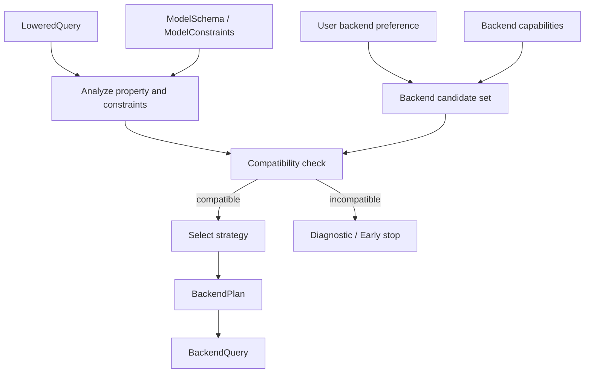

# Backend Orchestration

> Status: Post-V1 / target architecture  
> Scope: Backend selection, routing, strategy selection, AutoFORML foundation  
> Priority: P1

## Purpose

Backend orchestration is the subsystem responsible for choosing how a FORML verification problem should be executed.

It answers:

```text
Given a normalized verification problem, which backend and strategy should FORML use?
```

## V1 boundary

Backend orchestration is not required before the Z3 end-to-end path works. V1 should implement a direct and explicit `LoweredQuery → Z3 BackendQuery → Z3 result` path first. Automatic backend selection and AutoFORML belong after that baseline is functional.

## Position in the pipeline

Backend orchestration happens after the query is sufficiently normalized and prepared.

```text
IR2
→ Assertion Aggregation
→ Lowering / Minimization
→ LoweredQuery
→ Backend Orchestration
→ BackendQuery
→ VerificationBackend
```

The orchestrator should not operate on raw AST or DSL syntax.

## Inputs

The orchestrator should receive:

| Input | Description |
|---|---|
| `LoweredQuery` | Backend-preparation logical query. |
| `ModelSchema` or model constraints | Normalized model representation or model-derived constraints. |
| Property metadata | Property type, problem type, scope, target. |
| User backend preference | Optional `using z3`; non-Z3 backends are reserved/post-V1. |
| Backend capabilities | Declared support of each backend. |
| Runtime constraints | Timeout, exactness, determinism, performance preferences. |

## Outputs

The orchestrator should produce:

| Output | Description |
|---|---|
| `BackendPlan` | Selected backend and strategy. |
| `BackendQuery` | Backend-specific query artifact, if compilation is included. |
| `Diagnostic` | Explanation when no backend is suitable. |
| `ExecutionContext` | Runtime options for backend execution. |

## Manual backend selection

When a user explicitly selects a backend:

```forml
[ROBUSTNESS]: forall baseline, candidate => CLASSIFICATION.EQUAL() using z3
```

FORML should treat the backend as a user constraint, not as an unconditional instruction.

The backend must still be checked against:

- property type;
- model schema;
- logical form;
- required constraint encodings;
- backend capabilities.

If incompatible, FORML should reject the request early with a diagnostic.

## Automatic backend selection

When no backend is specified, a future FORML orchestrator may select a backend automatically.

Selection criteria may include:

| Criterion | Example |
|---|---|
| Property compatibility | Robustness may prefer neural verification backends. |
| Model compatibility | Linear models may be encoded into SMT. |
| Exactness | Exact proof vs approximate guarantee. |
| Counterexample support | Needed for debugging and boundary analysis. |
| Runtime cost | Choose cheaper backend when proof power is sufficient. |
| Observability | Prefer backend with richer diagnostics. |

This is the basis for a future AutoFORML system.

## Strategy selection

Backend orchestration is not only backend selection. It may also select a verification strategy.

Examples:

| Strategy | Purpose |
|---|---|
| Direct SMT encoding | Encode query directly into an SMT solver. |
| Clause-based solving | Use CNF-oriented representation. |
| Case splitting | Use DNF-oriented representation. |
| Abstract interpretation | Over-approximate model behavior. |
| Counterexample search | Prefer exploration over proof. |
| Runtime monitoring | Observe behavior instead of static proof. |

## Decision flow



## Diagnostics-first design

The orchestrator should be able to explain decisions.

Examples:

```text
Selected backend 'z3' because the query contains linear numeric constraints and no neural-network-specific encoding is required.
```

```text
Rejected backend 'eran' because the model framework is sklearn.RandomForestClassifier and no ERAN encoder is available.
```

```text
No backend selected because the query requires categorical domain constraints that no registered backend supports.
```

## Relationship with IR2

IR2 influences backend orchestration because different backends may prefer different normal forms.

| IR2 form | Possible use |
|---|---|
| CNF | Clause-oriented solving, SMT/SAT-style verification. |
| DNF | Case splitting, scenario exploration, counterexample search. |
| Canonical boolean form | Deduplication, simplification, backend-independent comparison. |

The orchestrator may request a specific IR2 form or lowering strategy.

## Relationship with lowering/minimization

Lowering and minimization prepare the query before backend compilation.

The orchestrator should not receive redundant, ambiguous, or high-level semantic constructs unless the backend explicitly supports them.

## Relationship with Miova

Miova can challenge backend orchestration by mutating:

- backend names;
- capability declarations;
- user backend preferences;
- query shapes;
- model framework metadata;
- strategy selection constraints.

Expected results should include:

- successful backend selection;
- explicit incompatibility;
- expected rejection;
- no silent fallback.

## Non-goals

Backend orchestration should not:

- perform semantic binding;
- rewrite DSL syntax;
- infer model schemas;
- implement solver-specific encodings directly;
- hide backend incompatibilities.

