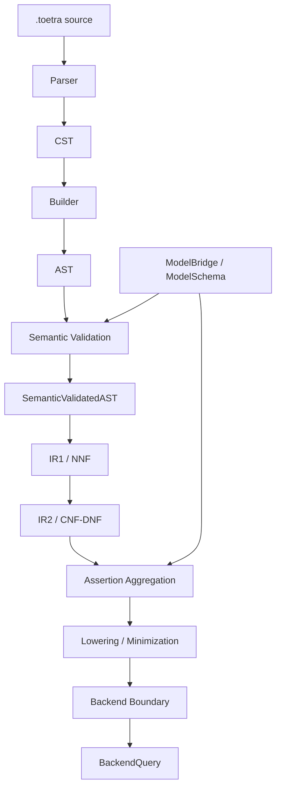

# Compiler Pipeline

> Status: P0 / Stabilizing  
> Scope: Compiler architecture  
> Implementation: Implemented until semantic validation and IR1, planned beyond IR1  
> Audience: Toetra maintainers, contributors, backend implementers, Miova campaign authors

## Purpose

The Toetra compiler pipeline transforms a `.toetra` specification into progressively more formal, normalized, and backend-preparable representations.

The compiler is not a single parsing step. It is a sequence of explicit artifact transformations, each with its own responsibilities, guarantees, and failure boundaries.

Its target end-to-end path is:

```text
.toetra source
    ↓
Language definition
    ↓
Parser
    ↓
CST
    ↓
Builder
    ↓
AST
    ↓
Semantic validation
    ↓
SemanticValidatedAST
    ↓
IR1 / NNF
    ↓
IR2 / CNF-DNF
    ↓
Assertion Aggregation
    ↓
Lowering / Minimization
    ↓
Backend Boundary
    ↓
BackendQuery
```

The current implementation reaches IR1. IR2, assertion aggregation, lowering, minimization, and backend query production are planned but architecturally required for the first true end-to-end Toetra verification query.

---

## Architectural Intent

Toetra follows a progressive formalization model.

Each layer receives an artifact from the previous layer and produces a stronger representation:

| Layer | Input | Output | Strength Added |
|---|---|---|---|
| Language | Vocabulary and grammar definitions | DSL syntax rules | Expressive boundary |
| Parser | Raw `.toetra` source | CST | Syntax structure |
| Builder | CST | AST | Typed domain structure |
| Semantic | AST | SemanticValidatedAST | Scope, binding, compatibility |
| IR1 | SemanticValidatedAST | IR1 task/query | Logical normalization, NNF |
| IR2 | IR1 | IR2 normal form | CNF/DNF and clause/case preparation |
| Aggregation | IR2 + model constraints | AggregatedAssertionSet | Global verification problem |
| Lowering | AggregatedAssertionSet | LoweredQuery | Simplification and backend preparation |
| Backend Boundary | LoweredQuery | BackendQuery | Backend-specific executable form |

---

## Current Implementation Status

| Stage | Status | Notes |
|---|---|---|
| Language vocabulary | Implemented / needs cleanup | Grammar and enum vocabulary exist; normalization rules need stabilization. |
| Parser | Implemented | Lark parser produces CST from `.toetra` source. |
| Builder | Implemented / stabilizing | CST is converted into Toetra AST nodes. |
| AST | Implemented / stabilizing | Most domain nodes exist; semantic attachment policy needs harmonization. |
| Semantic validation | Implemented / stabilizing | LHS validation, binding, logic validation and compatibility checks exist. |
| IR1 | Implemented / stabilizing | `VerificationTask`, `ScopeIR`, `QueryIR`, logical IR nodes exist. |
| IR1-NNF | Planned / critical | De Morgan and NNF belong to this planned IR1 subphase. |
| IR2 | Planned / critical | CNF/DNF and normal-form selection. |
| Assertion aggregation | Planned / critical | Combines DSL assertions, semantic constraints and model constraints. |
| Lowering / minimization | Planned / critical | Simplifies and prepares backend-oriented expressions. |
| BackendQuery | Planned / critical | First executable solver/backend artifact. |

---

## Compiler Inputs

The compiler consumes a `.toetra` specification.

A Toetra specification may include:

- model declaration;
- target declaration;
- optional dataset declaration;
- one or more property sections;
- property scopes;
- assertions;
- optional backend hints.

The compiler itself does not directly load the ML model. Model loading and model introspection belong to ModelBridge. The compiler and ModelBridge converge later through schema-aware semantic validation, model constraints, and assertion aggregation.

---

## Compiler Outputs

The final target output of the compiler-side pipeline is not the AST and not IR1.

The target output is a backend-preparable verification problem:

```text
BackendQuery
```

A `BackendQuery` is expected to be produced after:

1. DSL source has been parsed;
2. AST has been built;
3. semantic references have been resolved;
4. IR1 has normalized logical negation;
5. IR2 has selected CNF/DNF or another normal form;
6. DSL assertions have been aggregated;
7. ModelBridge-derived model constraints have been integrated;
8. lowering and minimization have prepared the query for backend encoding.

---

## Layer Isolation Principle

Each compiler layer must avoid leaking internal implementation details into adjacent layers.

Examples:

| Forbidden Leak | Correct Boundary |
|---|---|
| Parser-specific Lark `Tree` inside AST | Builder must fully translate CST into AST nodes. |
| Raw AST attribute names inside IR | IR must use semantic resolution when available. |
| Backend-specific Z3 objects inside IR1 | Backend objects must appear only after backend lowering. |
| Model framework objects inside semantic validation | Semantic validation should consume `ModelSchema`, not raw sklearn/XGBoost objects. |

---

## Semantic Preservation

Every transformation after parsing must preserve the intended meaning of the user specification.

This does not mean every transformation must preserve the same syntax. It means the logical meaning must remain stable or any relaxation must be explicit.

Toetra distinguishes:

| Preservation Type | Meaning |
|---|---|
| Syntactic preservation | Same or equivalent source shape. |
| Structural preservation | Same AST/IR organization. |
| Semantic preservation | Same logical meaning. |
| Equisatisfiability | Same satisfiability status, not necessarily same formula shape. |
| Backend preservation | Same backend-level verification result. |

IR2 transformations may sometimes preserve strict logical equivalence and sometimes only equisatisfiability, depending on the transformation strategy used.

---

## Relation to ModelBridge

The compiler pipeline expresses and normalizes user verification intent.

ModelBridge represents the target ML model and its schema.

They converge at two major points:

1. **Schema-aware semantic validation**  
   Toetra checks that DSL properties reference model-compatible features, targets and task types.

2. **Assertion aggregation**  
   Toetra combines DSL assertions with model-derived constraints to produce a complete verification problem.

---

## Relation to Miova

Miova is not part of the normal runtime compiler path.

Miova is used to challenge the compiler path by mutating artifacts and checking contracts between layers.

Potential Miova mutation boundaries include:

```text
Source
CST
AST
SemanticValidatedAST
IR1
IR2
AggregatedAssertionSet
BackendQuery
```

For each boundary, Toetra should define:

- valid mutations;
- invalid mutations;
- expected failures;
- invariant checks;
- contract checks;
- semantic preservation expectations.

---

## Target End-to-End Flow



---

## Open Questions

| Question | Why It Matters |
|---|---|
| Should IR1 be named `IR1` or `IR1-NNF` in code? | Keep structural IR1 named `IR1`; implement NNF as an explicit IR1 subphase/invariant once the pass exists. |
| Should IR2 choose CNF/DNF automatically or explicitly? | This affects backend orchestration and diagnostics. |
| Is lowering backend-independent or backend-aware? | Determines whether it belongs before or inside backend compilers. |
| What is the exact shape of `AggregatedAssertionSet`? | This is the future central verification artifact. |
| What is the first backend target: Z3 only or Z3-compatible abstraction? | This determines the first backend boundary contract. |

---

## Related Documents

- `compiler/language-layer.md`
- `compiler/parser-layer.md`
- `compiler/builder-layer.md`
- `compiler/ast-layer.md`
- `compiler/semantic-layer.md`
- `compiler/ir1-layer.md`
- `compiler/ir2-layer.md`
- `compiler/assertion-aggregation.md`
- `compiler/lowering-minimization.md`
- `compiler/backend-boundary.md`
