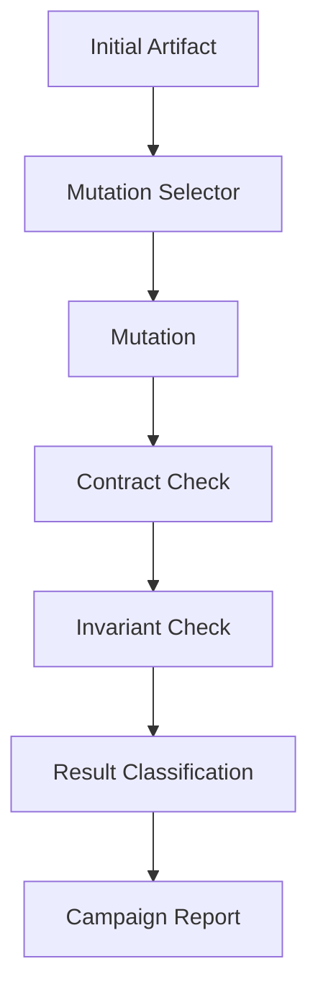

# Mutation Campaigns

> Status: planned / critical  
> Scope: campaign design for Toetra artifact exploration
> Audience: test engineers, compiler maintainers, mutation authors

## Purpose

A Miova campaign is a controlled exploration of Toetra artifact transformations.

It repeatedly selects artifacts, applies mutations, checks contracts and invariants, and classifies results.

The goal is to discover weak assumptions in the Toetra pipeline before they appear as silent verification errors.

## Campaign Model



## Campaign Inputs

A campaign should define:

- artifact source;
- artifact kind;
- allowed mutation set;
- maximum depth;
- expected preservation rules;
- target layer;
- invariants to check;
- failure classification policy;
- reporting format.

## Campaign Types

### 1. Parser Robustness Campaign

Purpose:

```text
Challenge source-level syntax handling.
```

Target artifact:

```text
toetra.source
```

Examples:

- remove closing bracket;
- alter property keyword casing;
- corrupt implication token;
- insert invalid backend syntax;
- mutate logical operators.

Expected outcomes:

- valid syntax remains parseable;
- invalid syntax fails deterministically;
- parser errors are not misclassified as semantic errors.

### 2. Builder Contract Campaign

Purpose:

```text
Challenge CST → AST assumptions.
```

Target artifact:

```text
toetra.cst
```

Examples:

- remove a subtree;
- duplicate a property node;
- mutate a comparison subtree;
- reorder optional blocks.

Expected outcomes:

- structurally valid CST produces a strict AST;
- malformed CST fails at the builder boundary;
- no `None` leaks into required AST fields.

### 3. Semantic Binding Campaign

Purpose:

```text
Challenge variable resolution, implicit entity binding, and scope compatibility.
```

Target artifact:

```text
toetra.ast
```

Examples:

- replace `x.age` with `z.age`;
- remove a scope variable;
- mutate `at` into `pairwise`;
- replace an allowed property-scope pair with an incompatible one.

Expected outcomes:

- valid bindings are resolved;
- invalid bindings are rejected;
- implicit entity rules remain predictable.

### 4. IR Preservation Campaign

Purpose:

```text
Challenge logical transformation guarantees.
```

Target artifacts:

```text
toetra.ir1
toetra.ir2
```

Examples:

- reorder AND operands;
- flatten nested conjunctions;
- push negations using De Morgan;
- eliminate implications;
- transform to CNF or DNF.

Expected outcomes:

- equivalent transformations are accepted;
- non-equivalent mutations are rejected or marked as weakening/strengthening;
- traceability is preserved.

### 5. ModelBridge Campaign

Purpose:

```text
Challenge model metadata extraction and schema-aware validation.
```

Target artifact:

```text
toetra.model_schema
```

Examples:

- remove a feature;
- change a feature dtype;
- change task classification to regression;
- corrupt framework metadata;
- mark required feature as nullable.

Expected outcomes:

- schema inconsistencies are detected;
- unsupported model metadata does not silently pass;
- DSL feature references remain schema-aware.

### 6. End-to-End Verification Preparation Campaign

Purpose:

```text
Challenge the full preparation path before backend execution.
```

Target artifacts:

```text
toetra.aggregated_assertions
toetra.lowered_query
toetra.backend_query
```

Examples:

- remove a model constraint;
- duplicate an assertion;
- weaken a bound;
- introduce contradiction;
- mutate backend capability requirements.

Expected outcomes:

- contradictions are detected;
- redundant constraints are simplified safely;
- unsupported backend queries fail before execution.

## Campaign Depth

Campaign depth controls how many mutations are applied in sequence.

| Depth | Meaning | Use Case |
|---:|---|---|
| 1 | Single mutation | Boundary contract testing. |
| 2-3 | Short mutation chain | Interaction between nearby layers. |
| 4+ | Exploration campaign | Stress testing and robustness discovery. |

P0 campaigns should start with depth 1 and 2.

## Campaign Result Report

A report should include:

- campaign name;
- artifact kind;
- mutation sequence;
- initial artifact summary;
- final artifact summary;
- outcome counts;
- failure reasons;
- violated contracts;
- violated invariants;
- reproduction seed when applicable.

## Expected Metrics

| Metric | Meaning |
|---|---|
| success rate | Mutations that produced valid expected artifacts. |
| rejection rate | Mutations correctly rejected by contracts. |
| skipped rate | Mutations not applicable to selected artifacts. |
| failure rate | Unexpected failures requiring investigation. |
| boundary coverage | Number of pipeline boundaries exercised. |
| invariant coverage | Number of invariants checked. |

## P0 Requirement

At P0, Toetra should define campaign specifications before implementing all campaign types.

The minimum campaign set is:

1. parser robustness campaign;
2. semantic binding campaign;
3. IR1 preservation campaign;
4. ModelSchema mutation campaign;
5. end-to-end preparation campaign.
