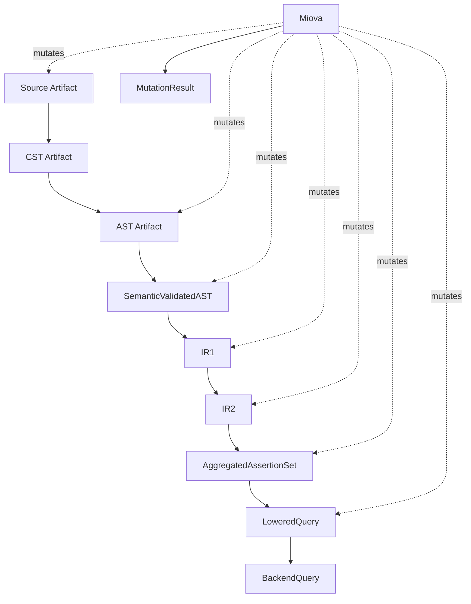

# Miova Integration Overview

> Status: planned / critical integration  
> Scope: mutation-oriented validation of the Toetra pipeline
> Audience: Toetra maintainers, contributors, verification engineers

## Purpose

Miova is the mutation and exploration framework used to challenge Toetra artifacts across compiler and verification boundaries.

Miova is not part of the normal verification runtime path.

Its role is to test whether Toetra remains correct, predictable, and diagnosable when artifacts are intentionally transformed, corrupted, weakened, strengthened, or structurally modified.

```text
Normal Toetra path:
.toetra → CST → AST → SemanticValidatedAST → IR1 → IR2 → Aggregation → Lowering → BackendQuery

Miova path:
Artifact → Mutation → Contract / Invariant Checks → Result Classification
```

## Why Miova Exists in Toetra

Toetra is designed as a layered verification system. Each layer introduces stronger guarantees than the previous one.

This makes Toetra a natural target for mutation-oriented validation:

- source mutations can test parser robustness;
- CST mutations can test builder assumptions;
- AST mutations can test semantic validation boundaries;
- semantic mutations can test binding and type guarantees;
- IR mutations can test logical preservation;
- ModelSchema mutations can test model-aware validation;
- backend query mutations can test lowering and diagnostic behavior.

Miova provides a disciplined way to explore these boundaries.

## Architectural Position

Miova is a transverse validation layer.



Miova does not replace formal verification backends.

It validates the robustness of the pipeline that produces backend verification artifacts.

## Core Relationship

| System | Role |
|---|---|
| Toetra | Specifies, validates, normalizes, and lowers ML behavioral properties. |
| ModelBridge | Converts ML model artifacts into normalized schema and future model constraints. |
| Miova | Challenges Toetra artifacts through controlled mutation, contracts, invariants, and campaigns. |
| Backend | Executes a lowered verification query. |

## What Miova Tests

Miova tests boundaries rather than individual helper functions.

The objective is not only to check whether code executes, but whether the system responds correctly to expected and unexpected perturbations.

Examples:

- invalid source syntax should fail at parsing;
- syntactically valid but semantically invalid AST should fail at semantic validation;
- equivalent logical transformations should preserve IR meaning;
- non-equivalent mutations should be detected or classified;
- unsupported backend constraints should fail before backend execution;
- model schema mutations should not silently break semantic binding.

## Mutation Result Semantics

A Miova mutation campaign should classify outcomes explicitly.

| Outcome | Meaning |
|---|---|
| `SUCCESS` | Mutation was applied and the resulting artifact is valid under its expected contract. |
| `SKIPPED` | Mutation was not applicable to the selected artifact. |
| `REJECTED` | Mutation was applied or attempted, but the contract rejected the result as expected. |
| `FAILED` | Unexpected failure occurred. This may reveal a Toetra bug, an invalid mutation definition, or a missing contract. |

## Integration Principle

Miova must never make Toetra less deterministic.

Miova campaigns are exploration tools. The Toetra compiler and verification pipeline must remain deterministic for the same input artifacts and configuration.

## Non-Goals

Miova integration does not aim to:

- replace unit tests;
- replace backend verification;
- prove model properties directly;
- generate production backend queries;
- mutate production artifacts silently;
- make the compiler nondeterministic.

## P0 Requirement

At P0, Miova integration must define:

1. artifact boundaries;
2. mutation scopes;
3. contract expectations;
4. invariant checks;
5. expected failure classification;
6. campaign reporting.

Implementation can evolve progressively, but these concepts must be stabilized early because they determine how Toetra will be tested end-to-end.
