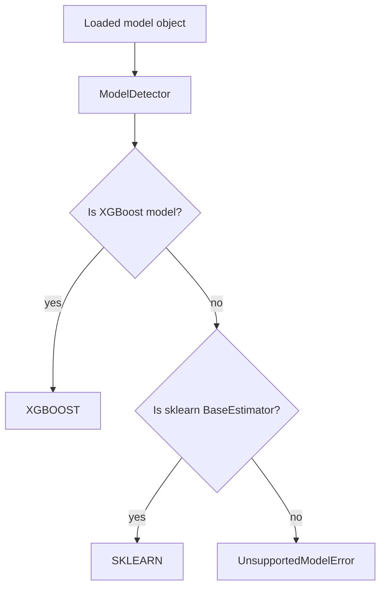

# Model Detection

> Status: implemented / stabilizing  
> Scope: ModelBridge framework detection boundary  
> Priority: P0

## Purpose

Model detection identifies the machine learning framework associated with a loaded model object.

```text
loaded model object → detected framework
```

This is required because introspection and backend preparation depend on framework-specific APIs.

## Why Detection Is Separate

The serialization format does not necessarily identify the framework.

A `.pkl` file can contain:

- a scikit-learn estimator;
- an XGBoost estimator;
- a custom Python object;
- an unsupported object.

Therefore, Toetra separates:

```text
model loading     = how the artifact is deserialized
model detection   = what framework the loaded object belongs to
model introspection = how metadata is extracted
```

## Current Detection Pipeline



## Current Frameworks

| Framework | Detection rule | Status |
|---|---|---|
| XGBoost | instance of `XGBModel` when XGBoost is installed | implemented |
| scikit-learn | instance of `BaseEstimator` when sklearn is installed | implemented |
| TensorFlow | enum exists, detection not implemented | planned |
| PyTorch | enum exists, detection not implemented | planned |

## Detection Order

Detection order matters.

XGBoost is checked before scikit-learn because XGBoost estimators may expose scikit-learn-compatible APIs.

Target order:

```text
specific framework checks → generic sklearn compatibility → unsupported
```

## Detection Contract

```text
Input:
    loaded model object

Output:
    EnumModelFramework

Failure:
    UnsupportedModelError
```

The detector must not:

- introspect features;
- infer task type;
- produce a `ModelSchema`;
- load files;
- perform backend lowering.

## Supported Framework Enum

The model framework enum defines the stable vocabulary for framework identity:

```text
SKLEARN
XGBOOST
TENSORFLOW
PYTORCH
```

Only part of this vocabulary is currently implemented. The enum intentionally exposes planned frameworks so the architecture can stabilize around a forward-compatible representation.

## Invariants

1. A loaded model must map to zero or one framework.
2. Detection must be deterministic for the same runtime object.
3. Unsupported models must fail before introspection.
4. Optional dependencies must not break Toetra import when missing.
5. Detection must not mutate the model object.
6. Detection must not assume that file extension equals framework identity.

## Failure Semantics

If no framework is detected, the pipeline should stop with a model detection error.

This is an early failure, not a backend failure.

```text
unsupported object → ModelDetectionError / UnsupportedModelError
```

## Target Extensions

Future detection may support:

- PyTorch `nn.Module`;
- TensorFlow/Keras models;
- ONNX graph artifacts;
- MLflow model wrappers;
- custom Toetra normalized model artifacts;
- model metadata files that explicitly declare framework identity.

## Relationship with Introspection

Detection selects the introspector.

```text
EnumModelFramework.SKLEARN → SklearnIntrospector
EnumModelFramework.XGBOOST → XGBoostIntrospector
```

If a framework is detected but no introspector exists, the failure belongs to the introspection boundary, not the detection boundary.
