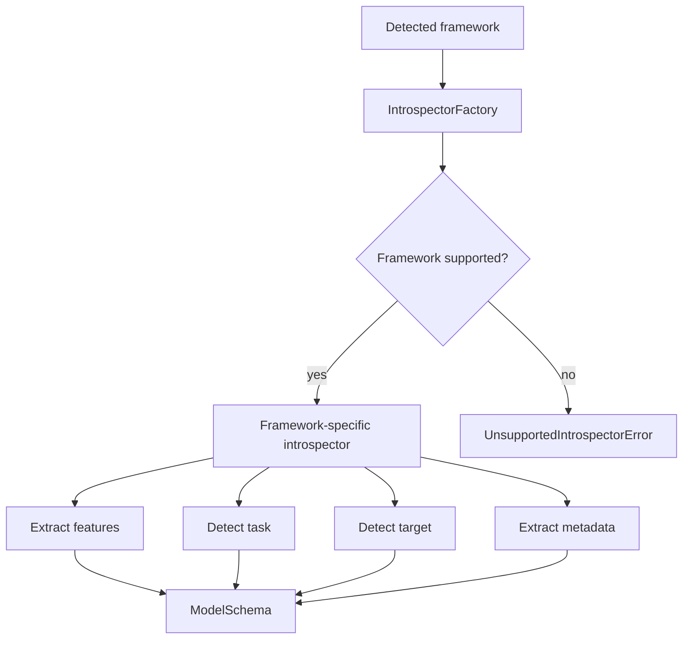

# Model Introspection

> Status: implemented / stabilizing  
> Scope: ModelBridge metadata extraction boundary  

## Purpose

Model introspection extracts normalized metadata from a loaded, detected model.

```text
detected framework + loaded model + optional dataset/schema
    → framework-specific introspector
    → ModelSchema
```

The output of introspection is a backend-independent `ModelSchema`.

## Why Introspection Exists

Toetra cannot validate properties against a model without a normalized representation of the model interface.

For example, a property may refer to:

```text
x'.age <= 30
```

To validate this properly, Toetra must eventually know whether:

- `age` exists;
- `age` is numeric;
- the model expects a feature with that name;
- the declared target is compatible with the model task;
- the model is a classifier, regressor, or another task type.

Introspection is the stage that makes this information available in a framework-independent way.

## Current Introspection Pipeline



## Current Introspectors

| Framework | Introspector | Status |
|---|---|---|
| scikit-learn | `SklearnIntrospector` | implemented / stabilizing |
| XGBoost | `XGBoostIntrospector` | implemented / stabilizing |
| TensorFlow | none | planned |
| PyTorch | none | planned |

## Base Introspector Contract

Every introspector should implement:

```text
introspect() -> ModelSchema
```

An introspector may receive:

- the loaded model object;
- an optional dataset path;
- an optional external schema;
- serialization format metadata.

## Feature Detection

Feature metadata may come from three sources, in priority order:

1. an externally provided schema;
2. sklearn named-input metadata (`feature_names_in_`) combined with dataset dtypes;
3. dataset-only inference when the model exposes no named-input contract.

Current behavior:

```text
if input_schema exists:
    use input_schema.features
elif model.feature_names_in_ exists:
    keep those names and that order
    read only their dtypes/nullability from dataset_path
else:
    infer every non-target dataset column as a feature
```

This distinction matters when one CSV is reused for anchor lookup. Lookup keys and provenance columns may coexist with model inputs, but they must not enter `ModelSchema.features` when the model declares its actual named inputs. If the model has no named-input metadata, callers must provide a dataset containing only model inputs plus the target, or keep lookup data separate through `anchor_source`/a custom resolver.

## Task Detection

The current sklearn introspector detects:

| Model kind | Toetra task |
|---|---|
| `ClassifierMixin` | `classification` |
| `RegressorMixin` | `regression` |
| otherwise | `unknown` |

XGBoost reuses sklearn-compatible introspection and overrides framework metadata.
It returns a new enriched schema; it does not mutate the sklearn snapshot.

## Target Detection

Target detection currently follows this strategy:

```text
if input_schema.target exists:
    use it
else:
    fallback to "target"
```

This is a practical default, but the target resolution contract should become stricter when end-to-end validation is stabilized.

## Metadata Extraction

Introspectors may extract framework-specific metadata while preserving a normalized schema boundary.

Examples:

| Metadata | Purpose |
|---|---|
| `serialization_format` | Remember how the model was loaded. |
| `model_class` | Identify the runtime model class. |
| `module` | Identify the Python module. |
| `n_features_in` | Validate input dimensionality. |
| `classes` | Classification output metadata. |
| `feature_names_in` | Feature alignment when available. |
| `xgboost.objective` | XGBoost-specific task information. |

Framework-specific metadata must remain optional and isolated.

## Invariants

1. Introspection requires a detected framework.
2. Unsupported frameworks fail at the introspector boundary.
3. Introspection produces exactly one `ModelSchema`.
4. `ModelSchema` must not expose framework-specific APIs directly.
5. Optional metadata must not be required by generic downstream stages.
6. Feature names should be represented as strings.
7. Feature dtypes should use Toetra semantic type vocabulary.
8. Introspection should not mutate the model.
9. Mutable adapter-local collections must be detached when constructing the
   immutable `ModelSchema` snapshot.

## Current Limitations

Current limitations to stabilize:

- feature detection may require a dataset path unless an external schema is provided;
- task detection is framework-specific and partial;
- target fallback is permissive;
- metadata is useful but not yet transformed into model constraints;
- TensorFlow and PyTorch are part of the target vocabulary but not implemented.

## Downstream Consumers

The `ModelSchema` produced by introspection will be consumed by:

- schema-aware semantic validation;
- model constraint generation;
- assertion aggregation;
- backend lowering;
- diagnostics and explainability tools.
