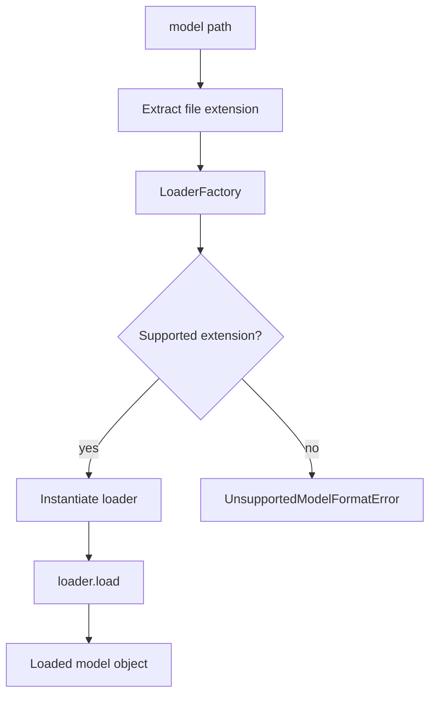

# Model Loading

> Status: implemented / stabilizing  
> Scope: ModelBridge loading boundary  

## Purpose

Model loading is the first ModelBridge stage.

Its role is to transform a model artifact path into a loaded Python model object that can be inspected by later stages.

```text
model path → loader selection → loaded model object
```

## Why This Layer Exists

Toetra should not couple model loading logic to framework detection or introspection.

Loading is its own boundary because serialization format and model framework are different concerns.

For example:

- a scikit-learn model may be serialized as `.pkl` or `.joblib`;
- a JSON artifact may represent structured model data but not necessarily a live framework object;
- future ONNX, PyTorch, TensorFlow, or custom artifacts may require different loading behavior.

Separating loading allows Toetra to evolve support for formats without changing semantic validation or IR lowering.

## Current Pipeline



## Current Loader Selection

The loader boundary is driven by file extension.

| Extension | Loader | Status |
|---|---|---|
| `.pkl` | `PklModelLoader` | implemented |
| `.joblib` | `JoblibModelLoader` | implemented |
| `.json` | `JsonModelLoader` | needs stabilization |

## Loader Contract

All model loaders should implement the same conceptual contract:

```text
Input:
    model artifact path

Output:
    loaded model object

Failure:
    typed ModelLoadingError subclass
```

## Current Loading Responsibilities

A loader is responsible for:

- opening the model artifact;
- deserializing the object;
- translating low-level file/deserialization errors into ModelBridge errors;
- returning the loaded object without introspecting it.

A loader is not responsible for:

- detecting the ML framework;
- validating the model task;
- extracting feature metadata;
- creating a `ModelSchema`;
- generating verification constraints.

## Error Boundary

Model loading errors should remain inside the model error hierarchy.

Expected loading error categories include:

| Error | Meaning |
|---|---|
| `UnsupportedModelFormatError` | No loader is registered for the file extension. |
| `ModelFileNotFoundError` | The artifact path does not exist. |
| `ModelDeserializationError` | The artifact exists but cannot be deserialized. |
| `ModelLoadingError` | Generic loading failure. |

## Known Stabilization Point

The JSON loading path should be aligned with the current loading error hierarchy.

The target behavior is:

```text
JsonModelLoader failures → ModelLoadingError or a subclass
```

This ensures all loader failures remain consistently typed.

## Target Extensions

Future loading formats may include:

| Format | Purpose | Status |
|---|---|---|
| `.onnx` | ONNX model artifacts | planned |
| `.pt` / `.pth` | PyTorch serialized models | planned |
| TensorFlow SavedModel | TensorFlow/Keras models | planned |
| MLflow model directory | MLflow-packaged models | planned |
| Custom Toetra model artifact | Internal normalized representation | future |

## Invariants

The loading layer should preserve the following invariants:

1. Loader selection is deterministic from the artifact path.
2. Unsupported formats fail before framework detection.
3. Deserialization failures are not swallowed.
4. Loading does not mutate the artifact path or original file.
5. Loading does not infer semantic model information.
6. The output is a runtime object passed to framework detection.

## Downstream Consumers

The loaded model object is consumed by:

- `ModelDetector`, for framework identification;
- framework-specific introspectors, for metadata extraction;
- future backend encoders, if direct access to the model object is required.
