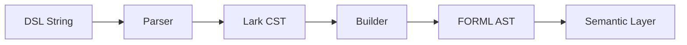

# Parser / Builder Boundaries

## Overview

This document defines the responsibilities of each pipeline layer.

Clear separation is required to:
- avoid duplicated validation,
- avoid inconsistent mutation targets,
- simplify debugging,
- preserve architectural clarity.

---

# Pipeline Overview

# Parser Responsibilities

The parser is responsible for:

- syntax recognition,
- grammar validation,
- tokenization,
- CST generation.

The parser is NOT responsible for:

- semantic validation,
- logical validation,
- invariant enforcement.

# Builder Responsibilities

The builder is responsible for:

- CST traversal,
- AST construction,
- AST typing,
- AST normalization.

The builder is NOT responsible for:

- advanced semantic reasoning,
- solver validation,
- verification execution.

# Semantic Layer Responsibilities

The semantic layer is responsible for:

- logical consistency,
- semantic constraints,
- property validation,
- future solver interactions.

# Mutation Layer Mapping
| Mutation Layer | Target              |
| -------------- | ------------------- |
| Lexical        | Parser              |
| Structural     | Builder             |
| Semantic       | Semantic validation |

# CST Usage

The Lark CST is currently considered:

- an internal parser artifact,
- not directly mutated,
- not exposed as a stable abstraction.

[TO_VERIFY]
If CST normalization is introduced later, update this document.

# Future Extensions

[TO_VERIFY]

- IR boundaries,
- solver integration boundaries,
- normalization stages,
- optimization stages.