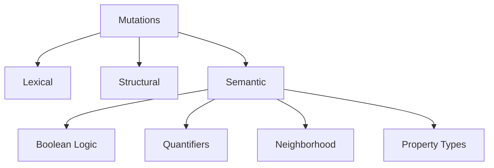

# Mutation Taxonomy

## Overview

This document defines the current mutation categories used in FORML.

---

# Mutation Table

| Mutation | Layer | Intent | Target |
|---|---|---|---|
| remove_character | lexical | parser corruption | parser |
| inject_noise | lexical | invalid token injection | parser |
| corrupt_keywords | lexical | keyword corruption | parser |
| truncate_program | lexical | EOF corruption | parser |
| remove_node | structural | AST corruption | builder |
| duplicate_node | structural | redundancy injection | builder |
| shuffle_body | structural | ordering instability | builder |
| drop_header_field | structural | incomplete AST | builder |
| invert_implication | semantic | reverse implication semantics | semantic |
| weaken_implication | semantic | constraint weakening | semantic |
| collapse_implication | semantic | implication corruption | semantic |
| negate_node | semantic | logical negation injection | semantic |
| double_negation | semantic | logical normalization stress | semantic |
| swap_quantifier | semantic | quantifier corruption | semantic |
| corrupt_metric | semantic | neighborhood semantic corruption | semantic |
| poison_domain_values | semantic | domain inconsistency | semantic |

---

# Mutation Hierarchy

---

# Mutation Design Rules

Each mutation must:

- target a specific invariant,
- remain deterministic,
- remain isolated,
- preserve reproducibility.
- Mutation Expansion Policy

New mutations should:

- document their intention,
- specify targeted invariants,
- specify target pipeline layer,
- avoid semantic ambiguity.

# Future Extensions

[TO_VERIFY]

- mutation severity scoring,
- mutation coverage metrics,
- adaptive mutation systems,
- solver-guided mutation generation.