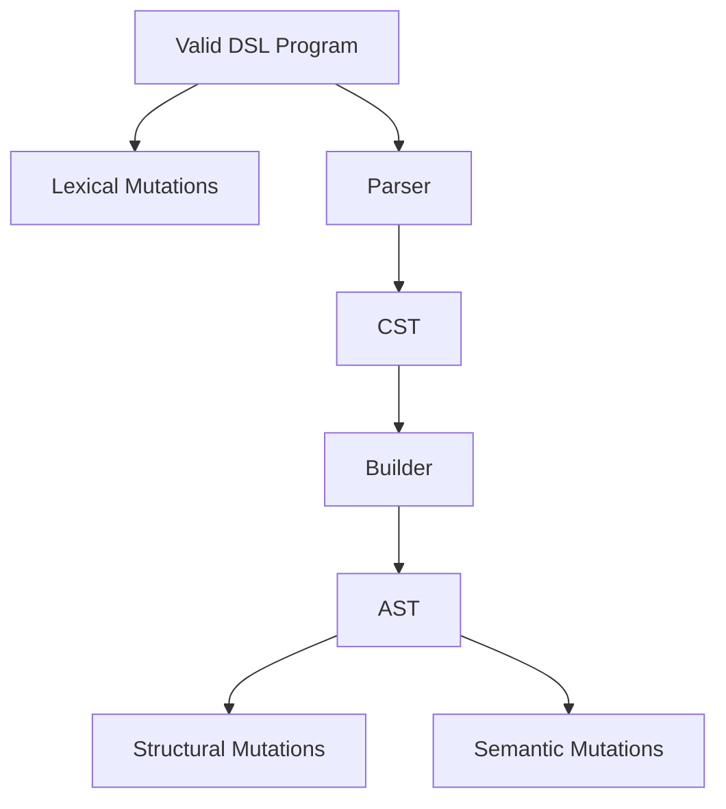
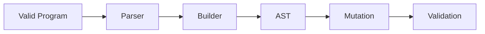

# Mutation Testing in FORML

## Overview

FORML uses mutation-based testing to validate the robustness of the DSL pipeline.

Mutation testing intentionally corrupts generated artifacts in order to:
- validate error detection,
- validate semantic robustness,
- validate parser resilience,
- validate builder consistency,
- validate future verification stages.

---

# Mutation Layers

FORML currently defines three mutation layers.

# Lexical Mutations
## Purpose

Lexical mutations operate directly on DSL strings.

They target:

- tokenizer robustness,
- parser robustness,
- grammar stability.
Examples
- keyword corruption,
- random symbol injection,
- truncation,
- character deletion.

# Structural Mutations
## Purpose

Structural mutations operate on AST structures.

They target:

- missing nodes,
- malformed AST structures,
- inconsistent AST composition.
Examples
- removing body elements,
- removing required sections,
- node duplication,
- property reordering.

# Semantic Mutations
## Purpose

Semantic mutations preserve AST validity while altering logical meaning.

They target:

- semantic validators,
- logical consistency,
- constraint validation.
Examples
- implication inversion,
- logical weakening,
- quantifier corruption,
- logical negation injection.

# Mutation Philosophy

Mutations should:

- have a single clear intention,
- target one invariant at a time,
- remain explainable,
- remain reproducible.

Mutations should NOT:

- mix unrelated semantic effects,
- mutate arbitrary attributes,
- bypass AST typing constraints.

# Current Mutation Flow

# Future Directions

Future mutation systems may include:

- coverage-guided mutation,
- mutation scoring,
- mutation lineage tracking,
- probabilistic mutation weighting,
- solver-aware mutation strategies.