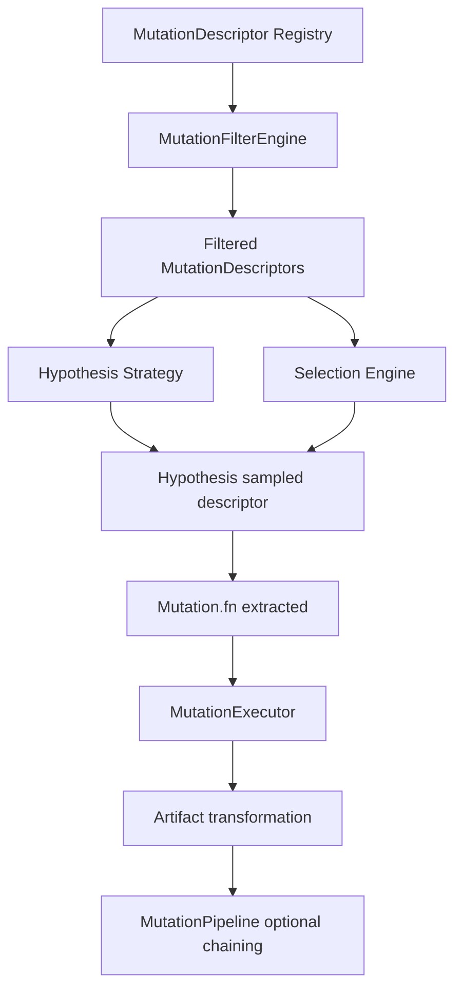
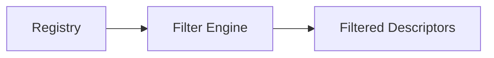
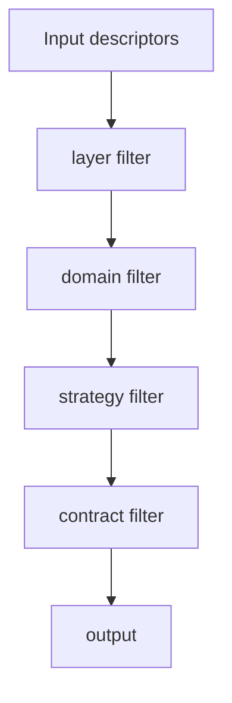
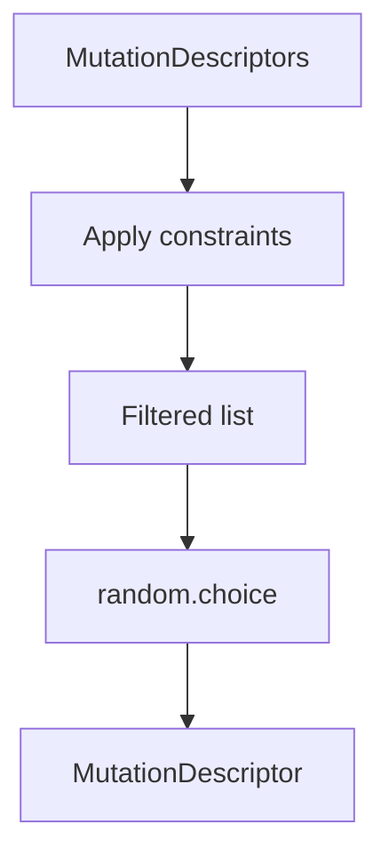
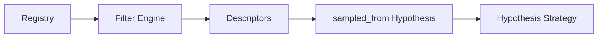
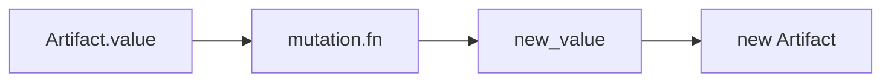
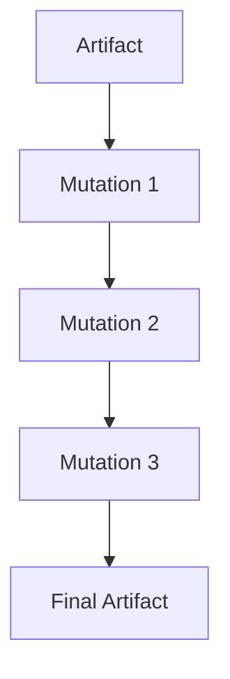
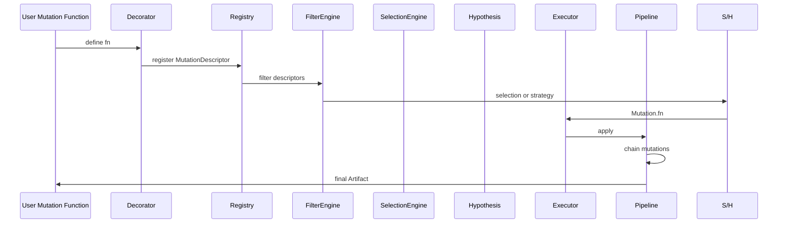

Below is a **clean, structured technical documentation** of your FORML mutation system. I’ll focus on **mental model, execution flow, and the subtle semantics hidden in parameters** (where most bugs will eventually live).

---

# 🧬 FORML Mutation System — Technical Documentation

## 1. Overview

The mutation subsystem is a **layered DSL transformation and fuzzing framework** built around three core ideas:

1. **Mutations are pure functions**
2. **Mutations are described, not just defined**
3. **Mutations are filtered, selected, and executed in pipelines**

At its core:

> A Mutation = metadata + function
> A MutationDescriptor = mutation + constraints + semantics
> An Artifact = typed DSL payload at a given layer

---

## 2. Global Architecture



---

# 3. Core Data Model

## 3.1 Artifact

```python
@dataclass(frozen=True, slots=True)
class Artifact(Generic[T]):
    value: T
    layer: str  # string | cst | ast | ir
```

### Meaning

An `Artifact` is the **runtime unit of transformation**.

### Fields

| Field   | Meaning                       | Subtlety                                    |
| ------- | ----------------------------- | ------------------------------------------- |
| `value` | actual DSL object             | fully generic, no constraints enforced here |
| `layer` | stage in compilation pipeline | string-typed → weak safety [TO_VERIFY]      |

### Important design implication

* `layer` is a **string**, not `Layer Enum`
* But elsewhere the system uses `Layer(Enum)`

👉 This introduces a **type mismatch risk across boundaries**

✔ Suggestion: unify later into `Layer` everywhere.

---

## 3.2 Mutation

```python
@dataclass(frozen=True, slots=True)
class Mutation:
    name: str
    fn: Callable[[T], T]
```

### Meaning

A Mutation is a **pure transformation function wrapped with identity metadata**.

### Fields

| Field  | Meaning                      |
| ------ | ---------------------------- |
| `name` | human-readable identifier    |
| `fn`   | deterministic transformation |

### Key constraint

> `fn` MUST be pure and deterministic

Otherwise:

* Hypothesis strategies become unstable
* Selection becomes non-reproducible

---

## 3.3 MutationDescriptor (MOST IMPORTANT STRUCT)

```python
@dataclass(frozen=True, slots=True)
class MutationDescriptor:
    mutation: Mutation
    layer: Layer
    nature: Nature
    strategy: Strategy
    domain: Domain
    contract: MutationContract
    severity: float | None
```

This is the **semantic heart of FORML mutation system**.

---

### Fields breakdown

## 1. mutation

The actual executable function wrapper.

---

## 2. layer (Layer Enum)

```python
class Layer(Enum):
    STRING = auto()
    CST = auto()
    AST = auto()
    IR = auto()
```

### Meaning

Defines **where in the DSL pipeline this mutation applies**.

| Layer  | Meaning                     |
| ------ | --------------------------- |
| STRING | raw text manipulation       |
| CST    | concrete syntax tree        |
| AST    | abstract syntax tree        |
| IR     | intermediate representation |

👉 This is crucial for filtering + strategy generation.

---

## 3. nature (Nature Enum)

```python
INSERTION / DELETION / SUBSTITUTION / REORDERING / CORRUPTION
```

### Meaning

Describes **what kind of structural effect the mutation has**

| Nature       | Interpretation                |
| ------------ | ----------------------------- |
| INSERTION    | adds structure                |
| DELETION     | removes structure             |
| SUBSTITUTION | replaces node/value           |
| REORDERING   | changes order only            |
| CORRUPTION   | breaks validity intentionally |

👉 Used for adversarial / fuzzing behavior modeling.

---

## 4. strategy (Strategy Enum)

```python
VALID / MUTATED / CORRUPTED
```

### Meaning

Defines **expected correctness level after mutation**

| Strategy  | Meaning                                |
| --------- | -------------------------------------- |
| VALID     | should preserve correctness            |
| MUTATED   | partially altered but still meaningful |
| CORRUPTED | intentionally invalid                  |

👉 This is a **semantic expectation contract**, not a technical one.

---

## 5. domain (Domain Enum)

```python
STRUCTURAL / SEMANTIC / LOGICAL / TYPING
```

### Meaning

Defines **what property the mutation targets**

| Domain     | Focus                 |
| ---------- | --------------------- |
| STRUCTURAL | tree shape            |
| SEMANTIC   | meaning preservation  |
| LOGICAL    | reasoning constraints |
| TYPING     | type system validity  |

---

## 6. contract (MutationContract)

```python
@dataclass(frozen=True, slots=True)
class MutationContract:
    cst: PreservationLevel
    ast: PreservationLevel
    typing: PreservationLevel
    semantics: PreservationLevel
```

### PreservationLevel

```python
NONE / PARTIAL / FULL
```

### Meaning

This is a **formal guarantee system for mutation safety**

| Field     | Meaning                       |
| --------- | ----------------------------- |
| cst       | CST integrity preservation    |
| ast       | AST integrity preservation    |
| typing    | type correctness preservation |
| semantics | semantic meaning preservation |

---

### Critical insight

This contract is used in filtering:

```python
d.contract.semantics.value >= min_semantic_preservation.value
```

⚠️ This assumes:

* Enum ordering reflects semantic strength

👉 That is **implicit ordinal logic** (risky if Enum order changes)
[TO_VERIFY if intentional design choice]

---

## 7. severity (float | None)

### Meaning

Represents **mutation aggressiveness / impact magnitude**

Examples:

* 0.1 → subtle transformation
* 0.9 → destructive mutation

⚠️ Currently unused in filtering logic
→ likely future weighting in selection [TO_VERIFY]

---

# 4. Registry System

## MutationRegistry

```python
class MutationRegistry:
    _items: List[MutationDescriptor]
```

### Role

Central **source of truth** for all mutations.

---

### Operations

#### register()

Adds descriptor.

#### all()

Returns copy of all descriptors.

#### filter()

Delegates to `MutationFilterEngine`.



---

# 5. Filtering System

## MutationFilterEngine

Filters descriptors using multiple orthogonal constraints:

### Supported filters

* layer
* domain
* strategy
* semantic preservation threshold

---

### Execution order



---

### Contract filter logic

```python
d.contract.semantics.value >= min_semantic_preservation.value
```

⚠️ Important assumption:

* Enum values are comparable in meaningful order

👉 This encodes **semantic strength ordering in enum definition itself**

---

# 6. Selection Engine (Fuzzing Sampler)

## MutationSelectionEngine

```python
select(items, layer=None, domain=None, strategy=None)
```

### Behavior

1. Applies constraints
2. Filters list
3. Randomly samples one item



---

### Key property

> This is a **uniform sampler**, not weighted

Even though `severity` exists, it is NOT used.

⚠️ Potential future extension point

---

# 7. Hypothesis Integration

## mutation_strategy()

```python
def mutation_strategy(registry, filter_engine, **filters):
```

### Flow



### Meaning

Transforms mutation descriptors into:

> Hypothesis-compatible stochastic strategy

---

### Important detail

```python
st.sampled_from(descriptors)
```

This implies:

* uniform sampling
* no weighting
* no adaptive fuzzing

---

# 8. Execution System

## MutationExecutor

```python
def apply(mutation, artifact)
```

### Flow



### Key property

* Stateless execution
* Layer preserved unchanged

⚠️ Important design decision:

> mutation does NOT change layer automatically

---

# 9. Pipeline System

## MutationPipeline

Sequential composition:

```python
for mutation in mutations:
    artifact = executor.apply(mutation, artifact)
```

### Flow



### Meaning

This is a **deterministic transformation chain**

---

# 10. Decorators

## Two mutation decorators exist (important distinction)

---

## 10.1 core.decorator.mutation

```python
Mutation(name=name, fn=fn)
```

### Purpose

Lightweight conversion:

> function → Mutation

---

## 10.2 decorators.mutation (advanced version)

```python
MutationDescriptor(...)
```

### Purpose

Full semantic registration:

> function → Mutation + metadata + contract

---

### Critical distinction

| Version            | Output             |
| ------------------ | ------------------ |
| core decorator     | Mutation           |
| advanced decorator | MutationDescriptor |

⚠️ These are conceptually different abstraction levels

---

# 11. Full System Lifecycle



---

# 12. Key Design Insights (Important)

## 12.1 Strong points

* Clean separation:

  * metadata
  * execution
  * selection
  * filtering
* Hypothesis integration is elegant
* MutationDescriptor acts as a **first-class semantic object**

---

## 12.2 Hidden risks

### 1. Mixed typing systems

* `Artifact.layer: str`
* `Layer enum elsewhere`

---

### 2. Enum ordinal dependency

* preservation comparison uses `.value`

---

### 3. severity unused

* likely future design gap

---

### 4. duplicate decorator concepts

* core decorator vs metadata decorator ambiguity

---

### 5. mutation purity not enforced

* system assumes correctness

---

# 13. Mental Model (How to think about FORML mutations)

> Think of it as a **probabilistic compiler mutation engine**

* Registry = genome
* FilterEngine = selection pressure
* SelectionEngine = stochastic sampling
* Hypothesis = experimental generator
* Executor = mutation application
* Pipeline = evolutionary chain

---

If you want next step, I can:

* design a **C4 architecture diagram**
* propose a **type-safe refactor (Layer unification + severity weighting)**
* or map this into an **evolutionary computation framework (GA-style)**
