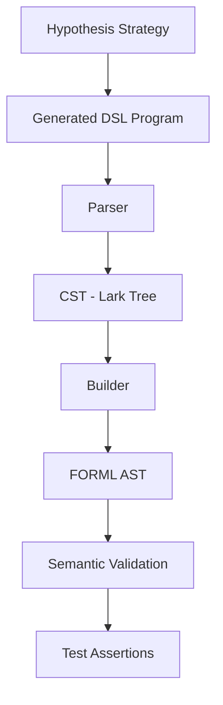

# Property-Based Testing in FORML

## Overview

FORML uses Property-Based Testing (PBT) to validate the robustness,
correctness, and stability of the DSL pipeline.

The project currently relies on Hypothesis for:
- random DSL generation,
- invariant checking,
- parser robustness validation,
- builder consistency validation,
- semantic stability validation.

---

# Objectives

The goals of Property-Based Testing in FORML are:

- explore large input spaces automatically,
- discover edge cases impossible to enumerate manually,
- validate parser/builder robustness,
- validate AST consistency,
- validate semantic invariants,
- prepare future fuzzing and formal verification layers.

---

# Current Pipeline

# Current Test Layers
| Layer          | Responsibility                         |
| -------------- | -------------------------------------- |
| Parser         | Validate DSL syntax                    |
| Builder        | Transform CST into AST                 |
| Semantic       | Validate logical consistency           |
| [TO_VERIFY] IR | Intermediate representation validation |

# Current Strategies

## Valid Program Generation

Valid programs are generated using composable Hypothesis strategies.

Current generation includes:

- header generation,
- property generation,
- logical assertions,
- optional neighborhood expressions,
- optional backend declarations.

## Invalid Program Generation

Invalid programs are generated using mutation-based approaches.

Current mutation categories:

- lexical mutations,
- structural mutations,
- semantic mutations.

See:

- mutation_testing.md
- mutation_taxonomy.md

## Invariants

The following invariants are currently tested:

| Invariant            | Description                                    |
| -------------------- | ---------------------------------------------- |
| Parser stability     | Valid programs should not crash parsing        |
| Builder stability    | AST construction should succeed                |
| Determinism          | Same input should produce identical outputs    |
| Structural validity  | AST must contain required sections             |
| Semantic consistency | Equivalent parses must produce equivalent ASTs |

## Shrinking

Hypothesis shrinking is currently enabled implicitly through Hypothesis strategies.

[TO_VERIFY]
Document custom shrinking strategy plans if introduced later.

# Future Directions

Planned future extensions include:

- coverage-guided fuzzing,
- mutation lineage tracking,
- semantic mutation scoring,
- IR-level mutation testing,
- solver-oriented fuzzing,
- LLM-assisted generation.
