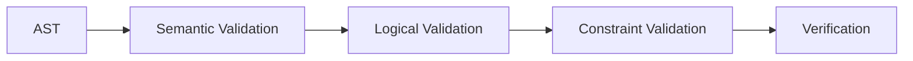

# Semantic Invariants

## Overview

This document defines the semantic invariants currently enforced or expected in FORML.

---

# Structural Invariants

| Invariant | Description |
|---|---|
| Header exists | Program must contain a header |
| Model exists | Model declaration is mandatory |
| Target exists | Target declaration is mandatory |
| Non-empty body | At least one property must exist |

---

# AST Invariants

| Invariant | Description |
|---|---|
| AST typing consistency | Nodes must respect expected types |
| Valid property types | Property types must belong to supported enums |
| Valid logical nodes | Logical expressions must remain well-formed |

---

# Logical Invariants

| Invariant | Description |
|---|---|
| Implication validity | Implication nodes must contain left/right expressions |
| Boolean validity | AND/OR nodes must contain valid operands |
| Negation validity | NOT nodes must target valid expressions |
| Nested validity | Nested logical expressions must remain traversable |

---

# Neighborhood Invariants

| Invariant | Description |
|---|---|
| Valid metric | Neighborhood metrics must be supported |
| Valid arguments | Neighborhood arguments must remain valid |
| Domain consistency | Domain values must remain coherent |

---

# Semantic Mutation Objectives

Semantic mutations intentionally violate:
- logical consistency,
- semantic expectations,
- constraint coherence.

They should NOT:
- bypass typing guarantees,
- introduce arbitrary runtime attributes,
- invalidate AST traversal guarantees.

---

# Semantic Validation Pipeline

# Future Invariants

[TO_VERIFY]

- solver consistency,
- satisfiability guarantees,
- normalization invariants,
- IR-level invariants.