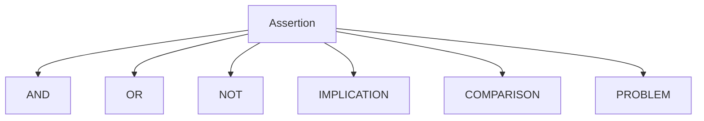

# Logic Unit Tests

## Purpose

This directory documents unit tests related to logical expressions
inside FORML assertions.

Logic tests validate parsing behavior, AST construction,
operator precedence, and invalid logical structures.

---

## Covered components

- logical operators
- implication
- precedence
- parentheses
- problem expressions

---

## Responsibilities

Logic tests validate:

- logical AST construction
- operator precedence
- parentheses behavior
- implication structure
- invalid logic rejection

---

## Design philosophy

Logic parsing must remain:

- deterministic
- explicit
- structurally stable
- precedence-safe

---

## Logic architecture

## Shared invariants

| Invariant             | Description                             |
| --------------------- | --------------------------------------- |
| Stable precedence     | Operators must preserve precedence      |
| Stable AST typing     | Operators must map to correct AST nodes |
| Explicit rejection    | Invalid logic must fail parsing         |
| Deterministic parsing | Same expression must produce same AST   |
