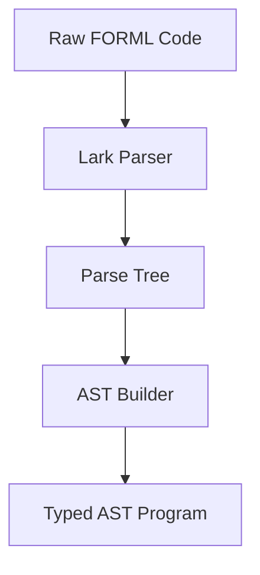

# Unit Parsing Tests Overview

## Scope

This directory contains unit tests for the FORML parsing layer.

These tests validate:

- syntactic correctness of FORML programs
- AST construction from parsed input
- structural invariants of scope, header, and body
- validation of invalid syntax cases

They do NOT test:

- execution or evaluation
- backend behavior beyond structural attachment
- external integrations
- property-based generation (handled in Hypothesis suite)

---

## Architecture under test

The parsing pipeline tested here follows:

Unit tests operate at levels C → D → E.

---

## Test philosophy

Unit parsing tests are:

- deterministic
- fixture-driven
- structurally focused
- strict on invalid cases
- scoped per syntactic feature

Each syntactic feature has:

- valid minimal cases
- valid extended cases
- invalid cases (when applicable)

## Test categories
- Header validation
- Scope validation (AT / CHECK_AT / FORALL / EXISTS / PAIRWISE)
- Neighborhood parsing
- Domain parsing
- Backend attachment
- Assertion parsing (logic)
- Program structure validation
- Invalid syntax rejection

 ## Key invariant

A parsed program must always satisfy:

- program.header is valid
- program.body contains valid properties
- each property has exactly one scope
- assertion tree is not null