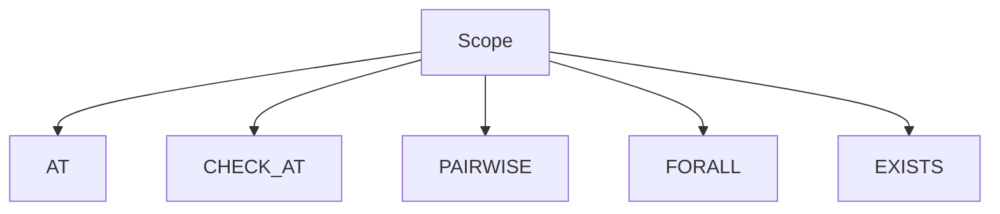

# Scope Unit Tests

## Purpose

This directory documents unit tests related to FORML scope expressions.

Scopes define the context in which assertions are evaluated.

---

## Covered scope types

- AT
- CHECK_AT
- PAIRWISE
- FORALL
- EXISTS

---

## Responsibilities

Scope tests validate:

- scope parsing
- AST node construction
- optional components
- scope invariants
- invalid syntax rejection

---

## Shared concepts

Some concepts are shared across multiple scopes:

- neighborhoods
- domains
- backend attachment

These are documented separately.

---

## Scope architecture

## Design philosophy

Each scope type must provide:

- minimal valid examples
- extended valid examples
- explicit invalid cases
- stable AST structure