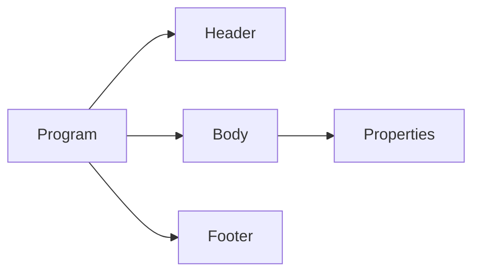

# Structure Unit Tests

## Purpose

This directory documents unit tests related to the structural organization
of FORML programs.

Structure tests validate how complete programs are organized and parsed.

---

## Covered components

- program structure
- header parsing
- body parsing
- footer handling
- property organization

---

## Responsibilities

Structure tests validate:

- global program consistency
- mandatory sections
- property organization
- AST construction
- invalid structural cases

---

## Design philosophy

Structure tests focus on:

- deterministic parsing
- explicit structural invariants
- strict rejection of malformed programs
- stable AST construction

---

## Structure architecture

## Shared invariants
| Invariant            | Description                              |
| -------------------- | ---------------------------------------- |
| Header required      | Programs must define a valid header      |
| Body required        | Programs must contain properties         |
| Stable AST structure | Parsed programs must produce stable ASTs |
| Explicit rejection   | Invalid structures must fail parsing     |
